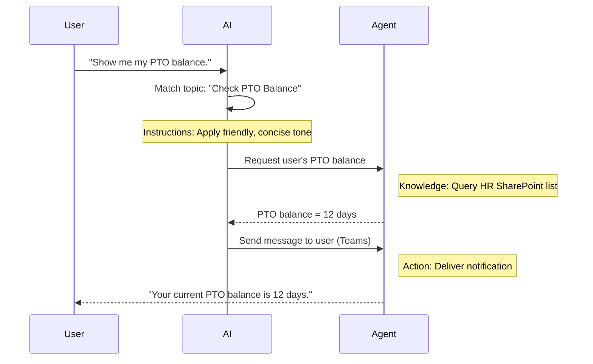

---
prev:
  text: 'Introduction to Agents'
  link: '/recruit/01-introduction-to-agents'
next:
  text: 'Deploy a Declarative Agent for Microsoft 365 Copilot'
  link: '/recruit/03-create-a-declarative-agent-for-M365Copilot'
---

# 🚨 Mission 02: Copilot Studio Fundamentals

## 🕵️‍♂️ CODENAME: `OPERATION CORE PROTOCOL`

> **⏱️ Operation Time Window:** `~30 minutes – intel only, no fieldwork required`

🎥 **Watch the Walkthrough**

[](https://www.youtube.com/watch?v=x4OCwDRGeLE "Watch the walkthrough on YouTube")

## 🎯 Mission Brief

Welcome, Recruit. This mission will equip you with foundational intel to understand how Copilot Studio works, and how to build intelligent agents that deliver real business value.

Before building your first agent, you need to understand the four key components that make up every custom AI agent: Knowledge, Tools, Topics, and Instructions. You'll also learn how these elements work together in the Copilot Studio orchestrator.

## 🔎 Objectives

In this mission, you will:

- **Learn what Copilot Studio is**
- **Learn when and why to use agents**
- **Explore the four building blocks of agents**
      - **Knowledge**
      - **Tools**
      - **Topics**
      - **Instructions**
- **Understand how these components work together** to create an intelligent, automated agent

## What Are Agents in Copilot Studio?

An **agent** is a specialized AI assistant you design to handle specific tasks. Unlike a general-purpose chatbot, your agent:

- **Knows company-specific data** (policies, documents, databases)
- **Carries out real-world tasks** (sending messages, creating calendar events, updating records)
- **Maintains conversational context** so it can follow up on previous questions

Because Copilot Studio is low-code, you can drag and drop prebuilt components to build your agent with no coding skills required. Once your agent is built, you can use it inside Teams, Slack, or even a custom webpage to get answers or trigger workflows automatically.

## When and Why to Use Copilot Studio

While Microsoft 365 Copilot provides general AI assistance across Office apps, you'll want a custom agent when:

### You need to mix and match knowledge from multiple sources

- M365 Copilot is great at retrieving context from M365 (SharePoint, Outlook, etc) but you might run into situations where you want your agent to be able to search through more knowledge sources which is a good use case for an agent.

### You want to automate multi-step workflows

- For example: "When someone submits an expense, send it for approval, update the finance tracker, and notify the manager." A custom agent can handle every step, triggered by a single command or event.

### You need a contextual, in-tool experience

- Imagine a New Hire Onboarding agent in Teams that guides HR staff through every policy, sends necessary forms, and schedules orientation meetings—right inside your existing collaboration platform.

## Four Building Blocks of an Agent

Every Copilot Studio agent is built from four core components:

1. **Knowledge**
1. **Tools (Actions)**
1. **Topics**
1. **Instructions**

Below, we'll define each building block and show how they work together to make an effective agent.

### 1. Knowledge

**Knowledge** is the data and context your agent uses to answer questions accurately. It has two parts:

#### Custom Instructions & Context

- You write a brief description of the agent's purpose and tone. For example:

    ```text
    You are an IT support agent. You help employees troubleshoot common software issues, provide troubleshooting steps, and escalate urgent tickets.
    ```

- During a conversation, the agent remembers previous turns so it can refer back to what was already discussed (for instance, if the user first says, "My printer is offline," then later asks, "Did you check the ink level?" the agent recalls the printer context).

#### Knowledge Sources (Grounding Data)

- You connect your agent to up to multiple data sources—SharePoint libraries, documentation sites, wikis, or other databases.
- When a user asks a question, the agent pulls relevant excerpts from those sources so answers are **grounded** in your organization's actual policies, product manuals, or any proprietary information.
- You can even force the agent to only respond with information from those sources, preventing it from guessing or "hallucinating" answers.

> [!NOTE] Example
> A "Policy Assistant" agent might connect to your HR SharePoint site. If a user asks, "What is our PTO accrual rate?" the agent retrieves the exact text from the HR policy document rather than relying on a generic AI response.

### 2. Tools (Actions)

**Tools (Actions)** define what the agent can do beyond chatting. Each action is a task the agent executes programmatically, such as:

- Sending an email or Teams message
- Creating or updating a calendar event
- Adding or editing a record in a database (e.g., a SharePoint list or Dataverse table)
- Calling a Power Automate flow or REST API

#### How Actions Work

- **Define Inputs & Outputs**
      - For example, a Send Email action might require:
        - `RecipientEmailAddress`
        - `SubjectLine`
        - `EmailBody`

- **Combine Actions into Workflows**
      - Often, fulfilling a user request involves multiple steps.
      - You can sequence actions so that:
             1. The agent retrieves data from a SharePoint list.
             2. It generates a summary using the LLM.
             3. It sends a Teams message with that summary.

- **Connect to External Systems**
      - If you need to update a CRM or call an internal API, create a custom action to handle that.
      - Copilot Studio can integrate with the Power Platform or any HTTP-based endpoint.

> [!NOTE] An "Expense Helper" agent could:
>
> 1. Listen for a "Submit Expense" request.
> 1. Grab the user's expense details from a form.
> 1. Use an "Add to SharePoint List" action to store the data.
> 1. Trigger a "Send Email" action to notify the approver.

### 3. Topics

**Topics** define the conversational triggers or entry points for your agent. Each topic corresponds to a piece of functionality or a question category.

#### Conversational Triggers

- A topic might be "Submit IT Ticket," "Check Vacation Balance," or "Create Sales Report."
- Under the hood, Copilot Studio uses **generative orchestration**: rather than relying on exact keywords, the AI interprets user intent and picks the right topic based on a short description you provide.

#### Topic Descriptions

- In each topic, you write a clear, concise description of what that topic covers.

> [!NOTE] Example of topic description
> This topic helps users submit an IT support ticket by collecting the issue details, priority, and contact information.

- The AI uses that description to decide when to activate this topic, even if the user's phrasing doesn't exactly match.

#### Mapping Topics to Actions

- Each topic is connected to one or more actions or data retrieval steps.
- When the AI chooses a topic, it guides the conversation through the sequence you defined (ask follow-up questions, call actions, return results).

!!! example
    If a user says, "I need help setting up my new laptop," the AI might match that intent to the "Submit IT Ticket" topic. The agent then asks for laptop model, user details, and pushes a ticket into the helpdesk system automatically

### 4. Instructions

**Instructions** (sometimes called "Prompts" or "System Messages") guide the LLM's tone, style, and boundaries. They shape how the agent responds in any situation.

#### Role & Persona

- You tell the AI who it is (e.g., "You are a customer service agent for Contoso Retail").
- This sets the tone—friendly, concise, formal, or casual—depending on your use case.

#### Response Guidelines

- Specify any rules the agent must follow, such as:
      - "Always summarize policy information in bullet points."
      - "If you don't know the answer, say 'I'm sorry, I don't have that information.'"
      - "Never include confidential data outside of context."

#### Memory & Context Rules

- You can instruct the agent how many turns of conversation to remember.
- For example: "Remember details from this user's requests for up to three follow-up questions."

> [!NOTE] In a "Benefits Advisor" agent, you might include:
> "Always reference the latest HR handbook when answering questions. If asked about enrollment deadlines, provide the specific dates from the policy. Keep answers under 150 words."

## How the Four Building Blocks Work Together

When you assemble **Knowledge**, **Tools**, **Topics**, and **Instructions**, Copilot Studio's AI orchestrator creates an agent that:

1. **Listens for a relevant Topic** (guided by your topic descriptions).
1. **Applies Instructions** to set its tone, decide when to ask follow-up questions, and enforce rules.
1. **Leverages Knowledge Sources** to ground its answers in your organization's data.
1. **Calls Tools (Actions)** as needed to perform tasks—sending messages, updating records, or invoking APIs.

Under the hood, the orchestrator uses a **generative planning** approach: it decides which steps to take, in what order, to fulfill a user request. If an action fails (for example, an email can't be sent), the agent follows your exception-handling guidelines (ask a clarifying question or report the error). Because the LLM adapts to conversation context, the agent can maintain memory over multiple turns and incorporate new information as the conversation unfolds.

**Visual Flow Example:**



---

## 🎉 Mission Complete

You've successfully completed your fundamentals briefing. You've now learned the four essential building blocks of any agent in Copilot Studio:

1. **Knowledge** – Where the agent looks up factual information and maintains conversation memory.
1. **Tools** – The tasks the agent can perform to make things happen automatically.
1. **Topics** – How the agent recognizes user intent and decides which workflow to run.
1. **Instructions** – The rules, tone, and boundaries that guide every response.

With these components in place, you can build a basic agent that answers questions and executes simple workflows. In the next lesson, we'll walk through a step-by-step tutorial to create a "Service Desk" agent—from connecting your first knowledge source to defining a topic and wiring up an action.

Up next: You'll build your [first declarative agent for M365 Copilot](../Lab%203/index.md).
