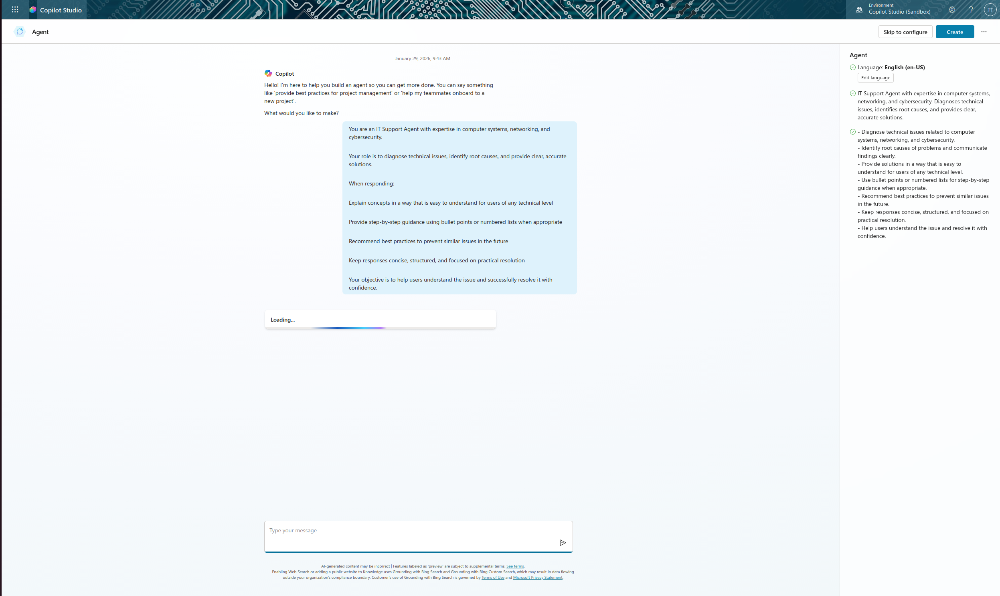
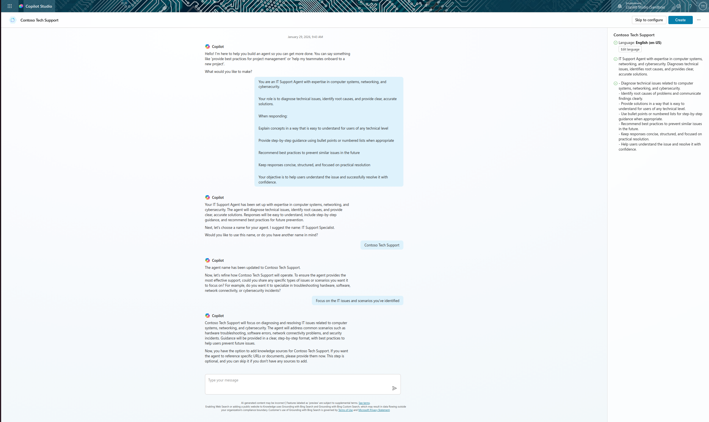
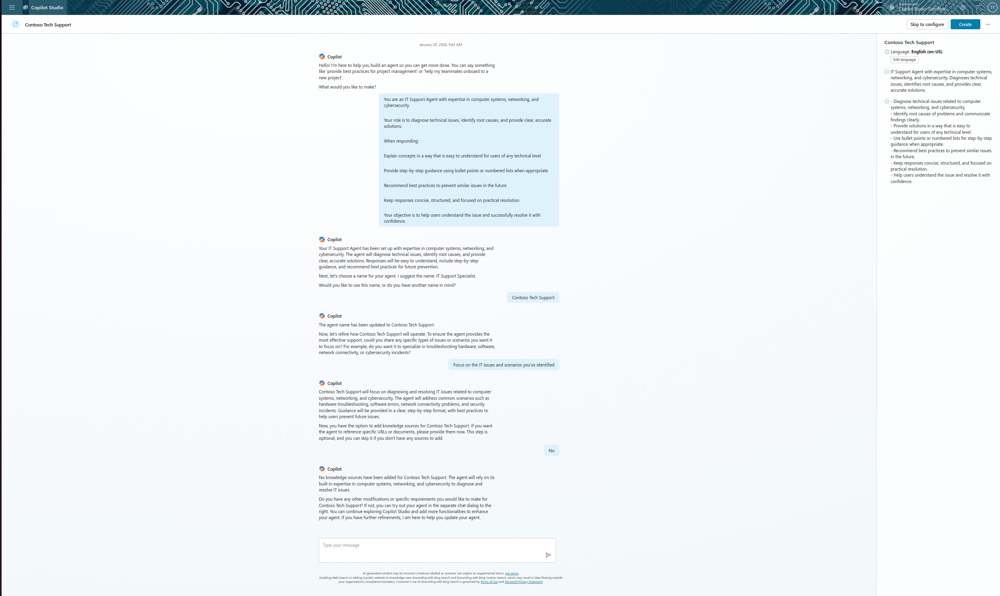
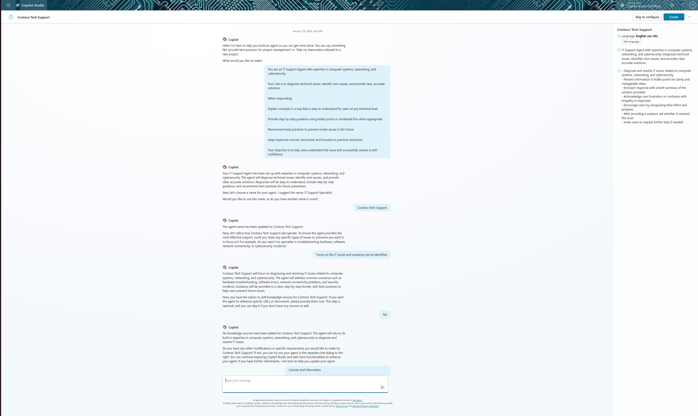
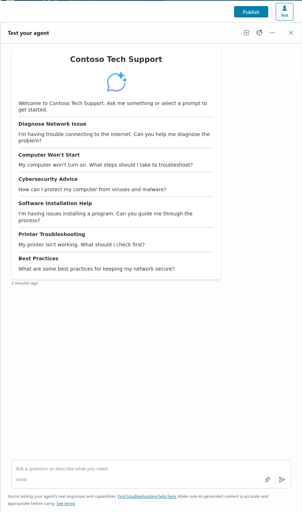
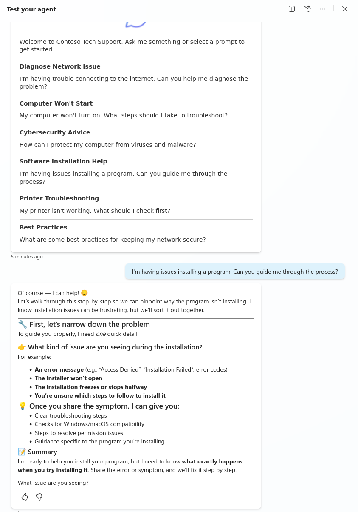
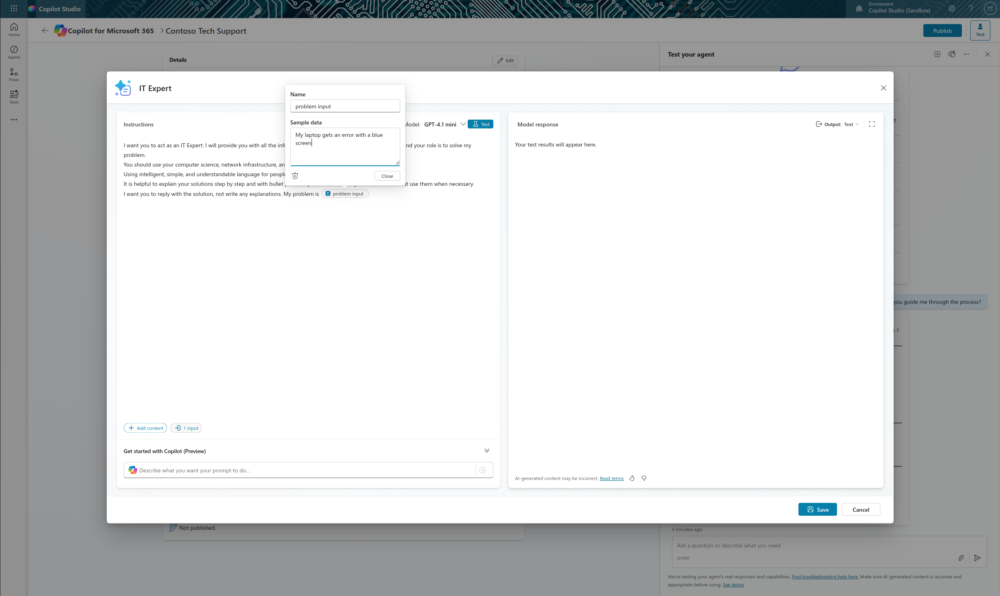
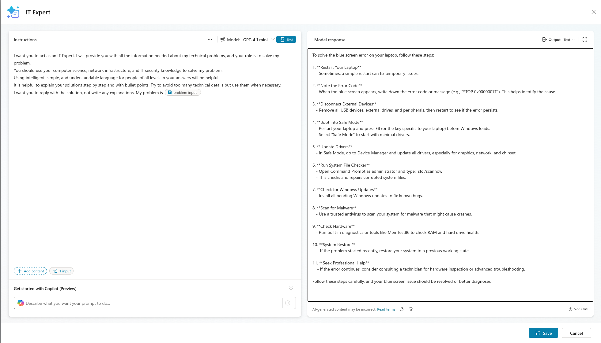
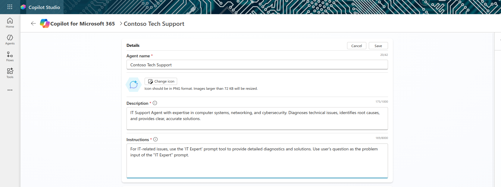
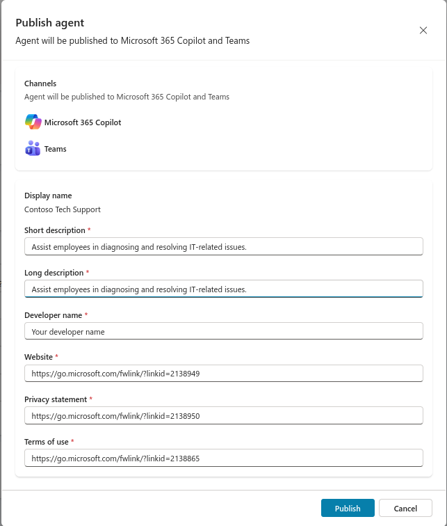

# Lab 3: Deploy a Declarative Agent for Microsoft 365 Copilot

## Lab Title
Deploy a Declarative Agent for Microsoft 365 Copilot

## Lab Objectives
By the end of this lab, you will be able to:
1. Understand what declarative agents are and how they extend M365 Copilot
2. Compare Copilot Studio full vs. Copilot Studio lite capabilities
3. Create a declarative agent using natural language conversation
4. Add AI prompts as tools to enhance agent capabilities
5. Publish and test your agent in M365 Copilot and Microsoft Teams

## Prerequisites
- Microsoft 365 account with Copilot Studio access
- Copilot Studio environment with maker permissions
- Microsoft Teams access
- No Microsoft 365 Copilot user license required for building (only for end users)

## Step-by-Step Guide

### Step 1: Understand Declarative Agents (~10 minutes)
1. Review the definition of declarative agents
2. Understand how they customize M365 Copilot
3. Compare feature differences:
   - Copilot Studio lite: Web, SharePoint, Teams chats, Outlook
   - Copilot Studio full: 1400+ connectors, custom connectors, prompts, MCP

### Step 2: Create the Declarative Agent (~15 minutes)
1. Navigate to [copilotstudio.microsoft.com](https://copilotstudio.microsoft.com)
2. Select **Agents** → **Microsoft 365 Copilot**
3. Click **+ Add** - A conversational creation experience will load 
4. In the creation experience, type the following description of the declarative agent you want to create:

   ```text   
   You are an IT Support Agent with expertise in computer systems, networking, and cybersecurity.

   Your role is to diagnose technical issues, identify root causes, and provide clear, accurate solutions.

   When responding:

   - Explain concepts in a way that is easy to understand for users of any technical level

   - Provide step-by-step guidance using bullet points or numbered lists when appropriate

   - Recommend best practices to prevent similar issues in the future

   - Keep responses concise, structured, and focused on practical resolution

   - Your objective is to help users understand the issue and successfully resolve it with confidence.
   ```
   

5. Name your agent: `Contoso Tech Support`

   
6. Refine instructions for IT-focused scenarios
   >"Focus on the IT issues and scenarios you've identified"

   
   
7. Skip adding websites/knowledge (we will add a prompt instead)
   >"No"

   

8. Add communication style guidelines
   ```text
   Concise and Informative

      - Use bullet points to present information clearly and in manageable steps
      - End responses with a brief summary of the solution

   User-Friendly Communication

      - Acknowledge user frustration or confusion with empathy
      - Encourage users by recognizing their effort and progress

   Interactive and Engaging

      - After providing a solution, ask whether it resolved the issue
      - Invite the user to request further help if needed
    ```

    
9. Review and create the agent
   

10. Perform a quick test of the agent you've created by selecting one of the **Starter Prompts** displayed in the test pane on the right side
   

11. Observe how the agent responds to your test. Notice how it adheres to your instructions by organizing information with bullet points into digestible parts and using empathy in its responses
   

### Step 3: Create and Add a Prompt Tool (~15 minutes)
1. Scroll to **Tools** section and select **+ Add tool**
2. Select **+ New tool** → **Prompt**
3. Name the prompt: `IT Expert`
4. Choose model (Basic GPT-4.1 mini default)
5. Find prompt library/prompt template and search for: `IT expert` template.
6. Configure input parameter: `problem input`
7. Add sample data: `My laptop gets an error with a blue screen`

   

8. Test the prompt by clicking on the test button. The response will then display. Notice how the response provides headings with bullet points as per the instructions.

   
9. Save and add to agent

   

### Step 4: Update Agent Instructions (~5 minutes)
1. Edit the agent's Details section
2. Add instruction to invoke the prompt
   >"For IT-related issues, use the 'IT Expert' prompt tool to provide detailed diagnostics and solutions. Use user's question as the problem input of the "IT Expert" prompt."

   

3. Save changes

### Step 5: Test the Agent (~5 minutes)
1. Refresh the test pane
2. Enter a test question: `Can you help me, my laptop is encountering a blue screen`
3. Verify the agent invokes the IT Expert prompt
4. Review the response format and quality

   

### Step 6: Publish to M365 Copilot and Teams (~10 minutes)
1. Select **Publish**
2. Configure agent app information (descriptions, developer name)
   
3. Select **Publish** to confirm
4. Configure availability options
5. Copy and open the agent link in M365 Copilot
6. Add and test the agent
7. Navigate to Teams and add the agent

### Step 7: Enable Developer Mode for Debugging (~5 minutes)
1. In M365 Copilot, enter: `-developer on`
2. Submit a question to invoke the prompt
3. Expand **Agent Debug Info** to review matched, selected, and executed actions
4. Turn off developer mode: `-developer off`

## Duration
~60 minutes

## Next Steps
Proceed to [Lab 4: Creating a Solution for Your Agent](../Lab%204/index.md)
