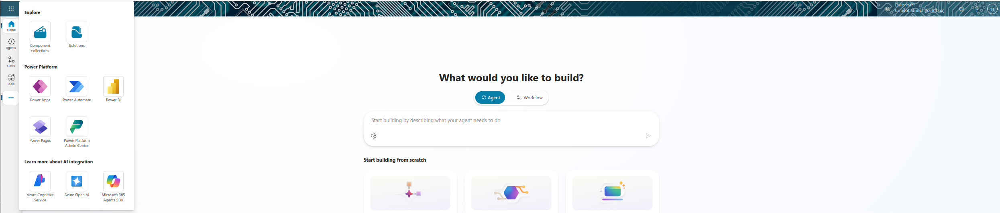
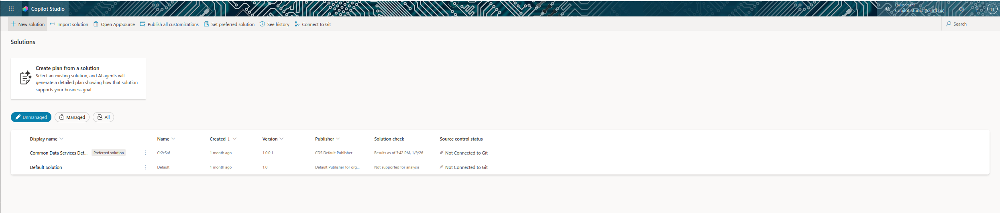
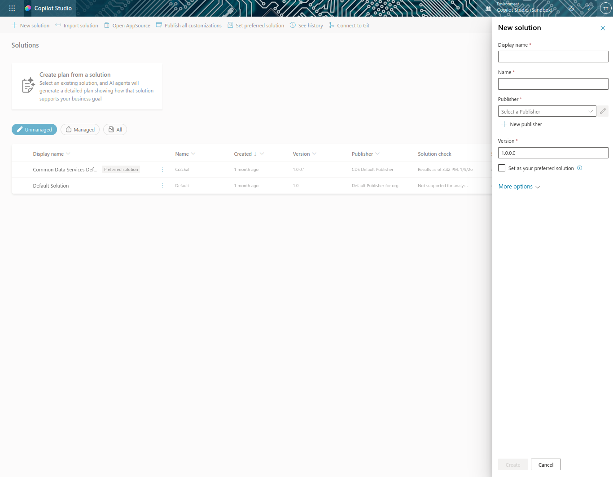
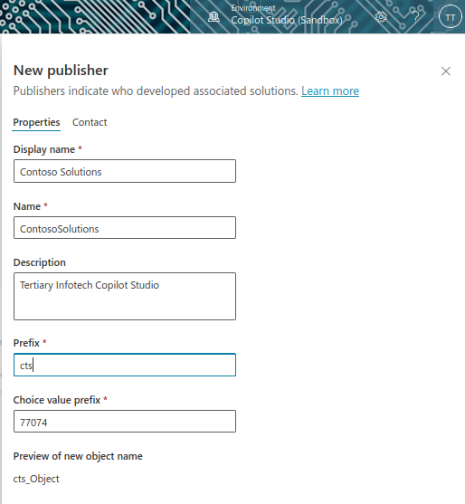
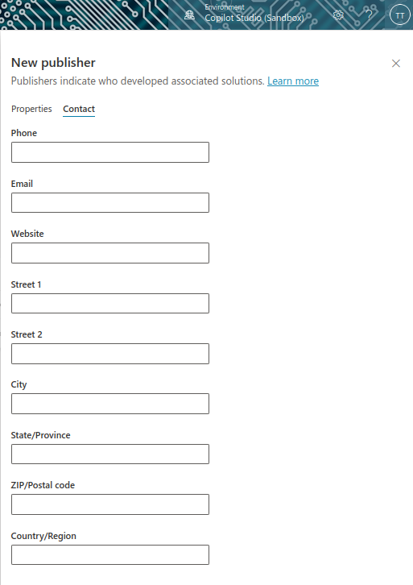
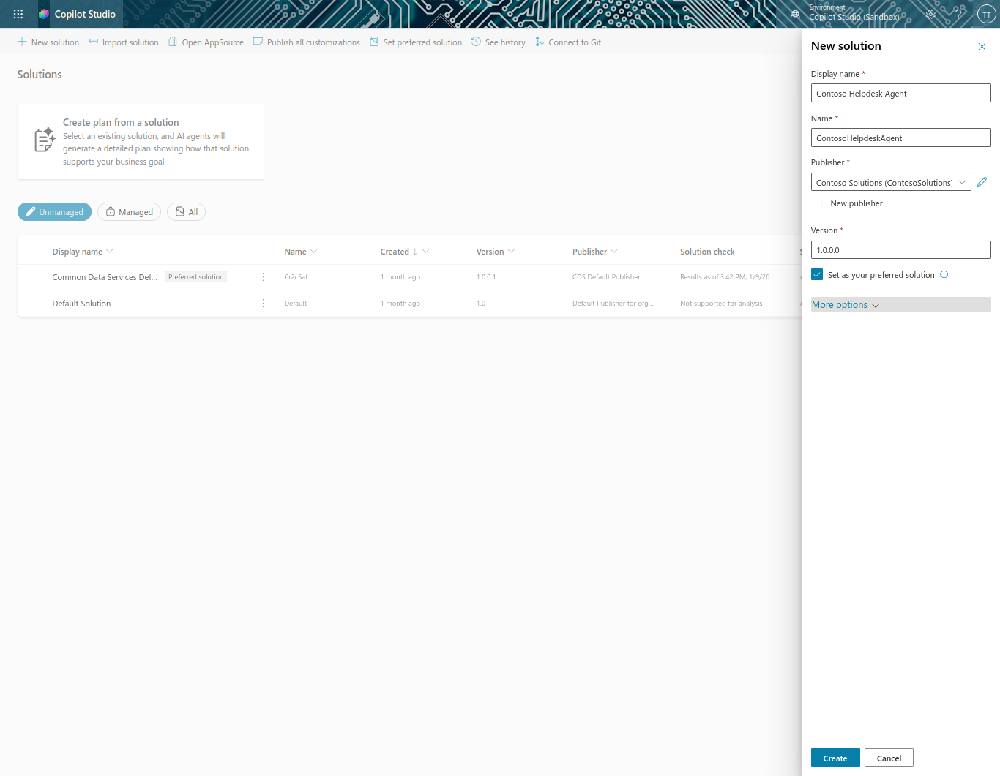
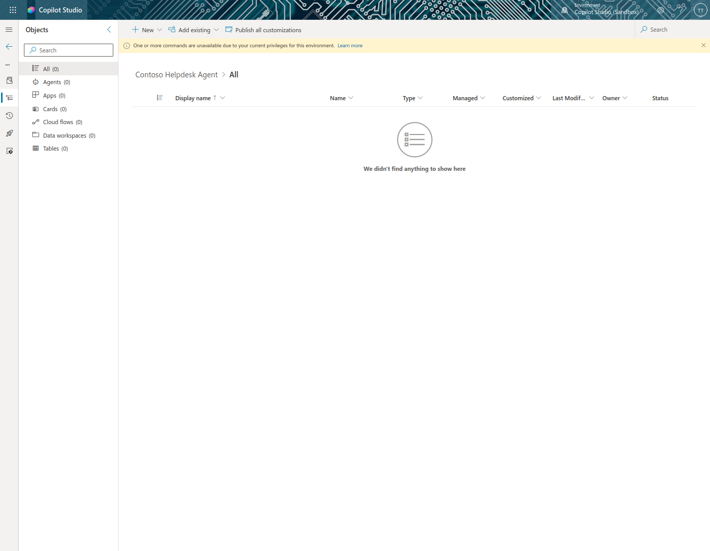
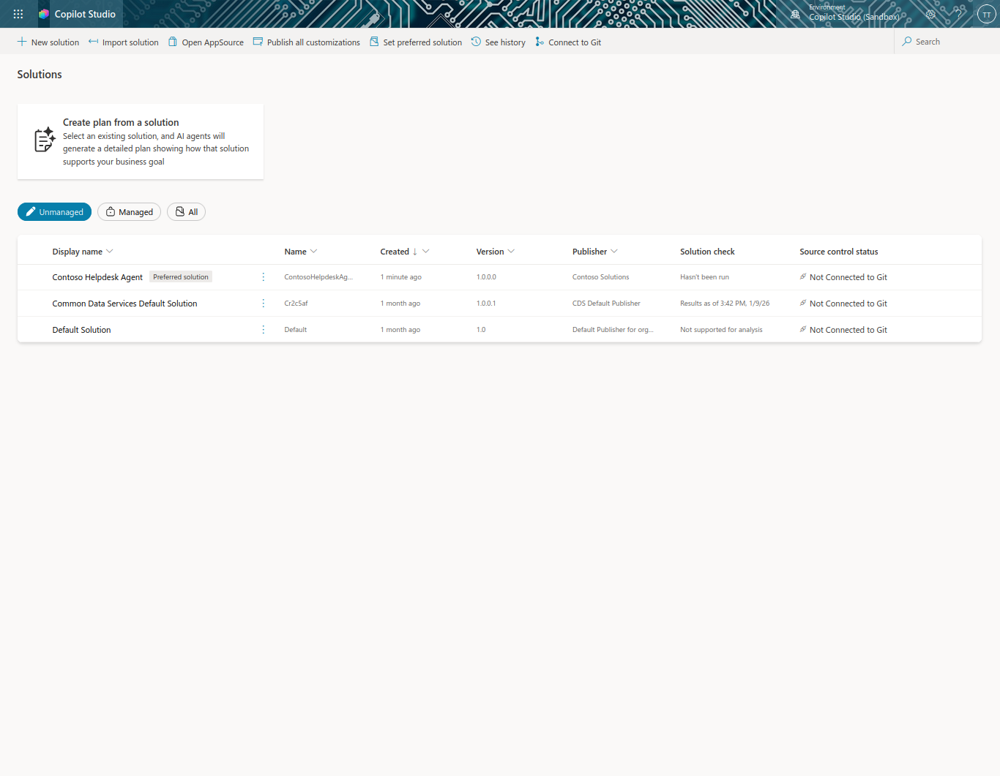

# Lab 4: Creating a Solution for Your Agent

## Lab Title
Creating a Solution for Your Agent - Power Platform ALM

## Lab Objectives
By the end of this lab, you will be able to:
1. Understand what Power Platform solutions are and their purpose
2. Explain the benefits of using solutions for agent development
3. Create a solution publisher with proper naming conventions
4. Create a custom solution for your agent
5. Understand the solution lifecycle from development to production

## Prerequisites
- Microsoft 365 account with Copilot Studio access
- Power Platform environment with appropriate permissions
- One of these security roles: Environment Maker, System Customizer, or System Administrator
- Developer environment (created in Course Setup)

## Step-by-Step Guide

### Step 1: Understanding Solutions (~10 minutes)
1. Review what a Power Platform solution is:
   - Container for apps, agents, tables, flows
   - Essential for Application Lifecycle Management (ALM)
2. Understand solution types:
   - **Unmanaged**: Used during development, freely editable
   - **Managed**: Used for deployment, locked down

### Step 2: Benefits of Using Solutions (~5 minutes)
1. **Organized development**: Keep agent components in one place
2. **Safe deployment**: Export as managed for production
3. **Version control**: Create patches, updates, or upgrades
4. **Dependency management**: Track component relationships
5. **Team collaboration**: Work together effectively

### Step 3: Understanding Solution Publishers (~5 minutes)

A **publisher** is a critical component of Power Platform solutions that represents the organization or entity responsible for creating and maintaining solutions.

**What is a Publisher?**
- A publisher acts as a label or brand for ownership of your solutions and components
- It identifies who created and is responsible for the solution
- Every solution must have a publisher associated with it
- Organizations typically create one publisher per team or department

**The Prefix System**
- A **prefix** is a unique identifier added to all custom components in your solution
- Example: If your prefix is `cts_`, all components will be named like `cts_agentname`, `cts_flowname`, etc.
- The prefix helps avoid naming conflicts when importing multiple solutions
- It makes it easy to identify which solution a component belongs to

**Why Prefixes Matter**

1. **Identification**: Quickly identify components by their prefix (e.g., `cts_` = Contoso Solutions)
2. **Conflict Prevention**: Prevents duplicate component names when importing multiple solutions
3. **ALM Tracking**: Makes it easier to track and manage components across environments
4. **Team Organization**: Different teams can use different prefixes for their solutions

**Example**
- Company: Contoso
- Publisher name: `Contoso Solutions`
- Prefix: `cts` (derived from company name and solutions type)
- Sample component: `cts_HelpdeskAgent`, `cts_ITSupportPrompt`

This naming convention ensures that even if another organization creates a component with the same name, the prefixes prevent conflicts and confusion across your Power Platform environments.

### Step 4: Create a Solution Publisher (~10 minutes)
1. Navigate to Copilot Studio
2. Select **...** → **Solutions**
   
3. Select **+ New solution**
   
4. Select **+ New publisher**
   
5. Configure publisher properties:
   - Display name: `Contoso Solutions`
   - Name: `ContosoSolutions`
   - Description: `Tertiary Infotech Copilot Studio`
   - Prefix: `cts`
   - Choice value prefix: Round to nearest thousand (e.g., 77000)

      
6. Optionally add contact information under contact tab
   

7. Save the publisher

### Step 5: Create a Custom Solution (~10 minutes)
1. Under the New solution pane that appears after you save the publisher, configure solution properties:
   - Display name: `Contoso Helpdesk Agent`
   - Name: `ContosoHelpdeskAgent`
   - Publisher: Select the publisher you just created
   - Version: `
2. Select your new publisher
3. Configure solution details:
   - Display name: `Contoso Helpdesk Agent`
   - Name: `ContosoHelpdeskAgent`
   - Version: `1.0.0.0` (default for new solutions)
4. Check **Set as your preferred solution**
   
5. Select **Create**
6. The solution for Contoso Helpdesk Agent has now been created. There will be zero components until we create an agent in Copilot Studio.
   
7. Press on the **back arrow** icon to verify solution appears in Solution Explorer
    

   

## Duration
~45 minutes

## Next Steps
Proceed to [Lab 5: Using a Pre-Built Agent](../Lab%205/index.md)
