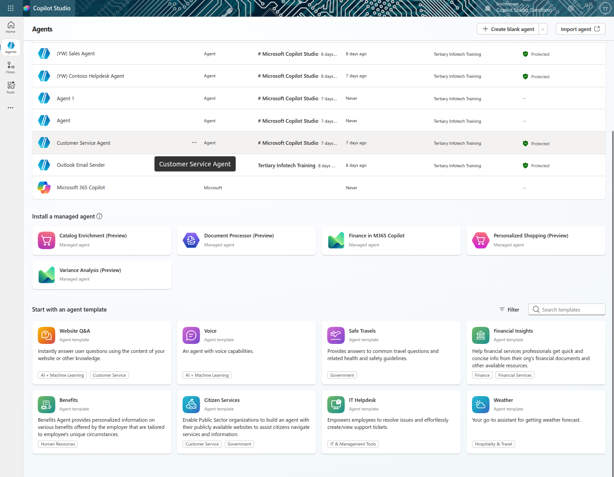
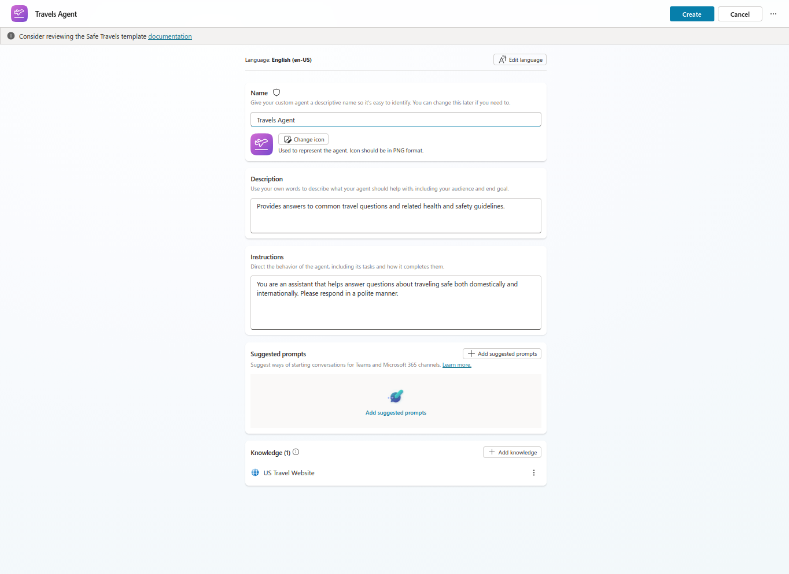
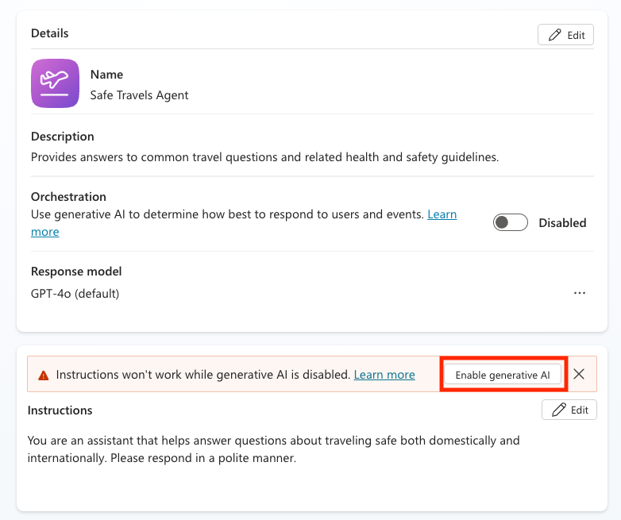
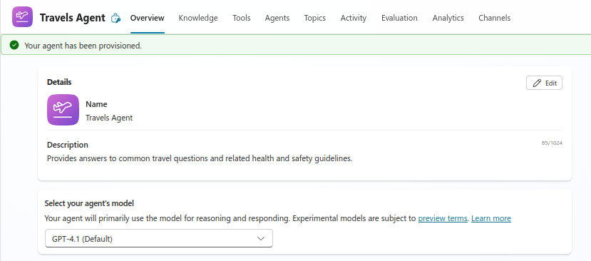
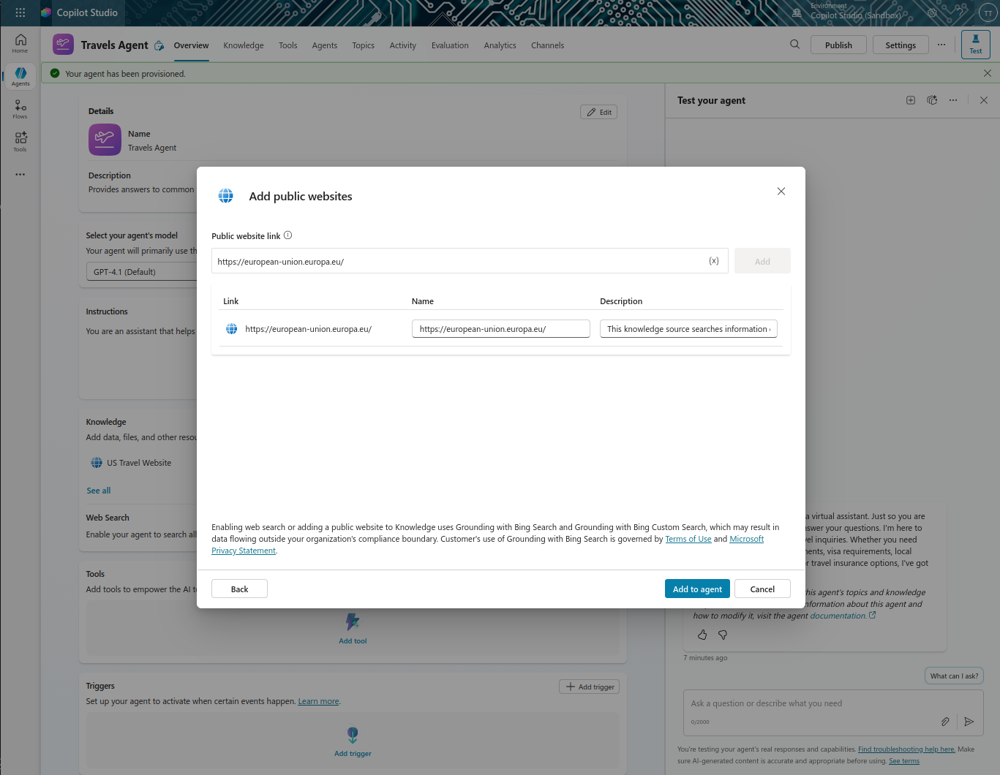
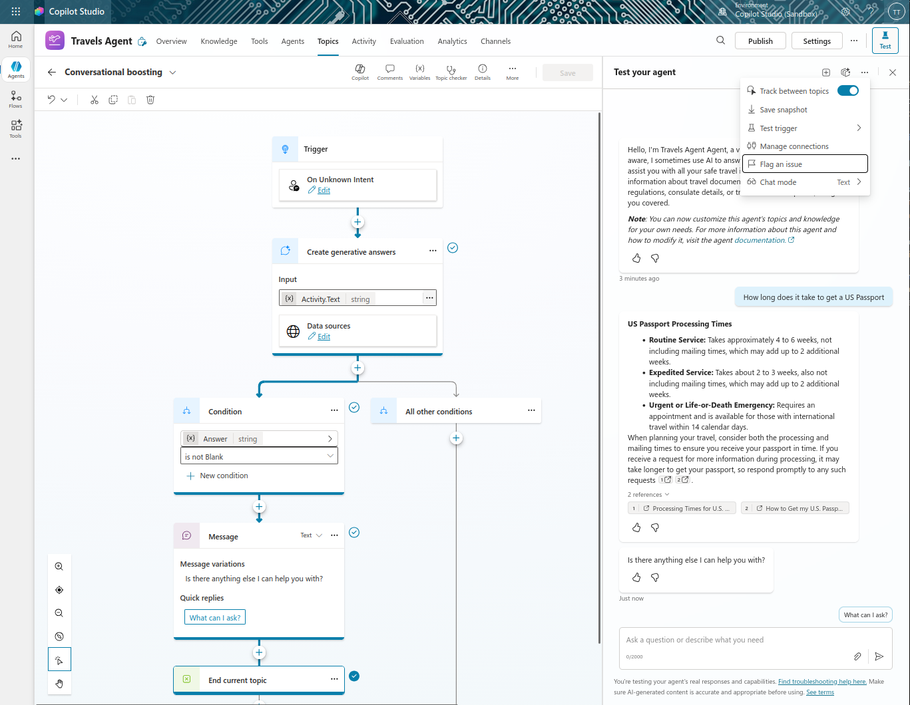
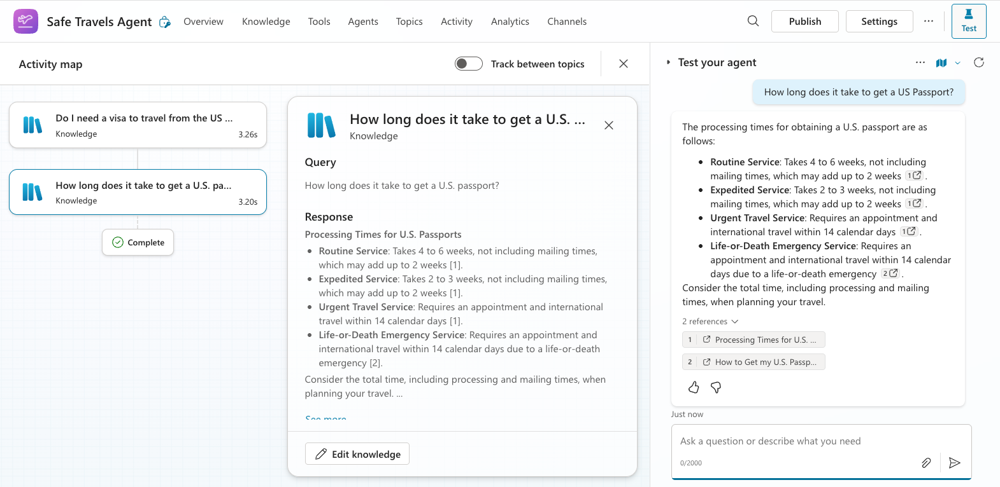

# Lab 5: Using a Pre-Built Agent

## Lab Title
Using a Pre-Built Agent - Quick Start with Templates

## Lab Objectives
By the end of this lab, you will be able to:
1. Understand what pre-built agents (agent templates) are
2. Deploy the Safe Travels agent template
3. Customize the agent with additional knowledge sources
4. Test and validate agent responses
5. Publish the agent to channels

## Prerequisites
- Microsoft 365 account with Copilot Studio access
- Copilot Studio environment with maker permissions
- Completed Lab 4 (Solution created)

## Step-by-Step Guide

### Step 1: Understanding Pre-Built Agents (~5 minutes)
1. Review what pre-built agents are:
   - Turnkey AI agents created by Microsoft
   - Address common business needs (travel, HR, IT support)
   - Include topics, triggers, instructions, and sample knowledge
   - Fully customizable and extendable
2. Explore available templates in Copilot Studio

### Step 2: Deploy the Safe Travels Template (~5 minutes)
1. Navigate to [copilotstudio.microsoft.com](https://copilotstudio.microsoft.com)
2. Select **Agent**
3. Scroll to **Start with an agent template**
4. Find and select **Safe Travels**
   
5. Name your agent: `Travels Agent`
5. The template will come with pre-loaded configuration such as the description, instructions, and knowledge sources.
   
6. Select **Create**

### Step 3: Enable Generative AI (~2 minutes)
1. In the agent Overview, locate the Instruction section
2. Click on the button **Enable generative AI** to turn on generatuve AI capabilities
   
3. If this prompt does not appear, generative AI might be enabled by checking if you have a panel called "Select your agent's model". If you have this panel, generative AI is already enabled.
   

### Step 4: Add Knowledge Sources (~10 minutes)
1. Scroll to the **Knowledge** section
2. Select **Add knowledge**
3. Select **Public websites**
4. Add the European Union travel website:
   - URL: `https://european-union.europa.eu/`
5. Select **Add**
   
6. Select **Add to agent**
7. The agent can now answer questions about European travel

### Step 5: Test the Agent (~5 minutes)
1. Select **Test** in the top-right corner to launch the test window/ it is already open on the right side
2. Try various travel-related questions:
   - `Do I need a visa to travel from the US to Amsterdam?`
   - `How long does it take to get a US Passport?`
   - `Where is the closest US embassy in Valencia, Spain?`
3. Observe the Activity Map to see knowledge source usage
   If the Activity Map is not visible, enable it by selecting the settings (**...**) icon in the test pane and toggling on **Track between topics**.
   >
   **Newer Version**: 
   >
   **Older Version**: 
4. Verify responses are accurate and helpful

### Step 6: Publish the Agent (~3 minutes)
1. Select **Publish** in the top toolbar when ready
2. Confirm by selecting **Publish** in the dialog
3. Wait for the publishing notification
4. Optionally add to Microsoft Teams via Channels

### Bonus: Ground with SharePoint (~Optional)
1. Navigate to Knowledge section
2. Add a SharePoint site with your company's travel policies
3. Test with company-specific travel questions
4. Verify the agent references your internal policies

## Duration
~30 minutes

## Next Steps
Proceed to [Lab 6: Create a Custom Agent Using Natural Language](../Lab%206/index.md)
