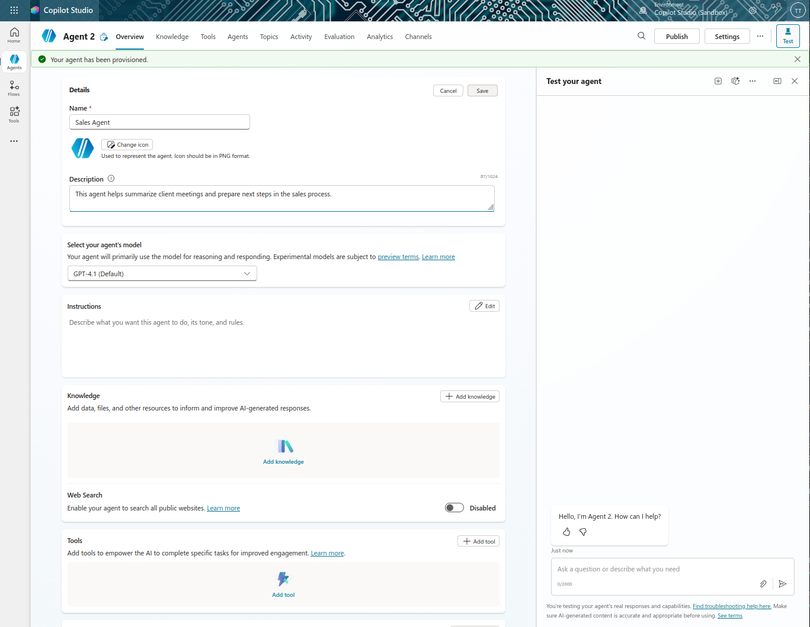
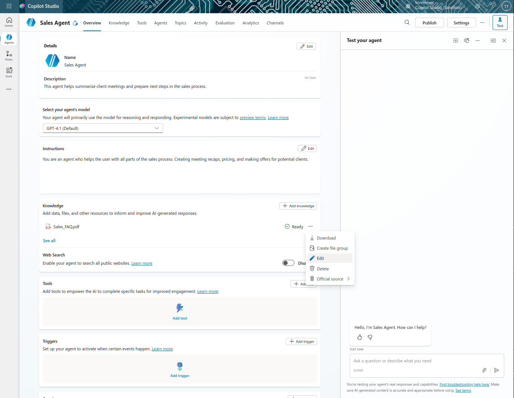
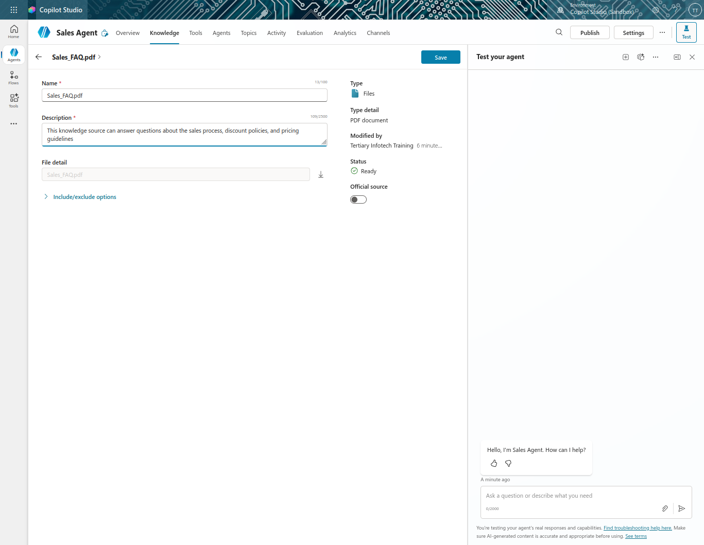
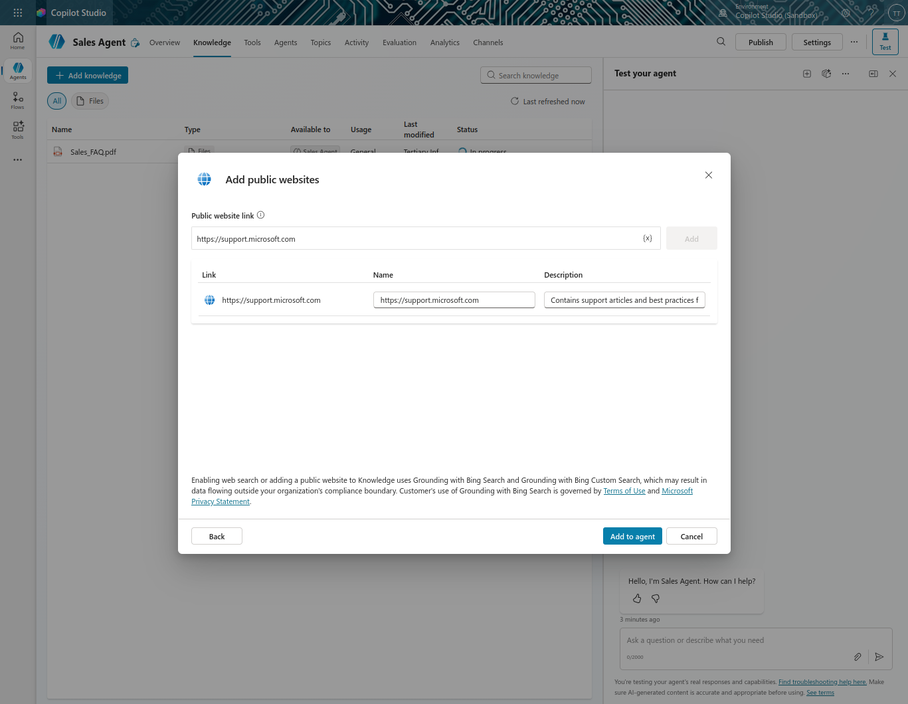
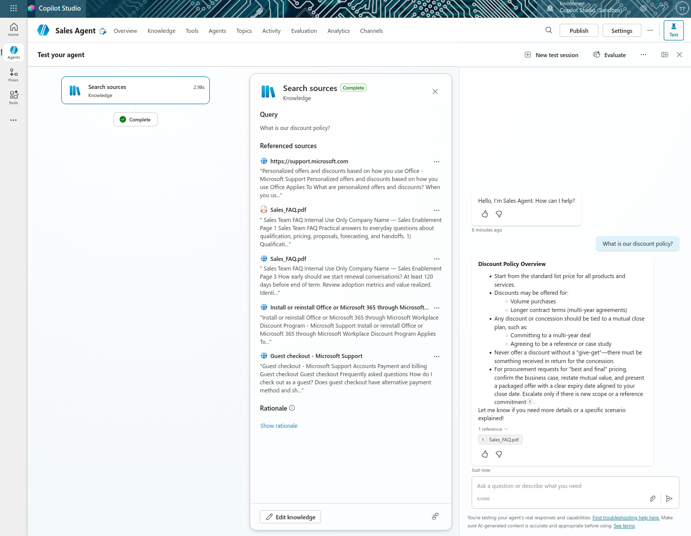

# Lab 6: Create a Custom Agent Using Natural Language

## Lab Title
Create a Custom Agent with Copilot

## Lab Objectives
By the end of this lab, you will be able to:
1. Understand what custom agents are vs. pre-built agents
2. Use natural language prompts to define agent behavior
3. Connect multiple knowledge sources (websites, SharePoint, documents)
4. Ground your agent with enterprise data
5. Test responses with citations from knowledge sources

## Prerequisites
- Microsoft 365 account with Copilot Studio access
- Copilot Studio environment with maker permissions
- SharePoint site with sales documentation (from Course Setup)
- Sample sales FAQ document or knowledge file
- OneDrive or SharePoint for document storage

## Step-by-Step Guide

### Step 1: Understanding Custom Agents (~5 minutes)
1. Review what custom agents are:
   - You define the purpose and behavior
   - You ground with your own data and knowledge sources
   - Full control over personality, instructions, and actions
2. Understand the difference from pre-built agents:
   - Pre-built: Templates with predefined structure
   - Custom: Built from scratch with your specific requirements
3. Explore use cases for custom agents (IT support, sales, HR, etc.)

### Step 2: Create Your Sales Agent (~10 minutes)
1. Navigate to [copilotstudio.microsoft.com](https://copilotstudio.microsoft.com)
2. Select **Agent** in the top-left corner
3. Select **Create blank agent**
4. Enter the following agent details by clicking on the **Edit** button and click on the **save** button after entering each field:
   - **Name**: `Sales Agent`
   - **Description**: `This agent helps summarize client meetings and prepare next steps in the sales process.` 
   
5. In the Instructions section, click on the **edit** button and enter:
   - **Instructions**: "You are an agent who helps the user with all parts of the sales process. Creating meeting recaps, pricing, and making offers for potential clients."

   Click on the **Save** button after entering the instructions.

### Step 3: Add Multiple Knowledge Sources (~20 minutes)
1. Navigate to the **Knowledge** section
2. **Add Knowledge Source 1 - Upload a File**:
   - Select **Add knowledge**
   - Select **Upload a file**
   - Choose your Sales FAQ document and add to the agent
   
   - Select **Add to agent**
   - Wait for status to reach "Ready"
   - Add description by clicking on the **...** button > Edit button: 
   `This knowledge source can answer questions about the sales process, discount policies, and pricing guidelines`
   
   >
   
   - Click on the **Save** button after entering the description.
3. **Add Knowledge Source 2 - Public Website**:
   - Select **Add knowledge**
   - Select **Public website**
   - Enter URL: `https://support.microsoft.com` (or your company sales documentation site) and select **Add**
   - Add description: `Contains support articles and best practices for client solutions`
   
   - Select **Add to Agent**
   - Wait for the knowledge source to reach "Ready"

### Step 4: Test Your Agent with Multiple Knowledge Sources (~15 minutes)
1. Open the **Test** pane on the right side
2. Refresh the test window to load the updated agent with all knowledge sources
3. Test with different types of questions to trigger each knowledge source:
   - **For uploaded file**: `What is our discount policy?`
   - **For website**: `How do I configure a Microsoft product?`
4. Observe the Activity Map to see:
   - Which knowledge sources are being referenced for each query
   - How the agent prioritizes and searches across multiple sources
   - The confidence level of responses
5. Verify responses include:
   - Proper citations from the knowledge sources
   - References to which document/source was used
   - Accurate and relevant information
   

### Step 5: Validate Enterprise Data Grounding (~5 minutes)
1. Verify your agent is properly grounded with enterprise data:
   - Check that the agent references internal documentation
   - Confirm responses include citations to your knowledge sources
   - Ensure the agent doesn't hallucinate or make up information
2. Review the grounding process:
   - Knowledge sources provide the "ground truth" for the agent
   - The agent retrieves information from these sources when responding
   - Citations show users where information came from
3. This enterprise grounding is critical for:
   - Maintaining accuracy and compliance
   - Building trust with users
   - Ensuring consistent company information

### Step 6: Understand the Agentic Pattern (~5 minutes)
1. Review the difference between a chatbot and an agent:
   - **Chatbot**: Responds to questions with knowledge
   - **Agent**: Performs actions, creates documents, sends emails, executes workflows
2. In the next lab, you'll make your agent truly agentic by adding:
   - **Topics**: Structured conversations for specific tasks
   - **Tools**: Power Automate flows that create documents and send emails
3. These components transform your agent from a knowledge assistant into an automation platform

## Duration
~60 minutes

## Next Steps
Proceed to [Lab 7: Add New Topic with Trigger and Nodes](../Lab%207/index.md)
