# Lab 7: Add New Topic with Trigger and Nodes

## Lab Title
Add New Topic with Trigger and Nodes - Structured Conversations

## Lab Objectives
By the end of this lab, you will be able to:
1. Understand what topics are and their purpose in agents
2. Create custom topics with trigger descriptions
3. Use conversation nodes (messages, questions, conditions)
4. Connect to SharePoint using connectors
5. Apply Power Fx for dynamic filtering and logic

## Prerequisites
- Microsoft 365 account with Copilot Studio access
- Sales Agent with knowledge sources from Lab 6
- SharePoint site with devices or product list (from Course Setup)
- Basic understanding of conversation design
- Familiarity with Power Fx formulas (helpful but not required)

## Step-by-Step Guide

### Step 1: Understanding Topics (~10 minutes)
1. Learn what topics are:
   - Structured conversations for specific tasks
   - Guide your AI agent on how to behave for certain requests
   - Allow you to create step-by-step interactions
2. Understand why topics are important:
   - Give agents direction for specific use cases
   - Enable structured data collection
   - Allow branching logic based on user responses
3. Review when to create topics:
   - User wants to create/recap a meeting
   - User needs to submit a request
   - User wants to upload a document
   - Any task with defined steps

### Step 2: Understanding Conversation Nodes (~10 minutes)
1. Learn the available node types:
   - **Send a message**: Display information or instructions to the user
   - **Ask a question**: Collect text input from the user
   - **Condition**: Branch logic based on user responses
   - **Variables**: Store and manage data during conversation
   - **Tools**: Call Power Automate flows, connectors, or prompts
2. Understand node flow:
   - Nodes execute in sequence
   - Questions collect data stored as variables
   - Tools process the collected data
   - Messages display results to the user

### Step 3: Create Your First Topic (~5 minutes)
1. Open your Sales Agent from Lab 6
2. Navigate to **Topics** tab
3. Select **Add a topic** → **From blank**
4. Configure the topic:
   - **Name**: `Meeting Recap`
   - **Trigger description**: `This topic helps users create comprehensive meeting recaps from transcripts. Use this when users ask to recap meetings, summarize transcriptions, or create meeting notes.`
   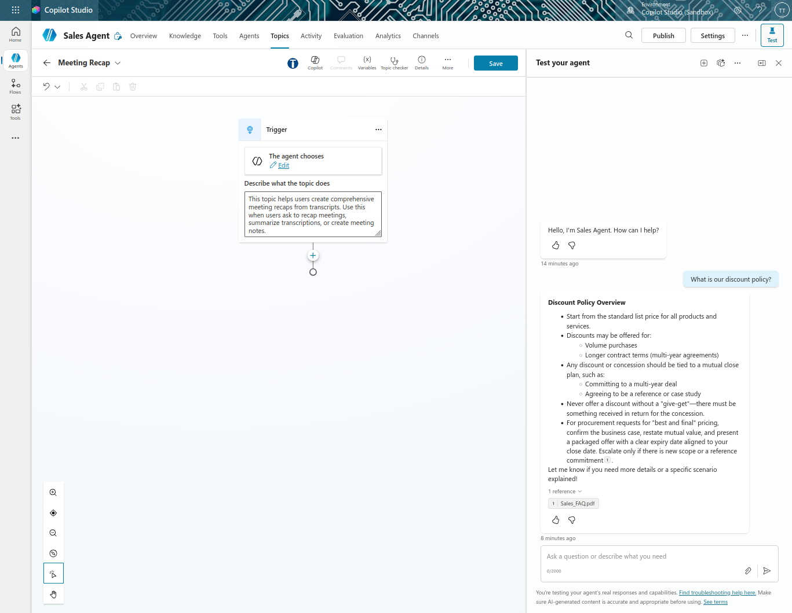

### Step 4: Add Question Node to Collect File (~10 minutes)
1. In the topic editor, select **+** to add a new node
2. Select **Ask a question**
3. Configure the question:
   - **Name**: `Question - Upload transcription` (rename at top)
   - **Message to user**: `Please upload the meeting transcript`
   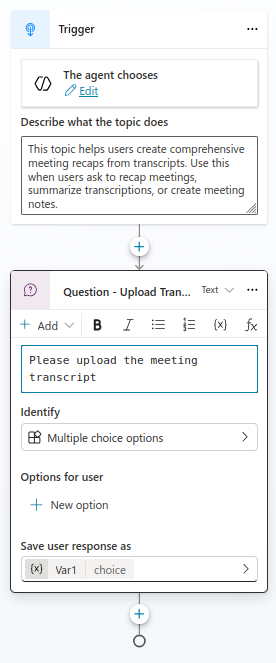
4. Configure the response:
   - Click the identity field to configure
   - Select the variable type as **File**
   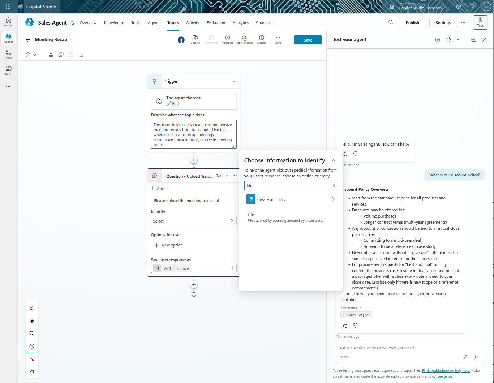
   - Click on the '**Var1**' under "**Save user response as**" to open up the "Variable Properties" pane
   - Name the variable: `transcript` (not v1, always use meaningful names)
   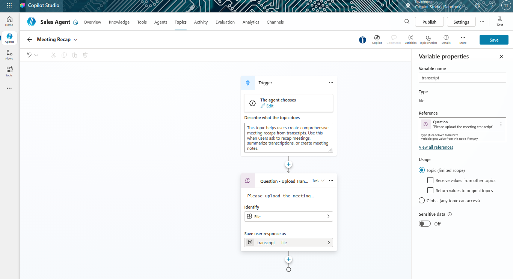

5. This will store the uploaded file as the `transcript` variable

### Step 5: Add Prompt Tool Node (~15 minutes)
1. Select **+** to add another node
2. Select **Add a tool** → **New prompt**
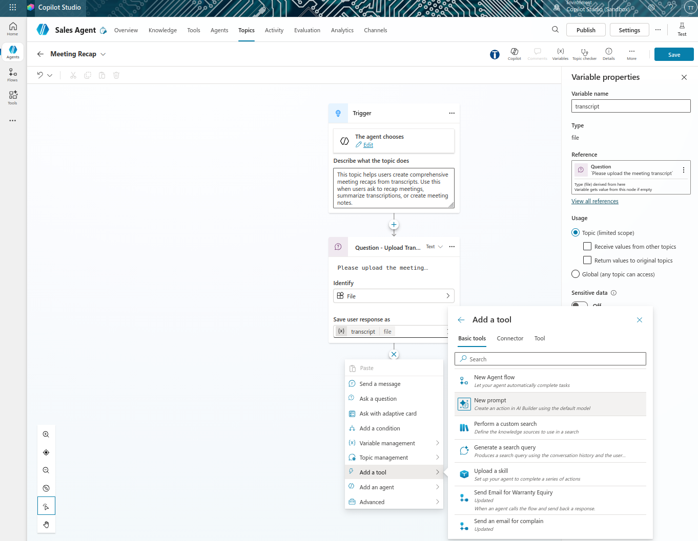
3. Configure the prompt:
   - **Name**: `Create a recap from transcript`
   - **Model**: Basic (GPT-4.1 mini default is fine)
4. In the **Instructions** field, enter:
   ```
   Create a comprehensive recap from this meeting transcript. 
   Include:
   - Key discussion points
   - Decisions made
   - Action items
   - Next steps
   ```
   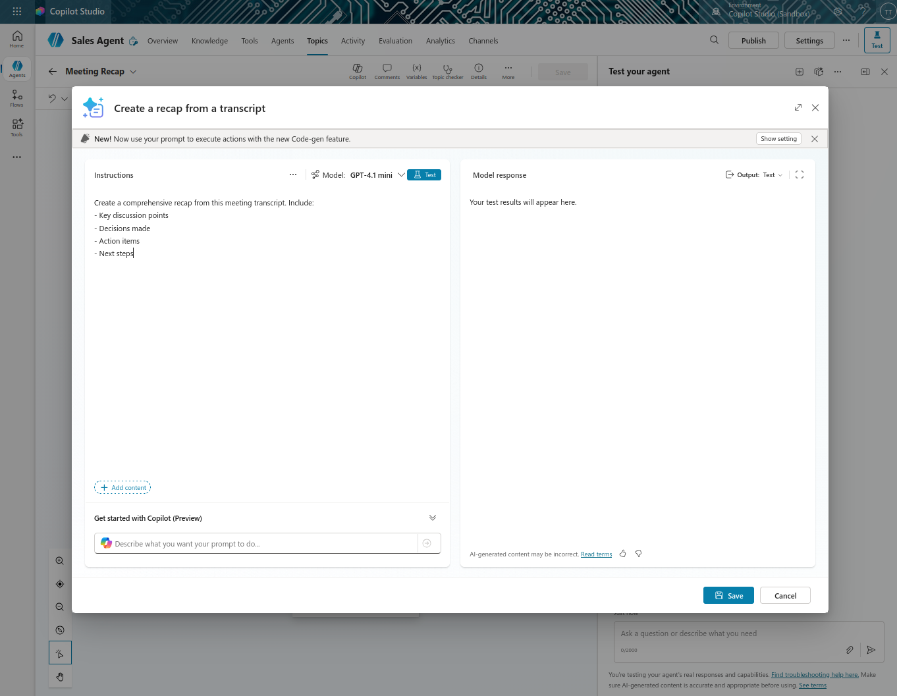
5. Add the transcript as input:
   - Click **Add content** or type `/`
   - Select **Document/Image** 
   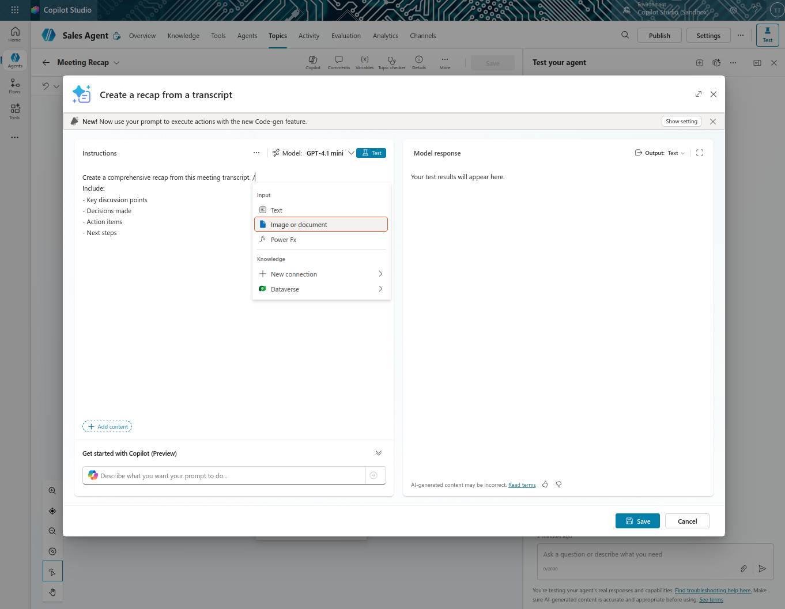
   - Name it: `transcription file`
   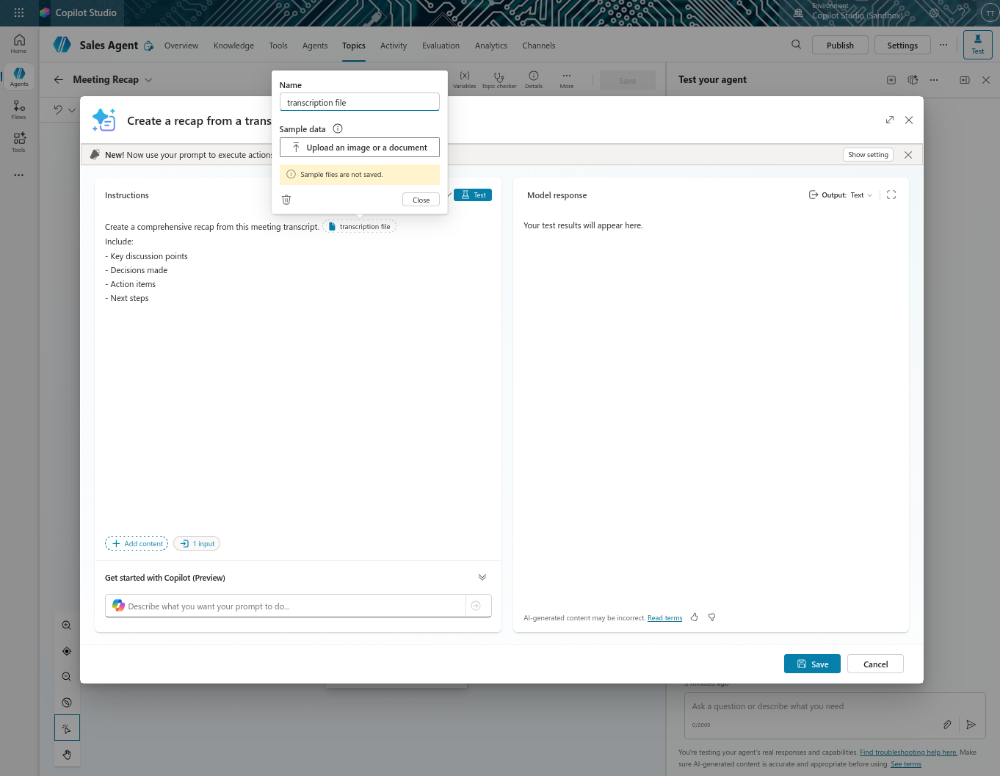
   - Once all these are done, click on the **Save** button.
6. Configure the input and output:
   - Click the three dots(**...**) on **Inputs**
   - Ensure the input parameter is set to `transcript` file
   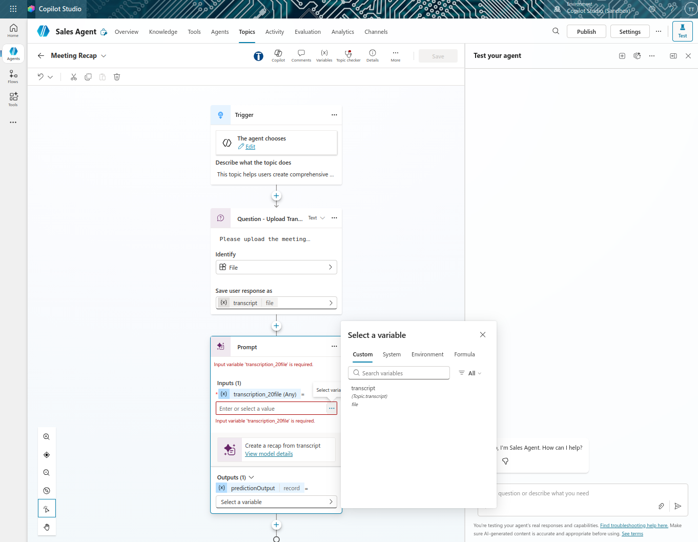
   - For output, Click the three dots (**...**)
   - Click on create a new variable, a variable name '**Var1**' will be created
   
   - Click on the '**Var1**' to open the "Variable Properties" pane
   - Rename it to `recap`
   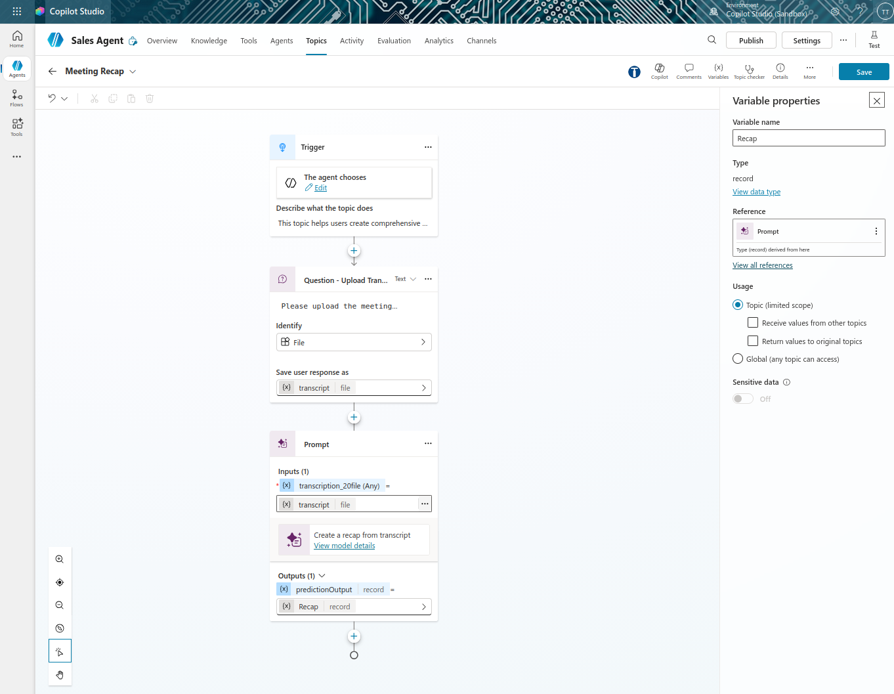

7. Click on the '**X**' button to close the "Variable Properties" pane.

### Step 6: Add Message Node to Display Results (~5 minutes)
1. Select **+** to add another node
2. Select **Send a message**
3. Configure the message:
   - **Name**: `Send message` (optional rename)
   - **Message**: `Here is your recap:`
   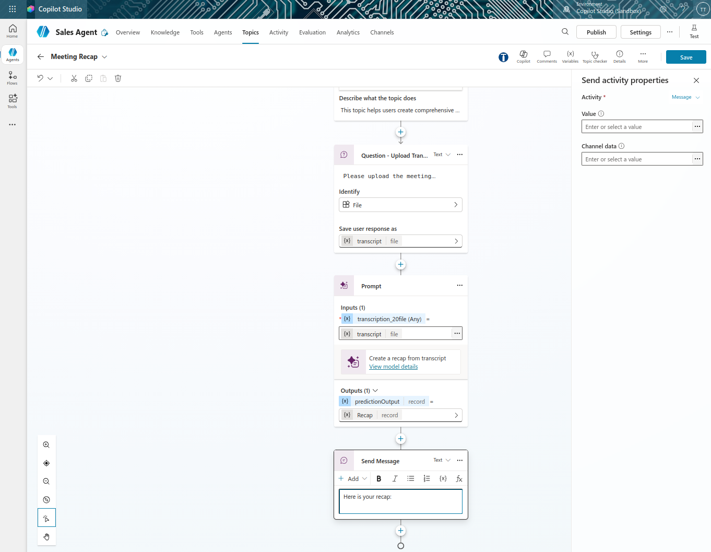
4. Add the recap output:
   - After the colon, click **Insert variable {x}**
   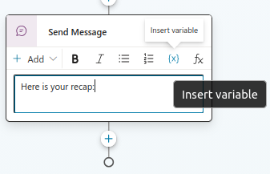
   - Select the `Recap.text` text from the prompt output
   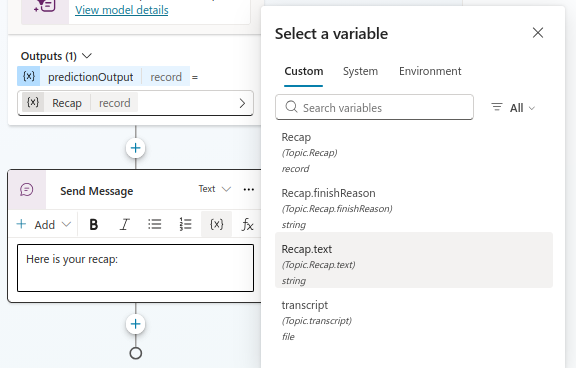
5. The message will now display the recap to the user
   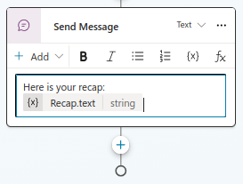
6. Click on the **Save** button at the top right corner to save the topic.
7. Once the topic is saved, there will be a "**Topic saved**" notification at the top.
   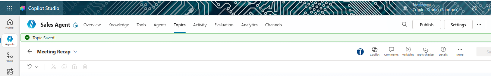

### Step 7: Test Your Topic (~5 minutes)
1. Navigate to the Test pane by clicking on **Test** on the top-right corner
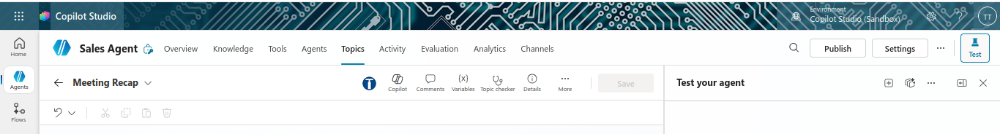
2. Refresh to load the updated agent by clicking on the refresh icon/ start new test session icon

3. Enter a message like: `I want to create a meeting recap from my latest sales meeting`
4. The agent should:
   - Recognize the trigger description and invoke your Meeting Recap topic
   - Ask you to upload a transcript file
   - Upload a sample transcript file
   - Generate and display the recap
5. Review the Activity Map to see the topic execution flow
   

## Duration
~60 minutes

## Next Steps
Proceed to [Lab 8: Add Power Automate Flows for Document and Email Creation](../Lab%208/index.md)
