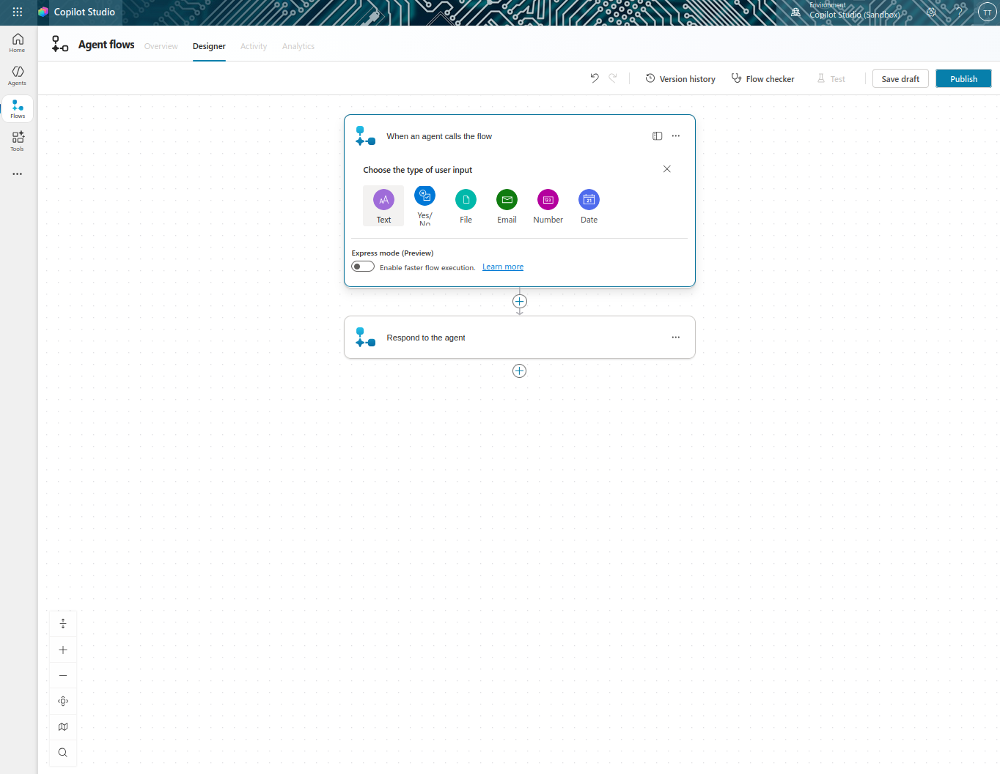
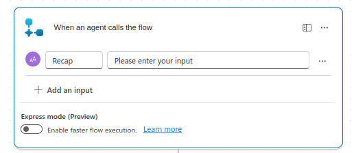
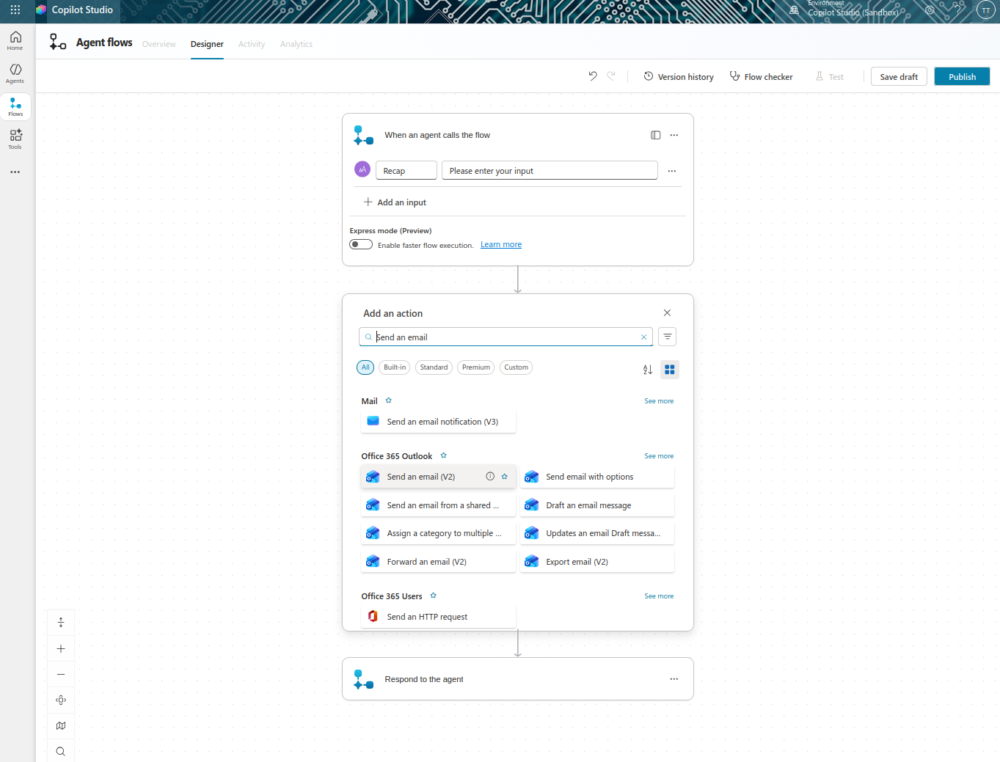
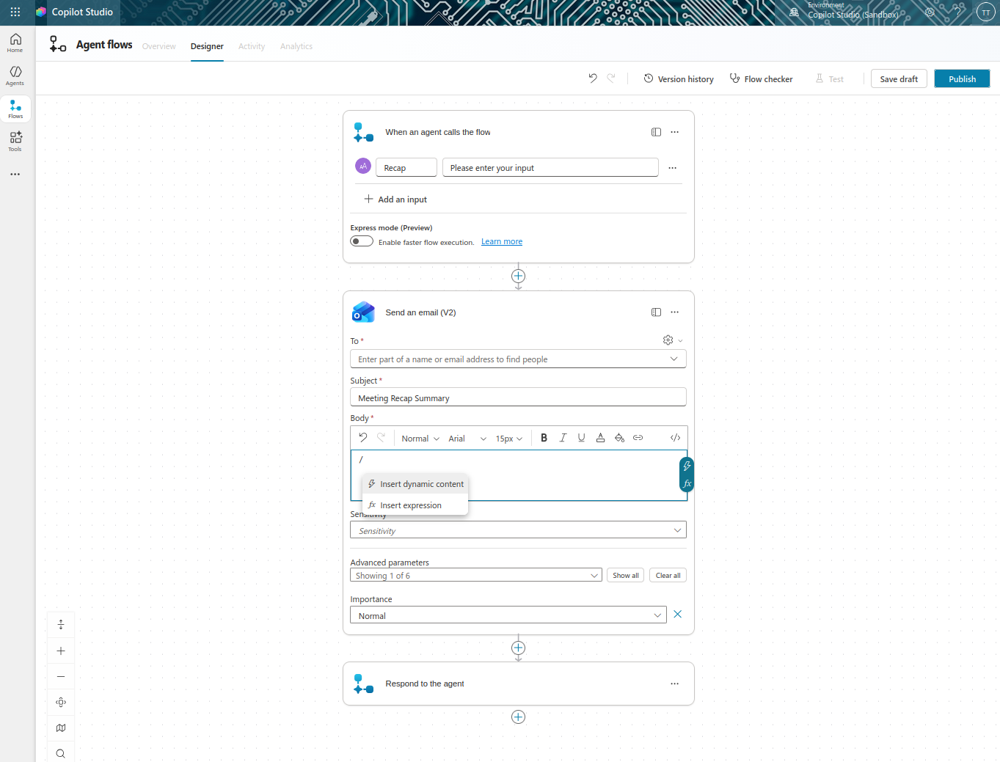
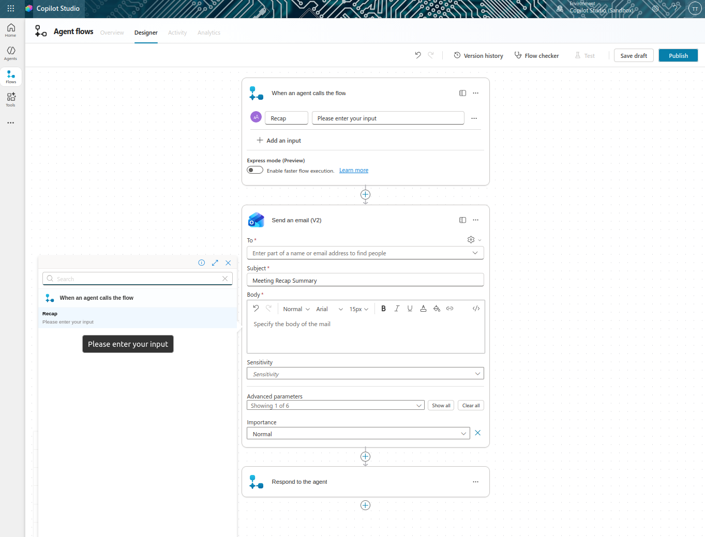
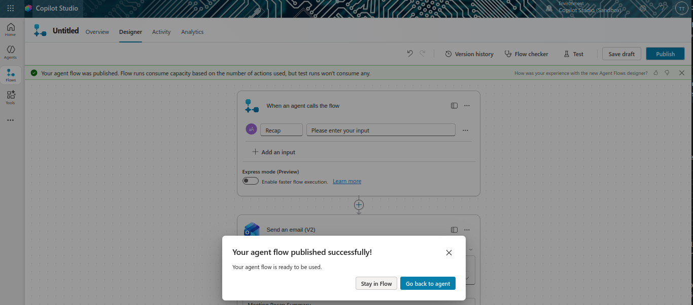
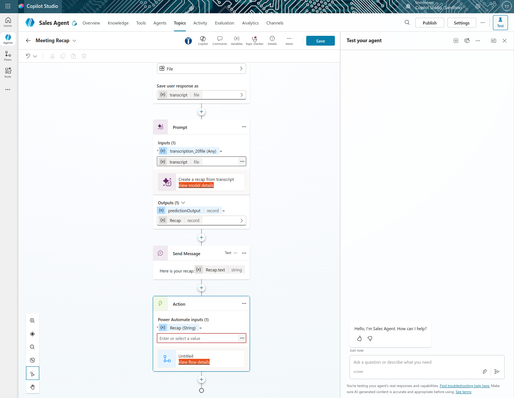
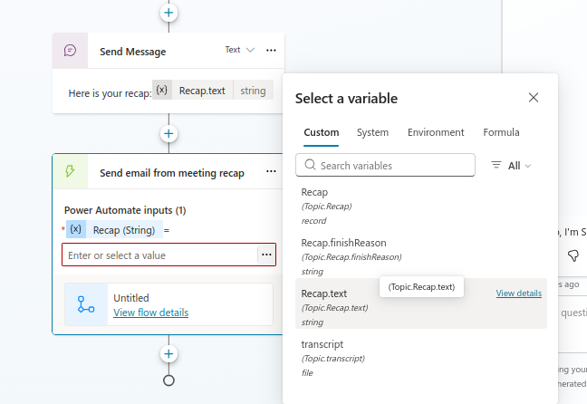
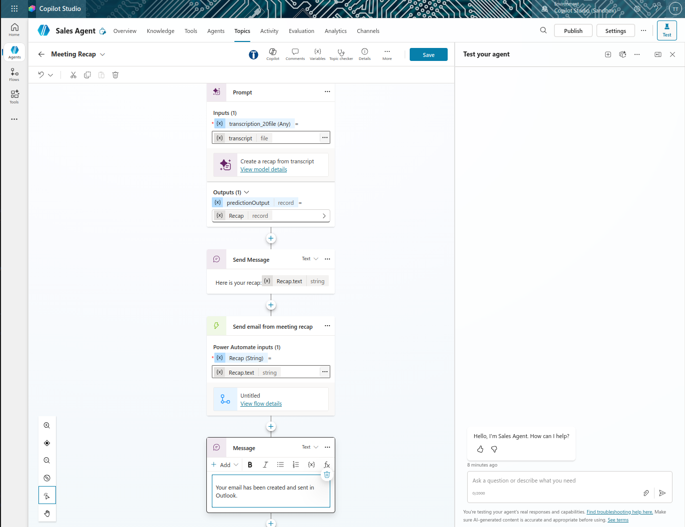

# Lab 8: Add Power Automate Flows for Document and Email Creation

## Lab Title
Add Power Automate Flows for Document and Email Creation

## Lab Objectives
By the end of this lab, you will be able to:
1. Understand what Power Automate flows are and how they integrate with agents
2. Use AI prompts within flows to generate email content
3. Draft and send emails from agent workflows
4. Connect flows to agent topics for end-to-end automation
5. Test complete end-to-end automation workflows

## Prerequisites
- Microsoft 365 account with Copilot Studio access
- Sales Agent with Meeting Recap topic (from Lab 7)
- Outlook access for email sending
- Basic understanding of Power Automate

## Step-by-Step Guide

### Step 1: Understanding Power Automate Flows (~10 minutes)
1. Learn what Power Automate flows are:
   - Automation platform that can perform actions across Microsoft 365
   - Can create documents, send emails, update databases, etc.
   - Reusable across your agent
2. Understand how flows integrate with agents:
   - Called from topics as tools
   - Receive data from the agent (like recap text)
   - Perform actions and return results
   - Enable true automation capabilities
3. Review common actions:
   - Send emails with dynamic content
   - Create documents in OneDrive or SharePoint
   - Update data in databases
   - Call external systems via connectors

### Step 2: Create Your First Agent Flow (~15 minutes)
1. In your Sales Agent, navigate to the **Meeting Recap** topic
2. After the message node that displays the recap, select **+**
3. Select **Add a tool** → **New Agent flow**
4. You'll be taken to Power Automate designer
5. The trigger will be: **When an agent calls this flow**
6. Add an input parameter:
   - Type: **Text**
   
   - Name: `recap`
   
   - This will receive the recap from your agent

### Step 3: Send an Email based on Recap (~10 minutes)
1. Select **+** to add an action
2. Search for **Send an Email**
   
3. Select **Send an email (V2)** from Outlook
4. Configure the email:
   - **To**: Your email address (for testing)
   - **Subject**: `Meeting Recap Summary`
   - **Body**: Use the dynamic content to insert the `recap` variable
      1. Click in the body field
      2. Type '**/**' 
      3. Choose '**Insert dynamic content**'
      
      4. Select the `recap` variable
      

5. Optionally, format the body with HTML for better readability
6. Select **Publish** to save and publish the flow
7. Once published, it will pop up a message panel telling you the flow is published successfully. Press '**Go back to agent**' to return to Sales Agent
   

### Step 5: Connect Flow to Topic (~5 minutes)
1. Return to Copilot Studio
2. You should see the flow added as a tool in your Meeting Recap topic

3. If not visible, refresh the topic view
4. Rename the flow to something meaningful:
   - `Send email from meeting recap`
5. Under '**Power Automate inputs**', map the `recap` input to the variable from the prompt tool that generates the recap
6. Click on the three dots(**...**) and choose '**Recap.text**' from the list

6. Select **Save** on the topic to save your changes
### Step 6: Complete the Topic Flow (~5 minutes)
1. After the tool executes, optionally add a final message:
   - `Your email has been created and sent in Outlook.`
   >
   
2. Save the topic

### Step 7: Test the Complete Email Automation (~10 minutes)
1. Refresh the test pane
2. Trigger the Meeting Recap topic entering a message like: `I want to create a meeting recap from my latest sales meeting`
3. Upload a sample transcript
4. The agent should:
   - Generate the recap
   - Generate an email draft (check Outlook)
   - Display a confirmation message
5. Review the Activity Map to see the entire flow execution
6. Verify the email draft was created successfully in Outlook
7. Review the AI-generated email content for quality and accuracy

## Duration
~35 minutes

## Next Steps
Proceed to [Lab 9: Create Additional Topics - Multi-Topic Agent Design](../Lab%209/index.md)
