# Lab 9: Create Additional Topics and Topics with Conditional Logic

## Lab Title
Create Additional Topics - Multi-Topic Agent Design

## Lab Objectives
By the end of this lab, you will be able to:
1. Understand how to create multiple topics for different agent capabilities
2. Design topics with branching logic and conditions
3. Create different prompts for different use cases
4. Integrate flows across multiple topics
5. Build a complete multi-capability agent

## Prerequisites
- Microsoft 365 account with Copilot Studio access
- Sales Agent with Meeting Recap and Flow (from Labs 6-8)
- SharePoint documents or knowledge sources
- Onedrive for business or SharePoint site with Excel access
- Email access for testing

## Step-by-Step Guide

### Step 1: Understanding Multi-Topic Agent Design (~10 minutes)
1. Learn how to create topics for different use cases:
   - Different topics for different user intents
   - Reuse knowledge and flows across topics
   - Build a complete agent experience
2. Understand topic triggering:
   - Each topic has a description that helps the agent know when to use it
   - Users can explicitly ask for a topic ("create a meeting recap")
   - Agent can intelligently route to topics based on user input

### Step 2: Create an Additional Topic (~10 minutes)
1. In your Sales Agent, add another topic
2. Select **Topics** → **Add a topic** → **From blank**
3. Configure:
   - **Name**: `Price Calculator`
   - **Description**: `This topic helps users calculate prices, create quotes, and provide pricing information for potential clients`
   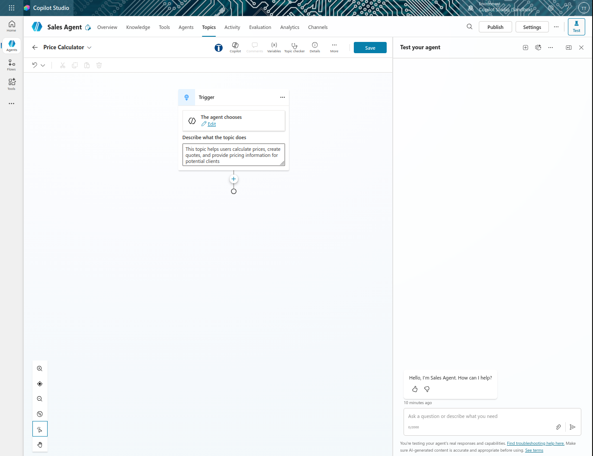

### Step 3: Add Pricing Input with Adaptive Card (~10 minutes)
1. In the Price Calculator topic, add a node
2. Select **Ask with adaptive card**
3. Click on the three dot(**...**) to open Adaptive Card Node Properties
4. Select **Edit adaptive card**
5. In the Adaptive Card Designer, by default it is a blank template
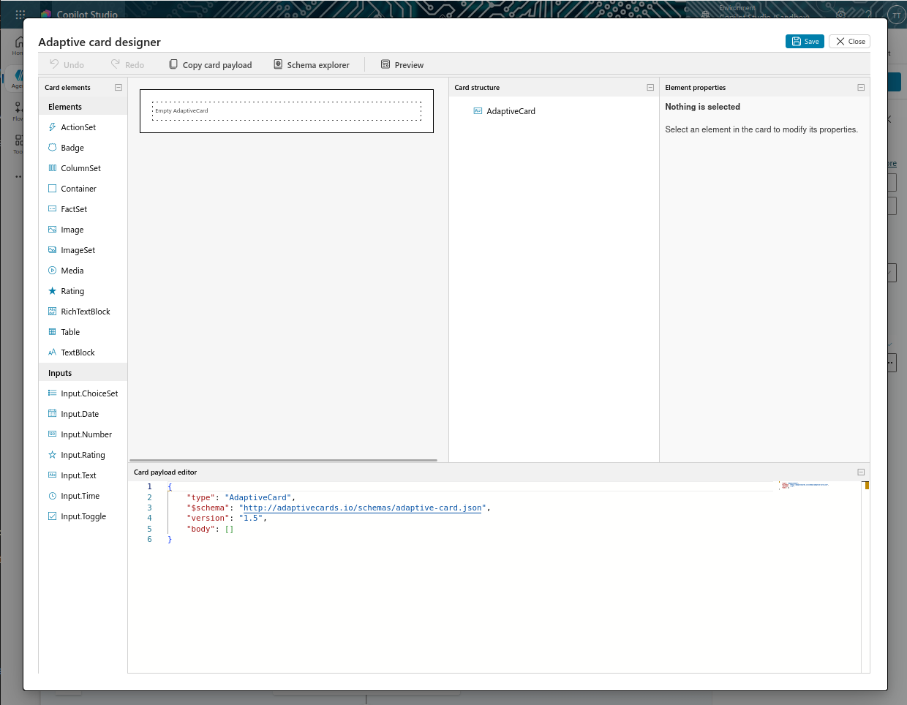
>
4. Configure the card structure:
   - Click on the middle(Under Empty Adaptivecard) to add elements
   - Double click/drag and drop **TextBlock** for the title:
     - Text: `Product Quote Request`
     - Size: `Large`
     - Weight: `Bolder`
     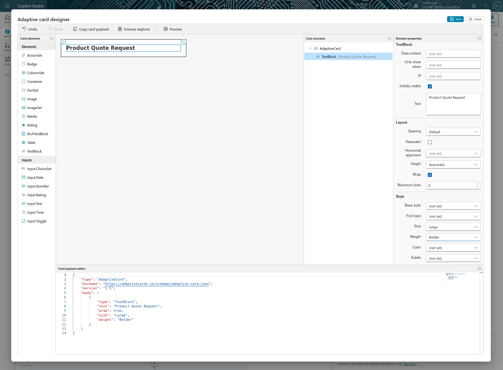
   >
5. Add input fields to the card:
   - **Input 1 - Product Name**:
     - Double click/drag and drop **Input.Text**
     - Label: `Product Name`
     - Placeholder: `e.g., Surface Laptop 5`
     - Id: `productName`
     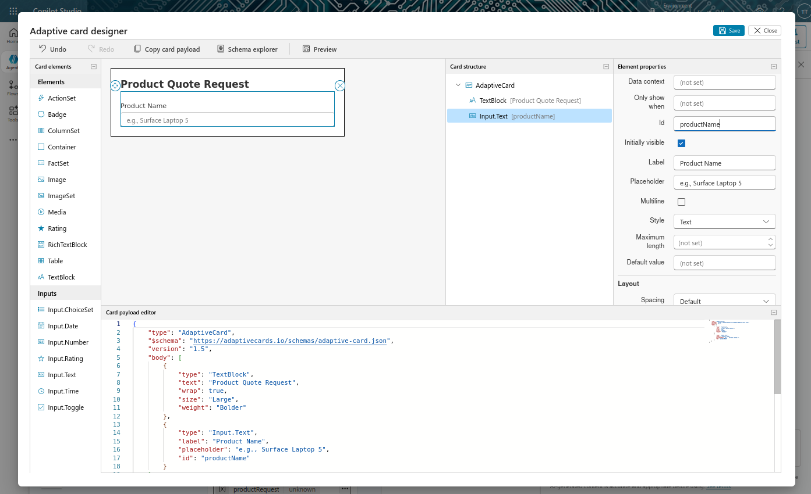
     >
   - **Input 2 - Quantity**:
     - Double click/drag and drop **Input.Text**
     - Label: `Quantity`
     - Placeholder: `Enter quantity`
     - Id: `quantity`
     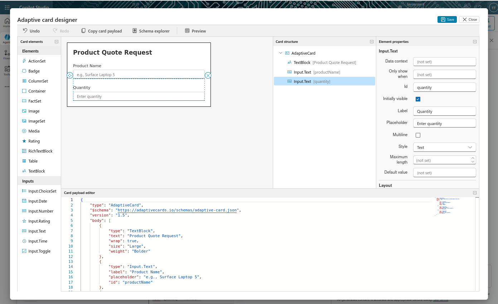
     >
   - **Input 3 - Unit Price** (Optional):
     - Double click/drag and drop **Input.Text**
     - Label: `Unit Price (if known)`
     - Placeholder: `e.g., 1299`
     - Id: `unitPrice`
     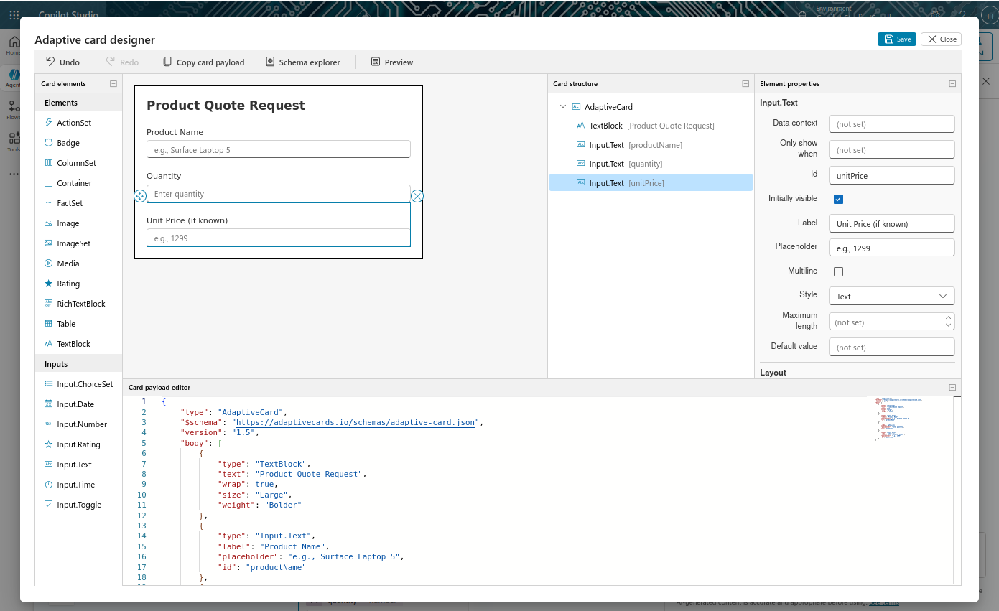
     >
6. Add a Submit button:
   - Double click on **ActionSet**
   - Click on **Add an action** → **Action.Submit**
   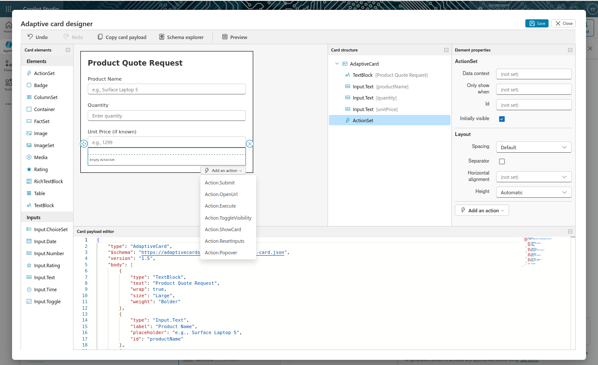
   >
   - Title: `Get Quote`
   - Id: `submitQuote`
   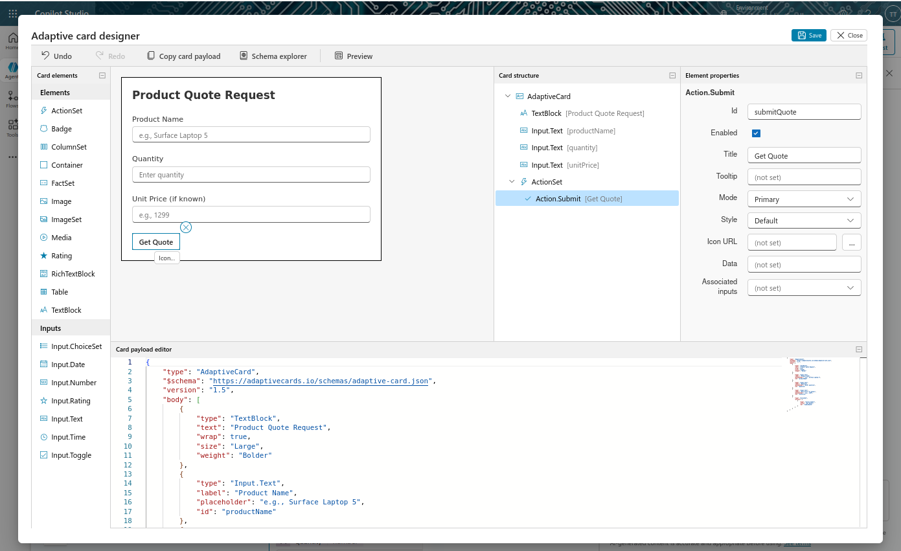
7. Save the adaptive card by clicking **Save** at the top right corner
8. Close the designer and return to the topic
9. Configure the adaptive card response variables:
   - The card will automatically create variables from the input fields:
     - `productName` - from the Product Name input
     - `quantity` - from the Quantity input
     - `unitPrice` - from the Unit Price input
   - These variables will be available for use in subsequent nodes
   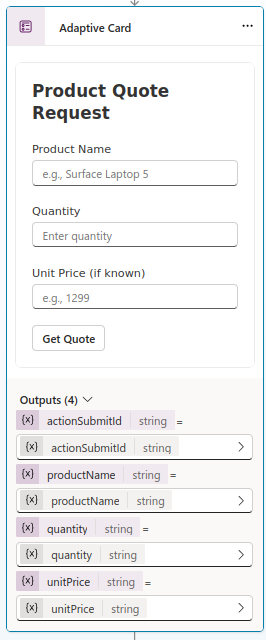
   >


### Step 4: Add a Pricing Prompt Tool (~10 minutes)
1. Select **+** to add a node
2. Select **Add a tool** → **New prompt**
3. Configure:
   - **Name**: `Calculate price and create quote`
   - **Instructions**: 
     ```
      Based on this product request provided, calculate a realistic price quote.
     Include:
     - Product Name /productName 
     - Unit price (use provided price or look up based on product) /unitPrice 
     - Quantity ordered /quantity 
     - Subtotal (Quantity × Unit Price) 
     - Any applicable discount (if quantity > 10, apply 10% discount)
     - Final total price
     - Payment terms suggestion (e.g., Net 30)
     Format as a professional quote with clear formatting.

      Return ONLY valid JSON in the following format.
      Do not include explanations, markdown, or extra text.

      {
      "itemName": "",
      "qty": 0,
      "unitPrice": 0,
      "subtotal": 0,
      "discount": 0,
      "finalTotal": 0
      }
      Rules:
      - subtotal = unitPrice * qty
      - discount = 0 unless qty > 10 then discount = subtotal * 0.10
      - finalTotal = subtotal - discount
      - paymentTerms default "Net 30"
      - note should be empty unless an input is missing or invalid, then explain briefly what is missing.
     ```
   
   >
   - Click **Add content** or type `/`
   - Select **Text**
   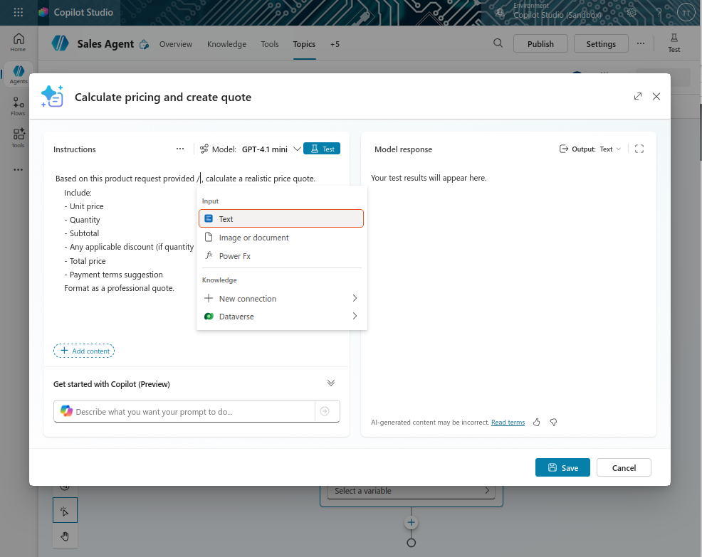
   >
4. Add the adaptive card inputs as content:
   - Name the first input: `productName`
   - Add another content field
   - Name it: `quantity`
   - Add another content field (Optional)
   - Name it: `unitPrice`
      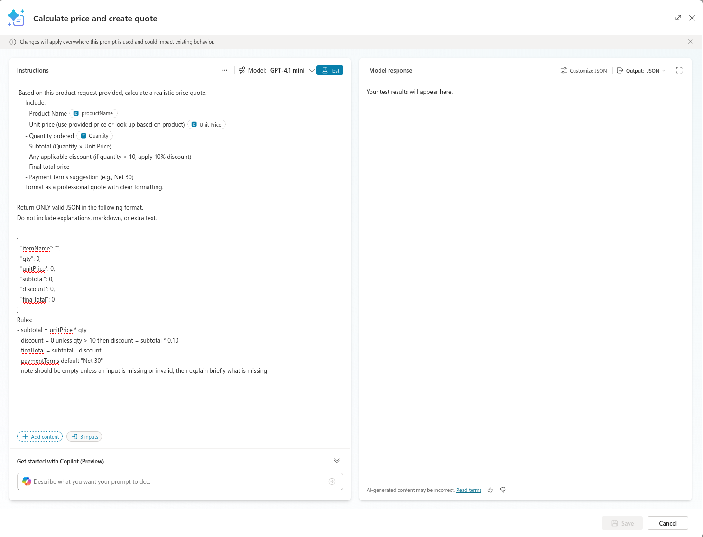
   - Test the prompt by clicking **Test prompt** at the top
   - Review the output and ensure it change the output to JSON format
      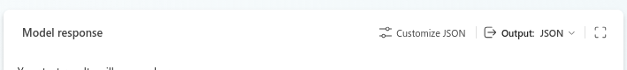
   - Save the prompt by clicking **Save** at the bottom right corner
5. Create output variables for each field:
   - Click the three dots (**...**) on **Inputs**
   - Fill in the respective variable names to match the adaptive card inputs:
     - `productName`
     - `quantity`
     - `unitPrice`
     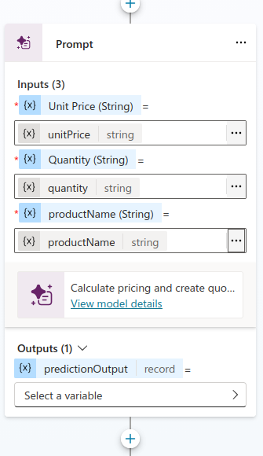
   - Click the three dots (**>**) on **Outputs**
   - Under **Custom**, click on **Create a new variable**
   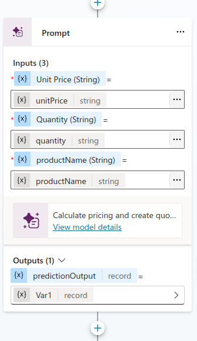
   - Rename the Var1 to `quote`
   - These will be populated by the prompt with the calculated values

### Step 5: Display the Quote (~5 minutes)
1. Add a **Send a message** node
2. Configure:
   - **Message**: `Here is your pricing quote:` followed by a new line and the quote details
   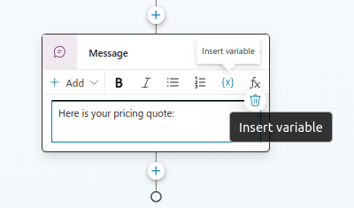
3. Insert the individual variables from the prompt using the insert variable button **{x}**:
   - Product: {x} itemName
   - Quantity: {x} qty
   - Unit Price: ${x} unitPrice

   - Subtotal: ${x} subtotal
   - Discount: ${x} discount
   - Final Total: ${x} finalTotal

   - Payment Terms: {x} paymentTerms
   - Note: {x} note
   
   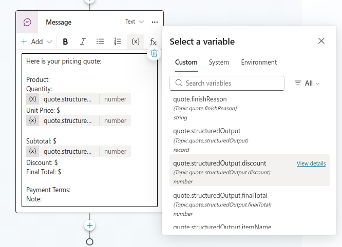
4 . Save the topic by clicking the **Save** button at the top right corner

### Step 6: Prepare the Excel File (One-Time Setup) (~10 minutes)
1. **Create the Excel file outside Copilot Studio first**
2. Go to **OneDrive for business** or **SharePoint Site**
   [Note: You can use either OneDrive or SharePoint for storing the Excel file. Ensure you have edit permissions.
   If you are unsure how to create an Excel file in OneDrive or SharePoint, follow the guide on [Course Setup](../Course%20Setup/index.md)]
3. Create a new file named: `PriceQuote.xlsx`
   
   >
4. Open the file and inside it:
   - Ensure you have a worksheet (default is Sheet1)
   - Create column headers in the first row:
     - **Column A**: Item
     - **Column B**: Quantity
     - **Column C**: Unit Price
     - **Column D**: Total
     - **Column E**: Discount
     - **Column F**: Final Total
     - **Column G**: Payment Terms
     - **Column H**: Note
5. Select the header row and all empty rows below it (e.g., A1:F100)
6. Convert the range into a Table:
   - Highlight the range
   - On the **Insert** tab, select **Table** option
   - A prompt will appear, ensure "My table has headers" is checked
   - Click on **OK**
   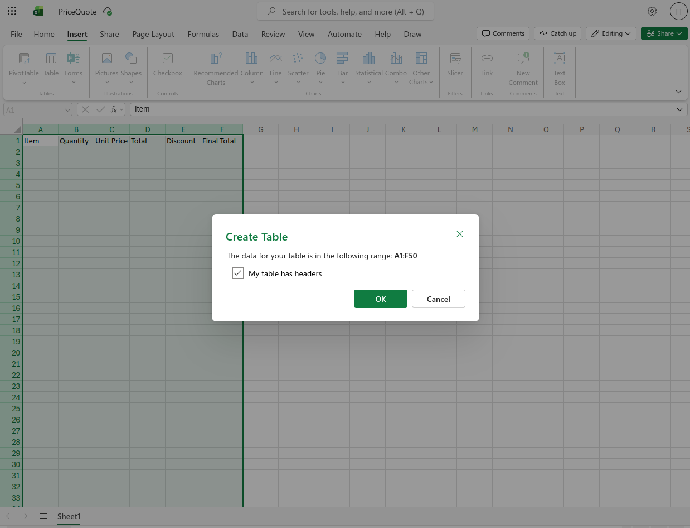
   >
7. Name the table:
   - In the **Table Design** tab, change the name to: `QuoteTable`
   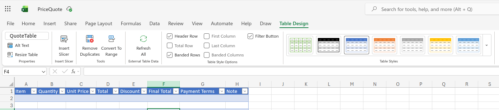
   >
8. Save the file
   - This pre-created table allows Power Automate to insert data into it dynamically

### Step 7: Create a Pricing Flow (~15 minutes)
1. In the Price Calculator topic, add another node after the message
2. Select **Add a tool** → **New Agent flow**
3. In the Power Automate designer:
   - Add inputs from the prompt outputs:
     - `itemName` (Text)
     - `qty` (Text)
     - `unitPrice` (Text)
     - `subtotal` (Text)
     - `discount` (Text)
     - `finalTotal` (Text)
     - `paymentTerms` (Text)
     - `note` (Text)
   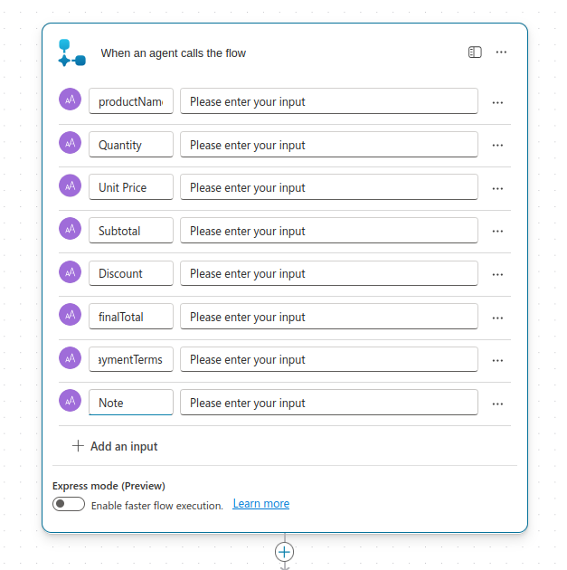
   >
4. Create an action: **Add a row into a table** (from Excel Online)
   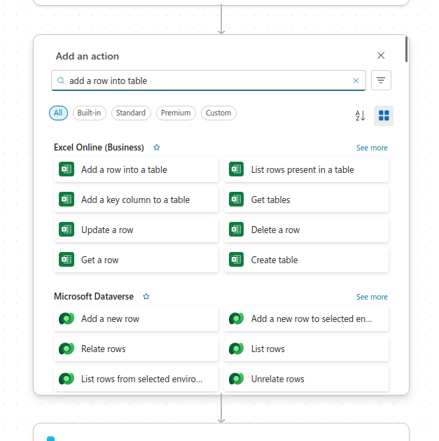
   >
5. Configure the Excel action:
   - **Location**: Select your OneDrive or SharePoint location
   - **Document Library**: Select the library where PriceQuote.xlsx is stored
   - **File**: `PriceQuote.xlsx`
   - **Table**: `QuoteTable`
   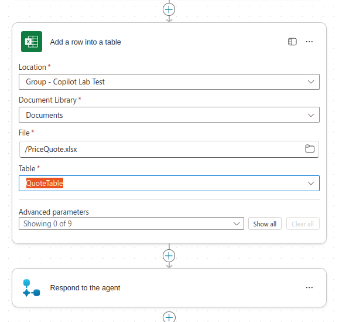
   >
   - Map the fields directly to the Excel columns:
     - **Item**: {x} productName
     - **Quantity**: {x} qty
     - **Unit Price**: {x} unitPrice
     - **Total**: {x} subtotal
     - **Discount**: {x} discount
     - **Final Total**: {x} finalTotal
     - **Payment Terms**: {x} paymentTerms
       - **Note**: {x} note
   
   - No parsing or expressions needed—the prompt already returns segregated, clean data ready for direct insertion
6. Optionally add another action:
   - Use **Send an email** to email the quote details to the user
   - Include a link to the PriceQuote.xlsx file in OneDrive/SharePoint
   - Format the email professionally
7. Save and publish the flow
8. Return to the topic and connect it

### Step 8: Test Both Topics (~5 minutes)
1. Refresh the test pane
2. Test Topic 1 - Meeting Recap:
   - `I want to create a meeting recap`
   - Upload a transcript
   - Verify email draft creation
3. Test Topic 2 - Price Calculator:
   - `Can you calculate a price for me?`
   - Request a quote for a product
   - Verify the price calculation and that it's added to the QuoteTable in PriceQuote.xlsx
4. Check the PriceQuote.xlsx file in OneDrive/SharePoint to verify the data was inserted into the QuoteTable
5. Observe how the agent intelligently routes between topics

### Step 9: Update Agent Instructions (~5 minutes)
1. Navigate to the agent **Overview**
2. Edit the Instructions to include:
   - Reference to the new Price Calculator topic
   - Examples of when to use each topic
3. Save changes

## Duration
~75 minutes

## Next Steps
Proceed to [Lab 10: Create Conditional Logic and Multi-Path Conversations](../Lab%2010/index.md)
