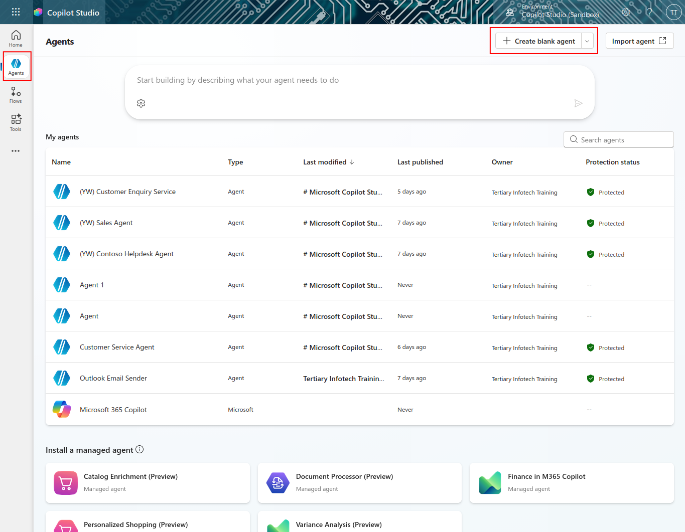

# 🚨 Lab 01: Create a custom agent using natural language with Copilot

## 🕵️‍♂️ CODENAME: `OPERATION AGENT FORGE`

> **⏱️ Operation Time Window:** `~75 minutes`

## 🎯 Lab Brief

Welcome back, Agent Maker. This lab puts you in the command seat of the most powerful capability in Copilot Studio - creating a custom agent from scratch using only natural language… and supercharging it with your own data.

This isn’t just another chatbot. You’re building a knowledge empowered digital coworker - one that can reason, respond, and reference real enterprise info.

Your weapon of choice? Natural language. Your lab? Design, train, and test a fully customized helpdesk agent that answers IT questions using SharePoint, uploaded files, or company URLs.

Let’s build your agent from the ground up.

## 🔎 Objectives

In this lab, you’ll learn:

1. Understanding what custom agents are and how they differ from pre-built templates
1. Creating agents using natural language prompts and conversational design with Copilot
1. Grounding agents with enterprise knowledge sources including SharePoint, documents, and websites
1. Learning about generative orchestration and how agents dynamically search and respond using multiple data sources
1. Building and testing a fully functional IT helpdesk agent that can answer questions from your own data

##
## 🧪 Lab 01: Create a custom agent in Copilot Studio
### 6.1 Creat a agent in copilot studio

> [!WARNING] Copilot questions may differ across sessions
>
> The Copilot conversational creation experience can vary each time where the provided questions for guidance may be slightly different than previously.

1. Navigate to the Agents page of Copilot Studio and click on create blank agent.
    