# Lab 12: Build a Hiring Agent in Copilot Studio

## Lab Title
Build a Hiring Agent - Complete Recruitment Workflow Implementation

## Lab Objectives
By the end of this lab, you will be able to:
1. Create a Hiring Agent that processes job applications
2. Build topics for job enquiries and application collection
3. Implement eligibility conditions for candidate screening
4. Create agent flows to log applications and notify HR
5. Test and validate the complete hiring workflow

## Prerequisites
- Microsoft 365 account with Copilot Studio access
- Copilot Studio environment with maker permissions
- Excel or Dataverse knowledge for logging applications
- Completed Day 1 labs (Topics and Agent Flows)

## Step-by-Step Guide

### Step 1: Create the Hiring Agent (~10 minutes)

1. Navigate to [copilotstudio.microsoft.com](https://copilotstudio.microsoft.com)
2. Select **Agents** → **+ Create blank agent**
3. Select **Edit** under Details
4. Enter the agent details:
   - **Name**: `Hiring Assistant`
   - **Description**: `A professional hiring assistant that collects job applications and routes eligible candidates to HR`
   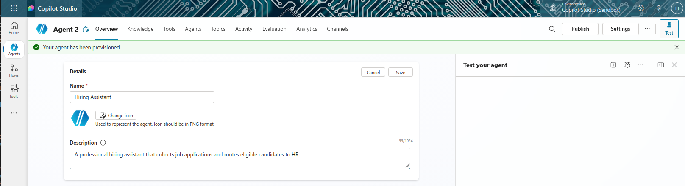
4. Click on **Save** to save the changes
5. Select the input field under Instructions and enter the following system message:

   ```
   You are a hiring assistant for our organization.
   Your role is to help candidates understand our open roles,
   collect their application details professionally,
   and route eligible candidates to the HR team.
   Always be professional, friendly, and encouraging.
   Provide clear next steps to all candidates.
   ```
   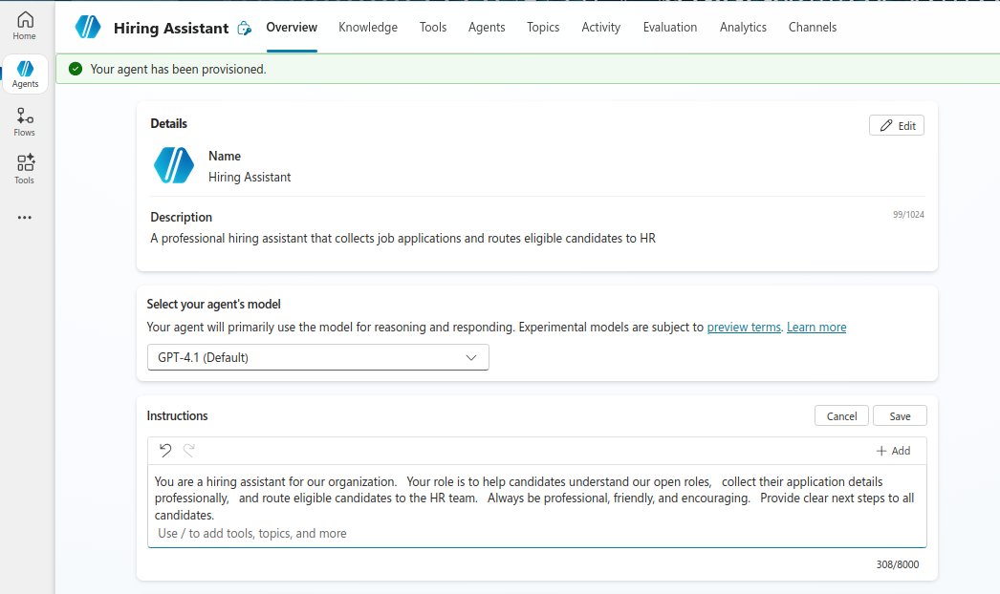

6. Select **Save** to save the instructions.

### Step 2: Create the Job Enquiries Topic (~10 minutes)

1. In your **Hiring Assistant** agent, select **Topics** → **Add a topic** → **From blank**
2. Configure the topic:
   - **Name**: `Job Enquiries`
   - **Description**: 
      ```
      Use this topic when the user asks about:
      - job openings
      - available roles
      - careers
      - open positions
      - hiring or vacancies
      ```
      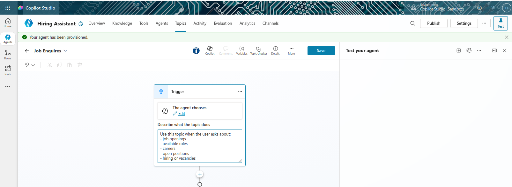
6. Add a **Message** node to describe your open positions:
   ```
   We currently have exciting opportunities available:
   
   • Software Engineer - Requires 3+ years of experience
   • Product Manager - Requires 5+ years of experience  
   • UX Designer - Requires 2+ years of experience
   
   Which role interests you?
   ```
   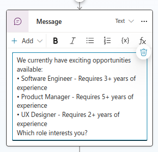
7. Select **Save** at the top-right corner to save the topic

### Step 3: Create the Job Application Topic (~15 minutes)

1. In your **Hiring Assistant** agent, select **Topics** → **Add a topic** → **From blank**
2. Configure the topic:
   - **Name**: `Job Application`
   - **Description**: 
      ```
      This topic collects job application information from candidates.

      Use this topic when the user says things like:
      - I want to apply
      - Apply now
      - Submit application
      - I'm interested in applying
      - Start my application
      ```
      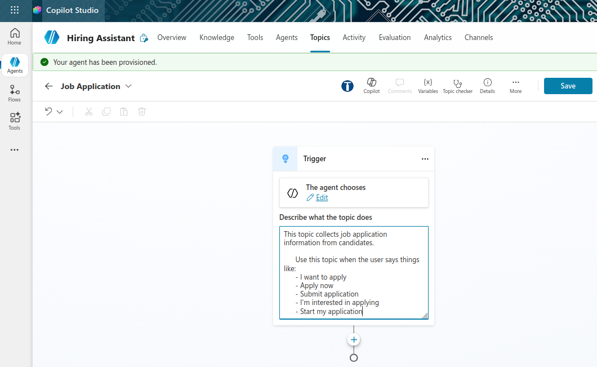

4. Add an initial **Message** node:
   ```
   Great! I'd be happy to help you apply. Let me collect some information about you.
   ```
   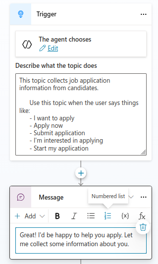
5. Add an **Ask with adaptive card** node to collect all candidate information at once. Select **+** and choose **Ask with adaptive card**:
   
   Configure the adaptive card with the following fields by copying the JSON below to the **Card payload editor**:

   **Adaptive Card JSON:**
   ```json
   {
     "$schema": "http://adaptivecards.io/schemas/adaptive-card.json",
     "type": "AdaptiveCard",
     "version": "1.4",
     "body": [
       {
         "type": "TextBlock",
         "text": "Job Application Form",
         "weight": "bolder",
         "size": "medium"
       },
       {
         "type": "Input.Text",
         "id": "firstName",
         "label": "First Name",
         "placeholder": "Enter your first name",
         "isRequired": true,
         "errorMessage": "First name is required."
       },
       {
         "type": "Input.Text",
         "id": "lastName",
         "label": "Last Name",
         "placeholder": "Enter your last name",
         "isRequired": true,
         "errorMessage": "Last name is required."
       },
       {
         "type": "Input.Text",
         "id": "email",
         "label": "Email Address",
         "placeholder": "Enter your email address",
         "style": "email",
         "isRequired": true,
         "errorMessage": "Email is required and must be valid."
       },
       {
         "type": "Input.Text",
         "id": "phone",
         "label": "Phone Number",
         "placeholder": "Enter your phone number",
         "isRequired": true,
         "errorMessage": "Phone number is required."
       },
       {
         "type": "Input.ChoiceSet",
         "id": "jobRole",
         "label": "Which role are you applying for?",
         "style": "dropdown",
         "choices": [
           {
             "title": "Software Engineer",
             "value": "Software Engineer"
           },
           {
             "title": "Product Manager",
             "value": "Product Manager"
           },
           {
             "title": "UX Designer",
             "value": "UX Designer"
           }
         ],
         "isRequired": true,
         "errorMessage": "Please select a job role."
       },
       {
         "type": "Input.Number",
         "id": "experienceYears",
         "label": "Years of Experience",
         "placeholder": "Enter years of experience",
         "min": 0,
         "isRequired": true,
         "errorMessage": "Please enter your years of experience."
       },
       {
         "type": "Input.ChoiceSet",
         "id": "rightToWork",
         "label": "Do you have the right to work in our country?",
         "style": "compact",
         "choices": [
           {
             "title": "Yes",
             "value": "Yes"
           },
           {
             "title": "No",
             "value": "No"
           }
         ],
         "isRequired": true,
         "errorMessage": "Please indicate your right to work status."
       }
     ],
     "actions": [
       {
         "type": "Action.Submit",
         "title": "Submit Application"
       }
     ]
   }
   ```
   **Save** the adaptive card and **Close** the editor.
   >
   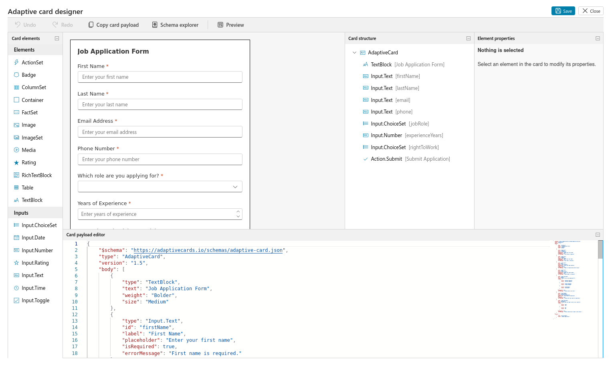
   >
   The variables created will be: `firstName`, `lastName`, `email`, `phone`, `jobRole`, `experienceYears`, `rightToWork` and you should see them under ouputs tab.
   >
   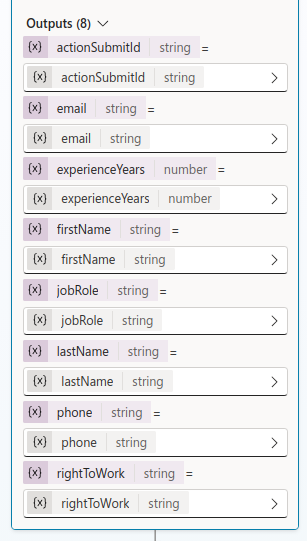
6. Click on the **Save** button at the top-right corner to save the topic incase anything happens in the next steps.

### Step 4: Add Eligibility Condition (~10 minutes)

1. After the questions, select **+** and add a **Condition**
2. Configure the condition:
   - **Left**: `experienceYears` (variable)
   - **Operator**: `is greater than or equal to`
   - **Right**: `2` (value)
   - This condition checks if candidates have 2+ years of experience

3. This creates two branches:

   **If condition is true (Eligible branch):**
   - Leave this branch open for Step 5

   **If condition is false (Ineligible branch):**
   - Select **+** in the false branch
   - Add a **Message** node:
     ```
     Thank you for your interest in joining our company.
     At this time, this role requires a minimum of 2 years of experience.
     We encourage you to reapply in the future as we review all applications
     and may have different opportunities that match your background.
     ```
     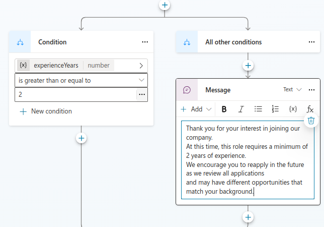
   - Select **Save**

### Step 5: Create Agent Flow for Logging Applications (~15 minutes)

1. Under **Hiring Assistant** topic, left condition true branch, select **+** → **Add a tool** → **New agent flow**
2. Create input variables for the flow:
   - `firstName` (Text)
   - `lastName` (Text)
   - `email` (Text)
   - `phone` (Text)
   - `jobRole` (Text)
   - `experienceYears` (Number)
   - `rightToWork` (Text)
   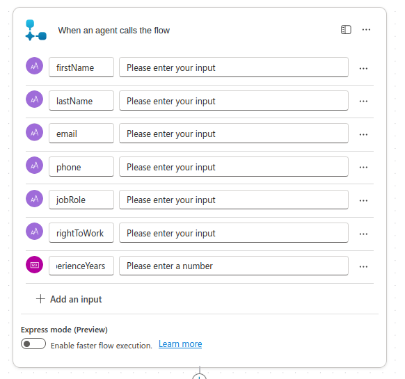
3. Add your first action:
   - Select **+ New step** and search for your data store:
     - For Excel: Search `Excel Online (Business)` → `Add a row into a table`
     - For Dataverse: Search `Dataverse` → `Add a new row`
4. Ensure to setup the Excel File beforehand on **OneDrive for business** or **SharePoint Site** with a table named `JobApplications` with columns(Refer to Lab 9 Step 6 for creating Excel table ../Day%201/Lab%209/index.md):
   ```
   - First Name
   - Last Name
   - Email
   - Phone
   - Role
   - Experience Years
   - Right to Work
   ```
   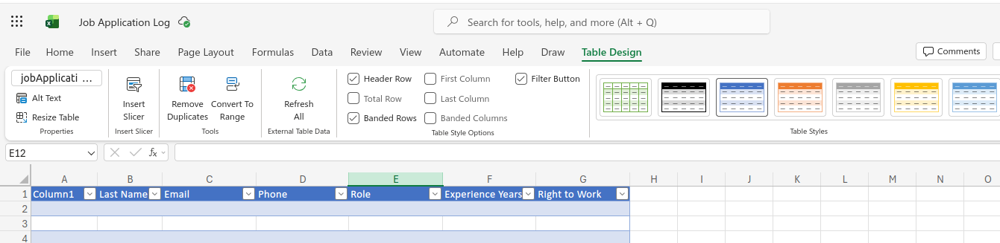
4. Configure the create row action:
   - **Location/Environment**: Select your Excel workbook or Dataverse environment
   - **Table**: Select or create a table called `jobApplications`
   
   - Map the columns:
     - **First Name** column → `firstName` variable
     - **Last Name** column → `lastName` variable  
     - **Email** column → `email` variable
     - **Phone** column → `phone` variable
     - **Role** column → `jobRole` variable
     - **Experience Years** column → `experienceYears` variable
     - **Right to Work** column → `rightToWork` variable
  Note: If you don't see your rightToWork variable in the mapping list, click on "See more" to expand the list of available variables.
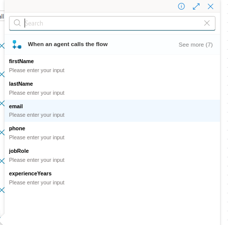 
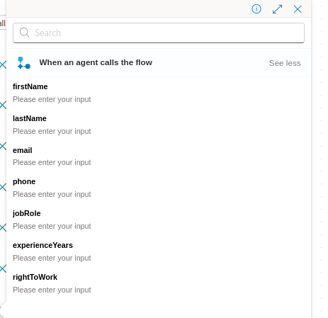
>
The final mapping should look like this:
  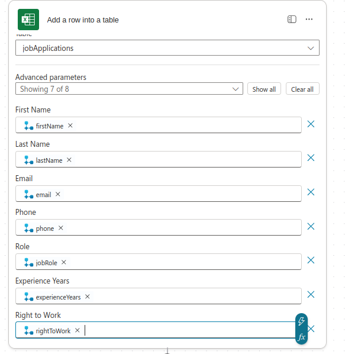
5. Add a second action to notify HR:
   - Select **+ New step** and search for `Office 365 Outlook`
   - Choose **Send an email (V2)**
   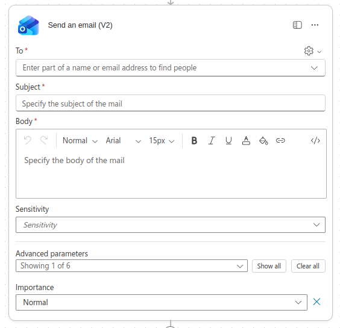
   

6. Configure the email:
   - **To**: `hr@company.com` (or your HR team email)
   - **Subject**: `New Job Application - /jobRole
   - **Body**:
     ```
     A new job application has been submitted:
     
     Name: /firstName /lastName
     Email: @{variables('email')}
     Phone: @{variables('phone')}
     Role: @{variables('jobRole')}
     Experience: @{variables('experienceYears')} years
     Right to Work: @{variables('rightToWork')}
     
     Please review the application in the JobApplications table.
     ```
    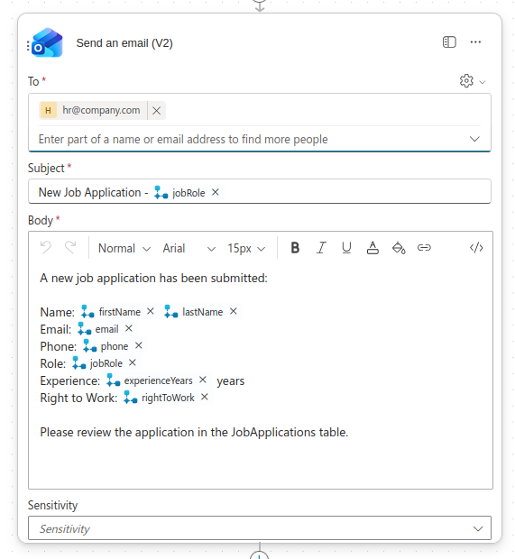
7. Select **Publish** to save and publish the agent flow
8. Go to overview of agent flow and **Edit** the details to give it a proper name and description:
   - **Name**: `Log Job Application`
   - **Description**: `Logs job application details to Excel/Dataverse and notifies HR via email`
  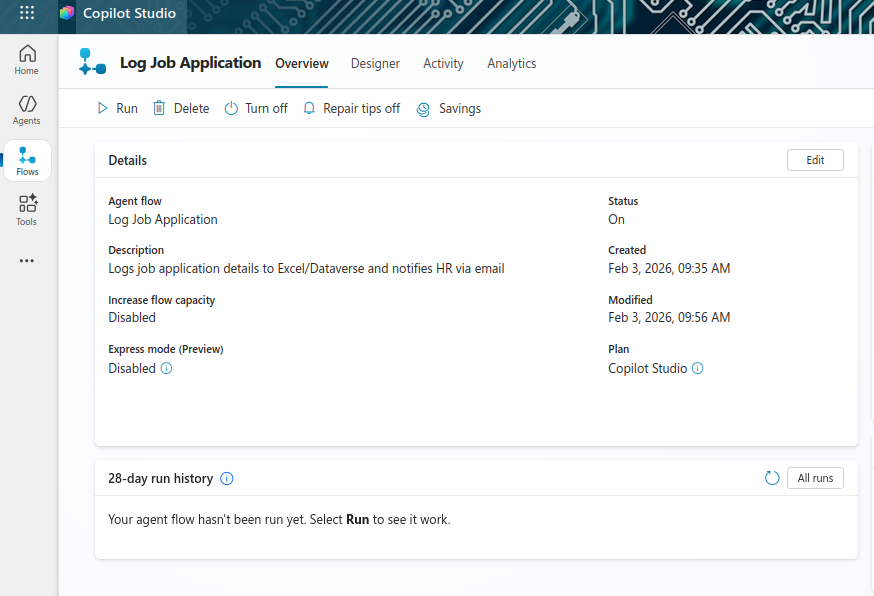
9. Select **Save**

### Step 6: Integrate the Agent Flow into Your Topic (~5 minutes)

1. Go back to the **Job Application** topic
2. In the **true branch** (eligible candidates), select **+** after the condition
3. Select **Add a tool**
4. Choose **Log Job Application** from the list
5. Map the variables from your topic to the flow inputs - they should map automatically:
   - `firstName` → firstName
   - `lastName` → lastName
   - `email` → email
   - `phone` → phone
   - `jobRole` → jobRole
   - `experienceYears` → experienceYears
   - `rightToWork` → rightToWork
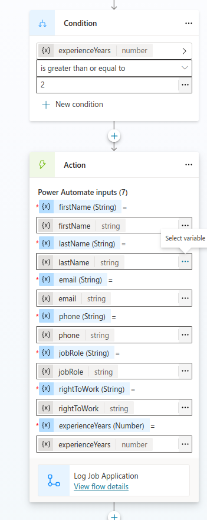
6. Select **Save**

### Step 7: Add Confirmation Message for Eligible Candidates (~5 minutes)

1. In the **true branch** (eligible candidates), select **+** after the agent flow call
2. Add a **Message** node:
   ```
   Thank you for applying, /firstName! 
   
   We've received your application for the /jobRole position.
   Our HR team will review your information and contact you within 3-5 business days.
   We appreciate your interest in joining our team!
   ```
   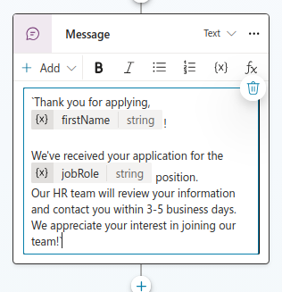
3. Select **Save**

### Step 8: Test Your Hiring Agent (~10 minutes)

1. Select **Test** in the top-right corner of your agent
2. Trigger the Job Application topic by typing: `I want to apply for a job`
3. Complete the application form with test data:
   - First Name: `John`
   - Last Name: `Doe`
   - Email: `john.doe@example.com`
   - Phone: `555-1234`
   - Role: `Software Engineer`
   - Experience: `5`
   - Right to Work: `Yes`
   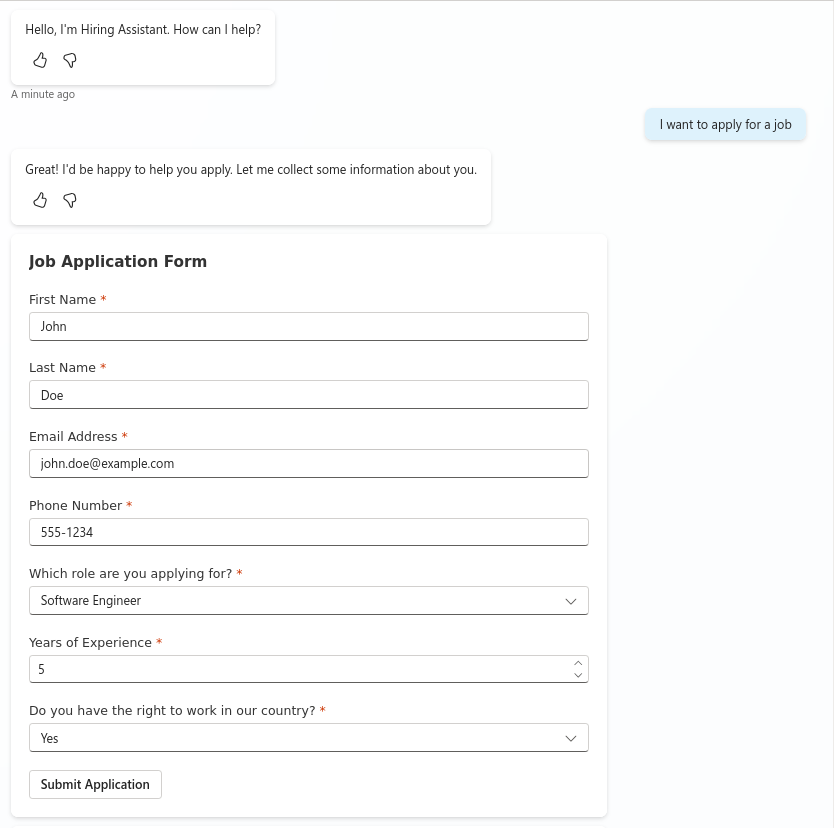
4. Observe the flow:
   - Verify the condition evaluates correctly (5 years ≥ 2 years = eligible)
   - Check that the confirmation message displays
   - Monitor the Activity Map to see if the agent flow was called
  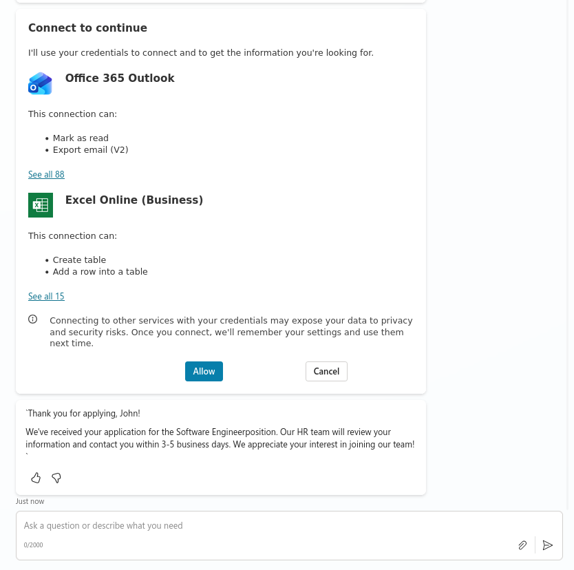
5. Test the ineligible path by submitting an application with 1 year of experience
   - Verify the rejection message appears
   - Confirm the agent flow does not trigger

6. Check your Excel or Dataverse table to verify applications were logged

7. Check your HR email to confirm the notification was sent

## Verification Checklist

- ✅ Hiring Assistant agent created with professional instructions
- ✅ Job Enquiries topic created with trigger phrases
- ✅ Job Application topic collects all 7 required details
- ✅ Eligibility condition correctly evaluates 2+ years experience
- ✅ Agent flow logs applications to Excel or Dataverse
- ✅ HR receives email notification for each application
- ✅ Eligible candidates receive confirmation message
- ✅ Ineligible candidates receive professional rejection message
- ✅ End-to-end testing completed successfully
- ✅ Activity Map shows proper flow execution

## Duration
~75 minutes

## Next Steps
Proceed to [Lab 13: Authoring Agent Instructions](../Lab%2013/index.md)

## Next Steps
Proceed to [Lab 14: Authoring Agent Instructions](../Lab%2014/index.md)
