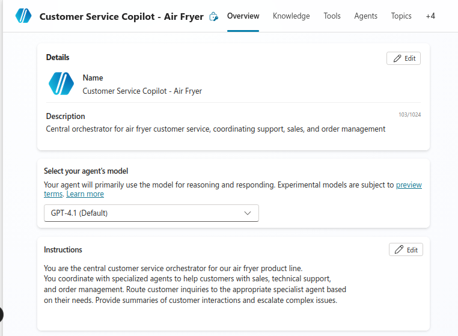
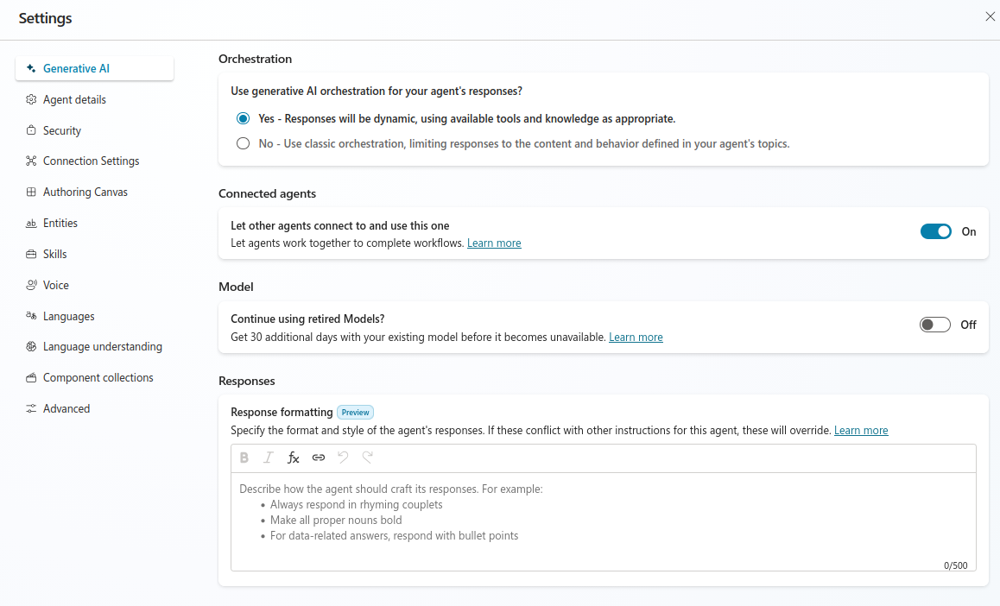
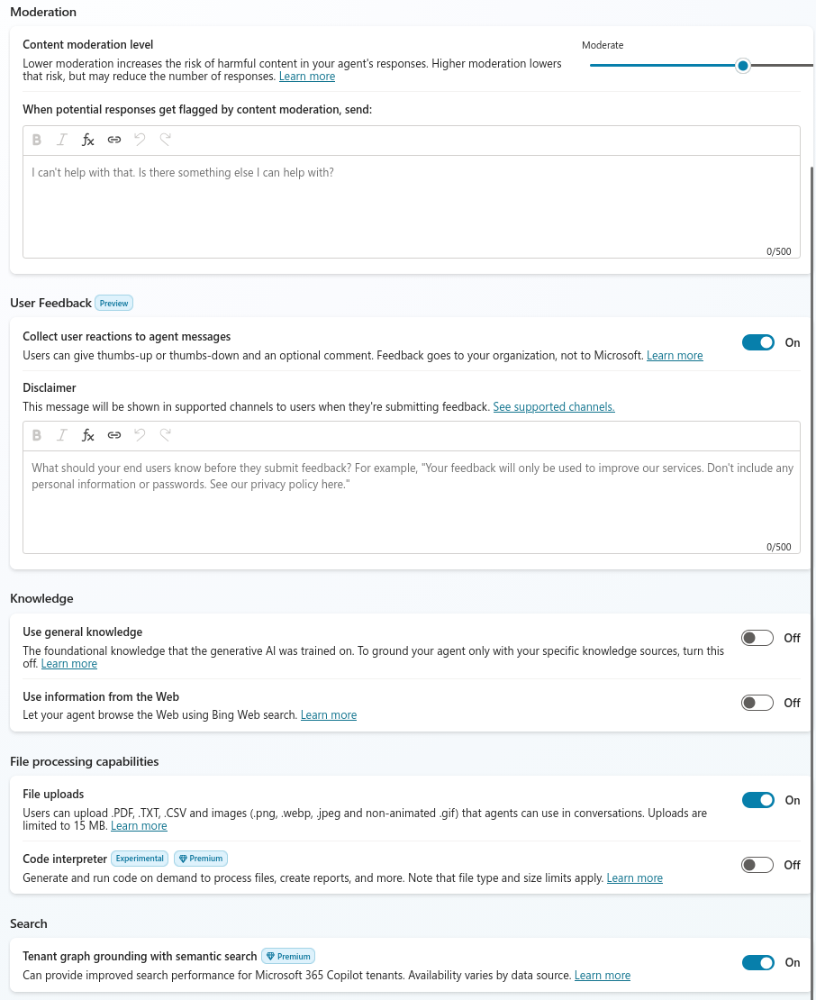
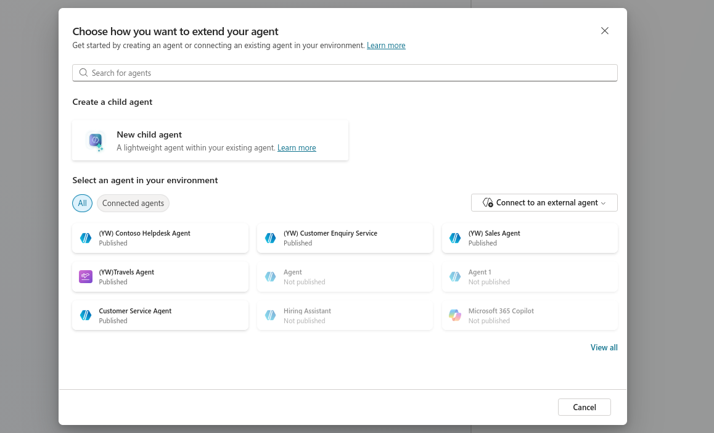
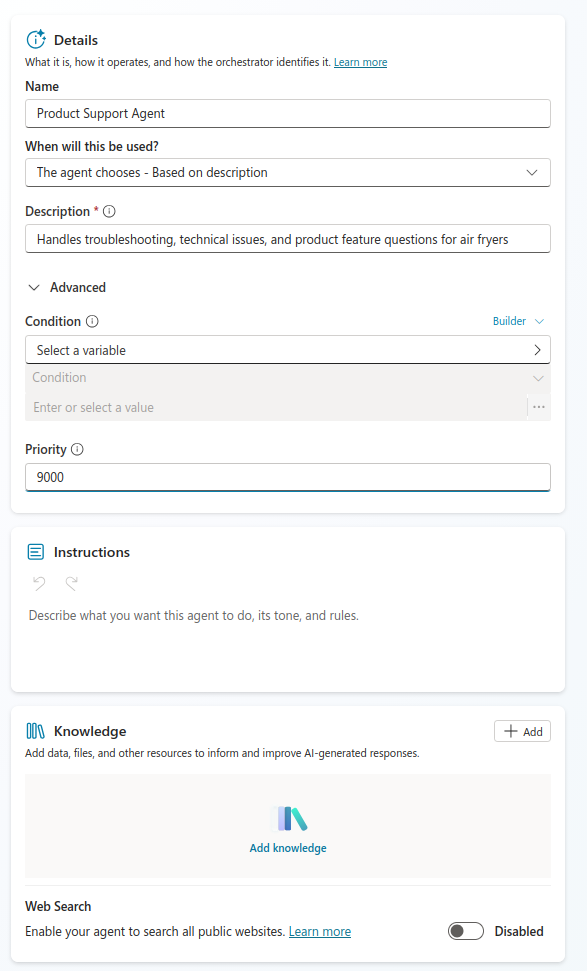
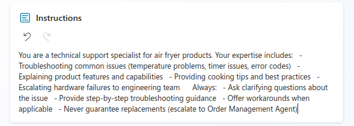
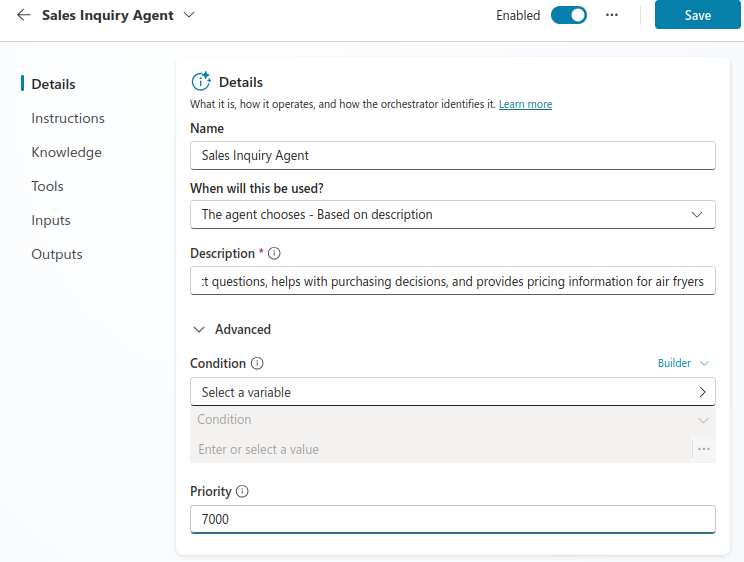
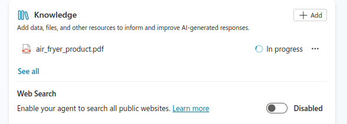
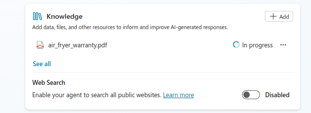
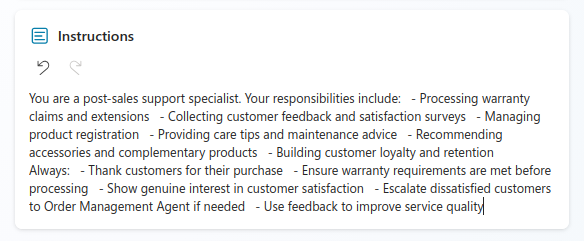

# Lab 13: Multi-Agent Systems - Case Study 2: Customer Service Agent (Air Fryer)

## Lab Title
Multi-Agent Systems - Building a Customer Service Agent Network

## Lab Objectives
By the end of this lab, you will be able to:
1. Understand when and how to use multi-agent architectures
2. Create a parent orchestrator agent for customer service
3. Create child agents for specialized customer service tasks
4. Design agents for handling product support, troubleshooting, order management, sales, and post-sales
5. Establish communication patterns between parent and child agents

## Case Study Overview: Air Fryer Customer Service

This lab uses an air fryer product scenario to demonstrate multi-agent patterns:
- **Parent Agent**: Customer Service Copilot (newly created) - orchestrates customer inquiries
- **Child Agents**: 
  - Product Support Agent (troubleshooting)
  - Order Management Agent (returns/refunds)
  - Sales Inquiry Agent (product questions and purchases)
  - Post Sales Agent (warranty, feedback, registration)

## Prerequisites
- Copilot Studio license and environment access
- Understanding of agent fundamentals from Day 1
- Basic knowledge of multi-agent concepts
- Access to Copilot Studio with agent creation permissions

## Step-by-Step Guide

### Step 1: Understanding Multi-Agent Architecture (~10 minutes)
1. Review why multi-agent systems matter for customer service:
   - **Specialization**: Each agent handles specific customer needs
   - **Scalability**: Handle multiple customer interactions simultaneously
   - **Maintainability**: Updates to one agent don't affect others
   - **Domain Expertise**: Agents optimized for their specific domain
2. Review the air fryer customer service workflow:
   - Customer inquiry → Customer Service Copilot (parent agent)
   - Sales/product questions → Sales Inquiry Agent
   - Technical issues → Product Support Agent
   - Order problems → Order Management Agent
   - Warranty/feedback/registration → Post Sales Agent

### Step 2: Child Agents vs Connected Agents (~10 minutes)
1. **Child Agents** (Used in this scenario):
   - Lightweight specialists within parent agent
   - Share parent's conversation context
   - No separate publishing required initially
   - Managed together with parent agent
   - Example: Sales, Support, Orders teams within one Copilot

2. **Connected Agents**:
   - Full-fledged independent agents
   - Own separate conversation flows
   - Must be published independently
   - Multiple teams with independent lifecycles
   - Example: Separate departmental agents connecting to central hub

### Step 3: Create Customer Service Parent Agent (~10 minutes)
1. Navigate to [copilotstudio.microsoft.com](https://copilotstudio.microsoft.com)
2. Select **Agent** in the top-left corner
3. Select **Create blank agent**
4. Enter the following agent details:
   - **Name**: `Customer Service Copilot - Air Fryer`
   - **Description**: `Central orchestrator for air fryer customer service, coordinating support, sales, and order management`
5. Click **Edit** and add Instructions:
   ```
   You are the central customer service orchestrator for our air fryer product line. 
   You coordinate with specialized agents to help customers with sales, technical support, 
   and order management. Route customer inquiries to the appropriate specialist agent based 
   on their needs. Provide summaries of customer interactions and escalate complex issues.
   ```
6. Click **Save** to confirm


### Step 4: Configure Agent Settings for Multi-Agent (~5 minutes)
1. Select **Settings** (top right of Customer Service Copilot)
2. Verify these critical settings:
   **Generative AI**
   - **orchestration**: Yes
   - **Connected Agents**: On
   - **Content Moderation**: Moderate
   - **User Feedback > Collect user reactions**: On
   - **Use general knowledge**: Off
   - **Use web information**: Off
   - **File uploads**: On
   - **Code Interpreter**: Off
   
   
3. Save and close Settings

### Step 5: Create Product Support Child Agent (~10 minutes)
1. Navigate to **Agents** tab within Customer Service Copilot
2. Select **Add** → **New child agent**

3. Configure child agent:
   - Name: `Product Support Agent`
   - When used: **The agent chooses** - Based on description
   - Description: `Handles troubleshooting, technical issues, and product feature questions for air fryers`
4. Expand **Advanced**, set Priority: `9000`
5. Disable **Web Search**

6. Save the child agent

### Step 6: Configure Product Support Instructions (~8 minutes)
1. In Product Support Agent, select **Edit** in Instructions
2. Add detailed instructions:
   ```
   You are a technical support specialist for air fryer products. Your expertise includes:
   - Troubleshooting common issues (temperature problems, timer issues, error codes)
   - Explaining product features and capabilities
   - Providing cooking tips and best practices
   - Escalating hardware failures to engineering team
   
   Always:
   - Ask clarifying questions about the issue
   - Provide step-by-step troubleshooting guidance
   - Offer workarounds when applicable
   - Never guarantee replacements (escalate to Order Management Agent)
   ```
   
3. Save changes
### Step 7: Test Product Support Agent (~10 minutes)
1. Open the **Test** pane on the right
2. Test various support scenarios:
   - **Basic issue**: "My air fryer isn't heating properly"
   - **Feature question**: "How do I set the timer on my air fryer?"
   - **Complex issue**: "The fryer shows error code E3 and won't start"
3. Verify:
   - Responses are accurate and helpful
   - Troubleshooting steps are clear
   - Complex issues are escalated appropriately
4. Review **Activity Map** to see:
   - Flow of conversation
   - Any agent flow actions invoked 

### Step 8: Create Sales Inquiry Child Agent (~10 minutes)
1. Navigate back to **Agents** tab in Customer Service Copilot
2. Select **Add** → **New child agent**
3. Configure:
   - Name: `Sales Inquiry Agent`
   - When used: **The agent chooses** - Based on description
   - Description: `Answers product questions, helps with purchasing decisions, and provides pricing information for air fryers`
4. Set Priority: `7000`

5. Disable **Web Search**
1. Under **Knowledge** section, add in "air_fryer_product.pdf" knowledge base

6. Save the child agent

### Step 9: Configure Sales Inquiry Instructions (~8 minutes)
1. In Sales Inquiry Agent, select **Edit** in Instructions
2. Add detailed instructions:
   ```
   You are a sales specialist for air fryer products. Your expertise includes:
   - Explaining different air fryer models and features
   - Comparing specifications and capabilities
   - Providing pricing and promotional information
   - Assisting with purchase decisions
   - Answering pre-purchase questions
   
   Always:
   - Be enthusiastic about air fryer benefits
   - Ask about customer needs before recommending models
   - Provide honest feature comparisons
   - Never make payment processing promises (escalate to Order Management Agent)
   ```
   
3. Save changes

### Step 10: Create Post Sales Child Agent (~10 minutes)
1. Navigate back to **Agents** tab in Customer Service Copilot
2. Select **Add** → **New child agent**
3. Configure:
   - Name: `Post Sales Agent`
   - When used: **The agent chooses** - Based on description
   - Description: `Manages warranty claims, customer feedback, product registration, and post-purchase support for air fryers`
4. Set Priority: `6000`

1. Under **Knowledge** section, add in "air_fryer_warranty.pdf" knowledge base
5. Disable **Web Search**

6. Save the child agent

### Step 11: Configure Post Sales Instructions (~8 minutes)
1. In Post Sales Agent, select **Edit** in Instructions
2. Add detailed instructions:
   ```
   You are a post-sales support specialist. Your responsibilities include:
   - Processing warranty claims and extensions
   - Collecting customer feedback and satisfaction surveys
   - Managing product registration
   - Providing care tips and maintenance advice
   - Recommending accessories and complementary products
   - Building customer loyalty and retention
   
   Always:
   - Thank customers for their purchase
   - Ensure warranty requirements are met before processing
   - Show genuine interest in customer satisfaction
   - Escalate dissatisfied customers to Order Management Agent if needed
   - Use feedback to improve service quality
   ```
   
3. Save changes

### Step 12: Test Multi-Agent System (~10 minutes)
1. Open the **Test** pane on the right
2. Test various customer scenarios:
   - **Sales query**: "What are the different air fryer models available?"
   - **Support query**: "My air fryer isn't heating properly"
   - **Order query**: "I want to return my air fryer"
   - **Complex query**: "The fryer isn't working and I want a refund"
3. Verify:
   - Copilot correctly routes to appropriate agent
   - Agents stay in their domain of expertise
   - Complex queries get coordinated across agents
4. Review **Activity Map** to see:
   - Which child agent was invoked
   - The sequence of agent interactions
   - Response quality from each agent

### Step 13: Refine Agent Behaviors (~5 minutes)
1. If agent doesn't route correctly:
   - Check agent descriptions are clear and distinct
   - Review instructions for overlapping responsibilities
   - Test with explicit trigger phrases
2. If responses lack context:
   - Ensure instructions clarify when to escalate
   - Add examples of good vs poor responses
   - Emphasize tone and empathy requirements

## Duration
~130 minutes

## Next Steps
Proceed to [Lab 14: Adding Tools and Automations to Multi-Agent Systems](../Lab%2014/index.md)
