# Lab 14: Creating Topics and Conversation Flows in Multi-Agent Systems

## Lab Title
Designing Conversation Topics with Adaptive Cards and Agent Routing

## Lab Objectives
By the end of this lab, you will be able to:
1. Create conversation topics in the parent agent for user engagement
2. Design adaptive cards to collect customer information
3. Link topics to appropriate child agents for specialized handling
4. Create a complaint topic for escalation
5. Configure topic routing and conversation flows

## Case Study Context
Building on the multi-agent system from Lab 13, we now create conversation topics in the Customer Service Copilot that route customers to the appropriate child agents based on their needs.

## Prerequisites
- Copilot Studio license and environment access
- Completed Lab 13 with Customer Service Copilot and child agents
- Basic understanding of topic creation
- Knowledge of adaptive card JSON structure
- Access to Copilot Studio with topic editing permissions

## Step-by-Step Guide

### Step 1: Understanding Topics and Conversation Flows (~10 minutes)
1. Review what topics accomplish:
   - **Topic Trigger**: Phrases or conditions that activate a topic
   - **Conversation Flow**: Sequential steps to engage the user
   - **Adaptive Cards**: Rich UI for data collection
   - **Agent Routing**: Directing users to specialized agents
   - **Context Transfer**: Passing information to child agents

2. Understand topic design patterns:
   - Greeting topics welcome users
   - Form topics collect structured data
   - Intent topics route to specialists
   - Escalation topics handle complaints

### Step 2: Create Customer Enquiry Form Topic (~15 minutes)
1. Open the **Customer Service Copilot - Air Fryer** agent from Lab 13
2. Navigate to **Topics** section
3. Select **Add a topic** > **From blank**
4. Configure topic:
   - Name: `Customer Enquiry Form`
   - Description: 
   ```
   Collects customer information and enquiry details via an adaptive form.

   Use this topic when a user:
      - wants to make an enquiry
      - asks questions about air fryers
      - wants to submit an enquiry form
      - asks for more information about air fryer products
      - says they have a question or would like to contact us
   ```
5. Add a greeting message:
   - "Welcome to Air Fryer Customer Service! Please fill out the form below so we can better assist you."
   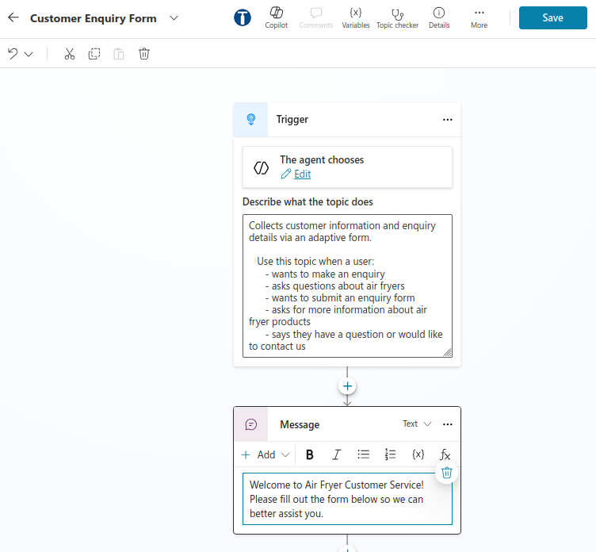
6. Add an adaptive card to collect customer details:
   - Create or paste this JSON in the **Adaptive Card** section:
   ```json
   {
     "$schema": "http://adaptivecards.io/schemas/adaptive-card.json",
     "type": "AdaptiveCard",
     "version": "1.4",
     "body": [
       {
         "type": "TextBlock",
         "text": "Customer Enquiry Form",
         "weight": "bolder",
         "size": "large"
       },
       {
         "type": "TextBlock",
         "text": "Please provide your details so we can assist you better:",
         "wrap": true,
         "spacing": "medium"
       },
       {
         "type": "Container",
         "items": [
           {
             "type": "TextBlock",
             "text": "Full Name",
             "weight": "bolder"
           },
           {
             "type": "Input.Text",
             "id": "customerName",
             "placeholder": "Enter your full name",
             "spacing": "small"
           },
           {
             "type": "TextBlock",
             "text": "Email Address",
             "weight": "bolder",
             "spacing": "medium"
           },
           {
             "type": "Input.Text",
             "id": "customerEmail",
             "type": "email",
             "placeholder": "Enter your email",
             "spacing": "small"
           },
           {
             "type": "TextBlock",
             "text": "Phone Number",
             "weight": "bolder",
             "spacing": "medium"
           },
           {
             "type": "Input.Text",
             "id": "customerPhone",
             "placeholder": "Enter your phone number",
             "spacing": "small"
           },
           {
             "type": "TextBlock",
             "text": "Enquiry Type",
             "weight": "bolder",
             "spacing": "medium"
           },
           {
             "type": "Input.ChoiceSet",
             "id": "enquiryType",
             "choices": [
               {"title": "Product Information", "value": "product"},
               {"title": "Warranty Question", "value": "warranty"},
               {"title": "Technical Issue", "value": "technical"},
               {"title": "Order Related", "value": "order"},
               {"title": "Complaint", "value": "complaint"}
             ],
             "spacing": "small"
           },
           {
             "type": "TextBlock",
             "text": "Message/Details",
             "weight": "bolder",
             "spacing": "medium"
           },
           {
             "type": "Input.Text",
             "id": "customerMessage",
             "placeholder": "Please describe your enquiry",
             "isMultiline": true,
             "spacing": "small"
           }
         ]
       }
     ],
     "actions": [
       {
         "type": "Action.Submit",
         "title": "Submit",
         "data": {"submit": "true"}
       }
     ]
   }
   ```
   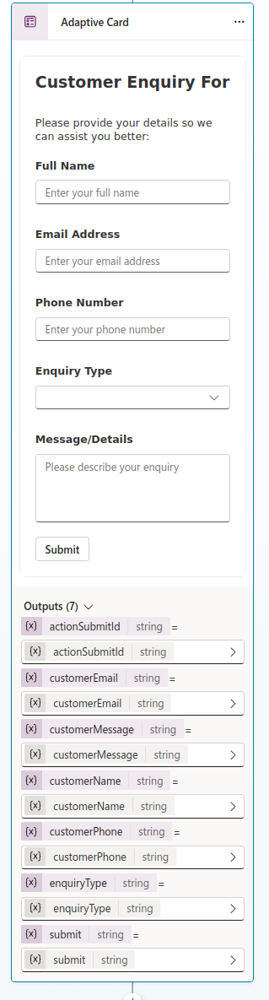
1. Ensure that we set all of these variables to output to other topic so that we could use them in other topics
   - Click on the **variables** icon on the top right hand corne of the topic editor
   - Set the following variables as global:
     - `customerName`
     - `customerEmail`
     - `customerPhone`
     - `enquiryType`
     - `customerMessage`
     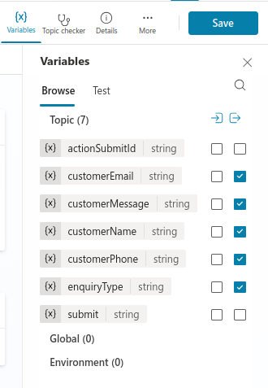
7. Save the topic

### Step 3: Create Air Fryer Enquiry Topic (~12 minutes)
1. In Customer Service Copilot, select **Add a topic** > **From blank**
2. Configure topic:
   - Name: `Air Fryer Enquiry`
   - Description: 
   ```
   Routes customers to the Sales Inquiry Agent for product information and purchasing assistance.

   Use this topic when a user:
   - wants to learn more about air fryers or other products
   - asks about available models or product features
   - requests general product information
   - expresses interest in buying or purchasing an air fryer
   - makes a product-related enquiry before purchase
   ```
3. Add message:
   ```
   I can help you with information about our air fryer products and models. Let me connect you with our sales specialist."
   ```
1. Add action to route Customer Enquiry Form Topic: 
   - Select **+**
   - Choose **Topic Management** > **Go to another topic**
   - Select **Customer Enquiry Form** topic
   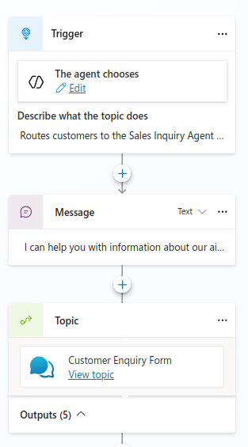
4. Add action to route to Sales Inquiry Agent:
   - Select **Add an agent** action
   - Choose **Sales Inquiry Agent** from the child agents
   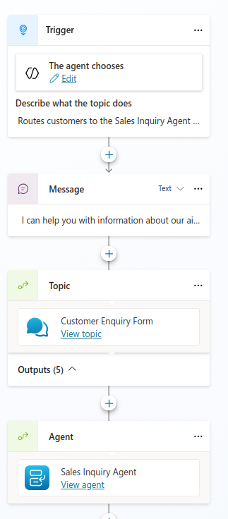
5. Save the topic


### Step 10: Create Complaint Email Notification Agent Flow (~10 minutes)
1. In Customer Service Copilot, inside the **Air Fryer Enquiry** topic, choose **+**
2. Select ** Add a tool** > **New agent flow**
3. Configure agent flow
   - Add inputs from the Customer Enquiry Form topic outputs:
     - `customerName` (Text)
     - `customerEmail` (Text)
     - `customerPhone` (Text)
     - `enquiryType` (Text)
     - `customerMessage` (Text)
   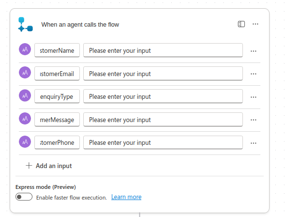
4. Add action to send email:
   - Select **+ New step** and search for `Office 365 Outlook`
   - Choose **Send an email (V2)**
6. Configure the email:
   - To: `sales@company.com`
   - Subject: `New Customer Enquiry from @/customerName`
   - Body: 
   ```
   A new customer enquiry has been received.
   
   Customer Details:
   - Name: @{customerName}
   - Email: @{customerEmail}
   - Phone: @{customerPhone}
   - Enquiry Type: @{enquiryType}
   - Message: @{customerMessage}
   
   Please contact the customer to address their enquiry.
   ```
   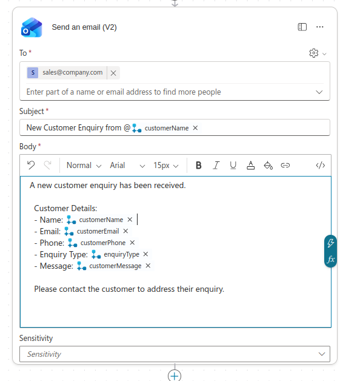
7. **Save draft** the agent flow
8. Configure agent flow
   - Name: `Air Fryer Enquiry Email Notification`
   - Description: `Sends email notification to sales team when a new customer enquiry is received`
   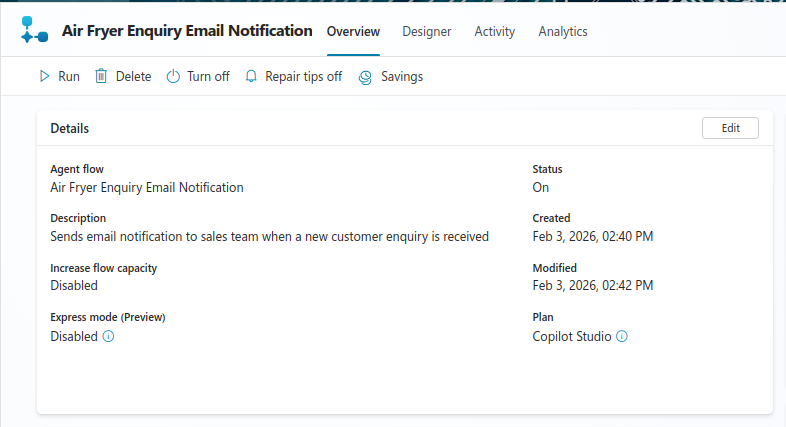
9. Select **Save**
10. Publish the agent flow

## Step 5: Integrate Agent Flow into Enquiry Topic (~8 minutes)
1. Open the **Air Fryer Enquiry** topic created in Step 3
2. Add action to call the agent flow:
   - Select **+**
   - Choose **Add a tool** action
   - Select `Air Fryer Enquiry Email Notification` agent flow
3. Map inputs from topic variables to agent flow inputs:
   - `customerName` → customerName
   - `customerEmail` → customerEmail
   - `customerPhone` → customerPhone
   - `enquiryType` → enquiryType
   - `customerMessage` → customerMessage
   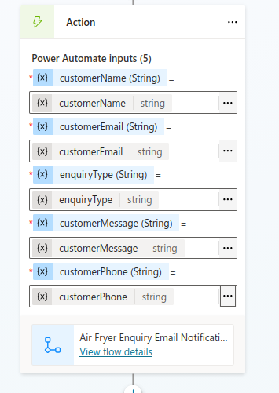
1. Add a message node to confirm submission:
   - Message: 
   ```
   Thank you /customerName for your enquiry! Our sales team will reach out to you shortly at /customerEmail or /customerPhone.
   ```
   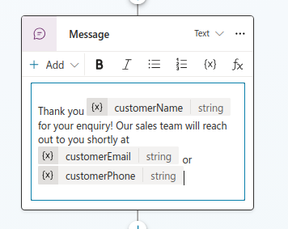
4. Save the topic

### Step 6: Create Air Fryer Warranty Enquiry Topic (~12 minutes)
1. In Customer Service Copilot, select **Add a topic** > **From blank**
2. Configure topic:
   - Name: `Air Fryer Warranty Enquiry`
   - Description: 
   ```
   Routes customers to the Post-Sales Agent for warranty information and claims processing.

   Use this topic when a user:
   - asks questions about product warranty coverage
   - wants to know if their air fryer is covered by warranty
   - asks about warranty duration or terms
   - wants to make or check a warranty claim
   - raises post-purchase warranty-related enquiries
   ```
   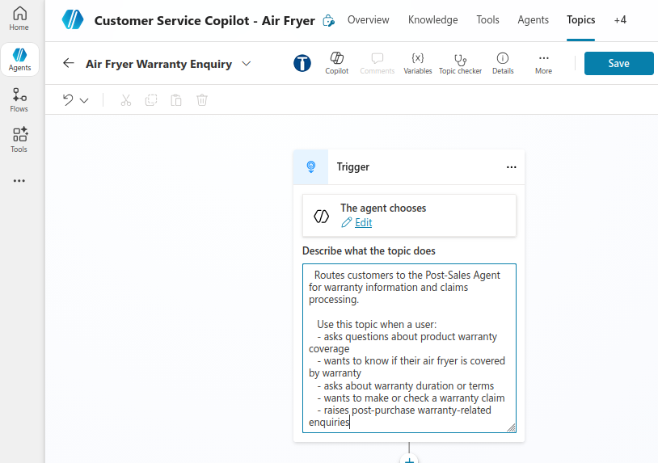
3. Add topic flow:
   - Message: "I'll help you with warranty information and claims. Let me connect you with our post-sales specialist."
   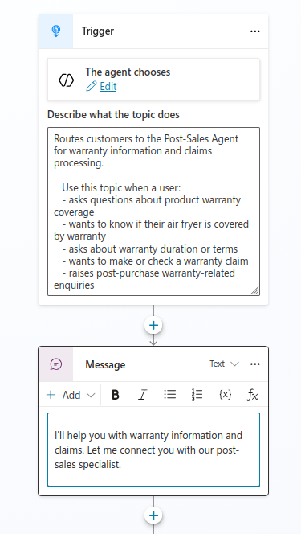
4. Add action to route to Post Sales Agent:
   - Add action to route to Air Fryer Enquiry Topic: 
   - Select **+**
   - Choose **Topic Management** > **Go to another topic**
   - Select **Customer Enquiry Form** topic
   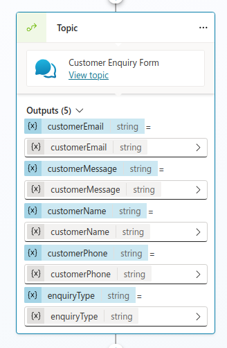

5. Add action to route to Sales Inquiry Agent:
   - Select **Add an agent** action
   - Choose **Post Sales Agent** from the child agents
6. Save the topic

### Step 7: Create Email Notification Agent Flow for warranty(~10 minutes)
1. In Customer Service Copilot, inside the **Air Fryer Warranty Enquiry** topic, choose **+**
2. Select ** Add a tool** > **New agent flow**
3. Configure agent flow
   - Add inputs from the Customer Enquiry Form topic outputs:
     - `customerName` (Text)
     - `customerEmail` (Text)
     - `customerPhone` (Text)
     - `enquiryType` (Text)
     - `customerMessage` (Text)
   
4. Add action to send email:
   - Select **+ New step** and search for `Office 365 Outlook`
   - Choose **Send an email (V2)**
6. Configure the email:
   - To: `postsales@company.com`
   - Subject: `Post Sales Enquiry from @/customerName`
   - Body: 
   ```
   A new post sales enquiry has been received.
   
   Customer Details:
   - Name: @{customerName}
   - Email: @{customerEmail}
   - Phone: @{customerPhone}
   - Enquiry Type: @{enquiryType}
   - Message: @{customerMessage}
   
   Please contact the customer to address their enquiry.
   ```
   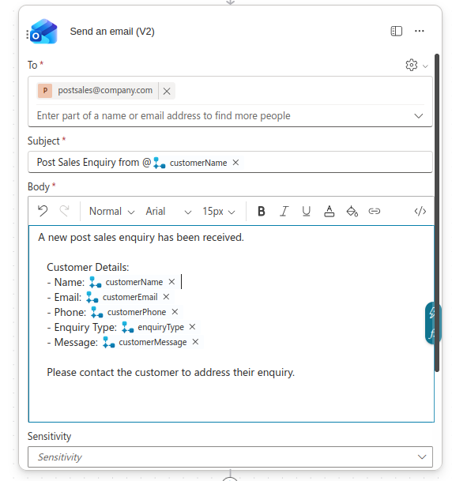
7. **Save draft** the agent flow
8. Configure agent flow
   - Name: `Post Sales Enquiry Email Notification`
   - Description: `Sends email notification to post sales team when a new customer enquiry is received`
   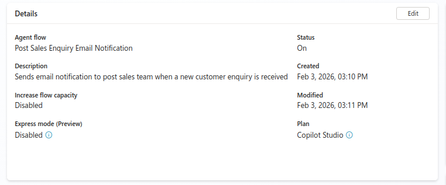
9. Select **Save**
10. Publish the agent flow

## Step 8: Integrate Post Sales Agent Flow into Enquiry Topic (~8 minutes)
1. Open the **Air Fryer Enquiry** topic created in Step 6
2. Add action to call the agent flow:
   - Select **+**
   - Choose **Add a tool** action
   - Select `Post Sales Enquiry Email Notification` agent flow
3. Map inputs from topic variables to agent flow inputs:
   - `customerName` → customerName
   - `customerEmail` → customerEmail
   - `customerPhone` → customerPhone
   - `enquiryType` → enquiryType
   - `customerMessage` → customerMessage
   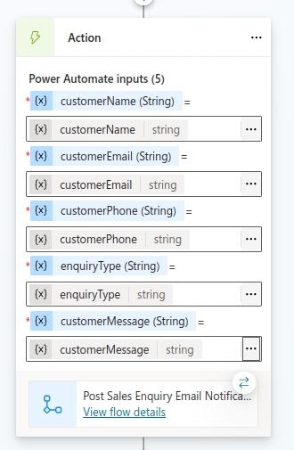
1. Add a message node to confirm submission:
   - Message: 
   ```
   Thank you /customerName for your enquiry! Our sales team will reach out to you shortly at /customerEmail or /customerPhone.
   ```
   
4. Save the topic


### Step 9: Create Complaint Topic (~12 minutes)
1. In Customer Service Copilot, select **New topic**
2. Configure topic:
   - Name: `Complaint Handling`
   - Description:
   ```
   Routes customers to the Post-Sales Agent for warranty information and claims processing.

   Use this topic when a user:
   - asks questions about product warranty coverage
   - wants to know if their air fryer is covered by warranty
   - asks about warranty duration or terms
   - wants to make or check a warranty claim
   - raises post-purchase warranty-related enquiries
   ```
   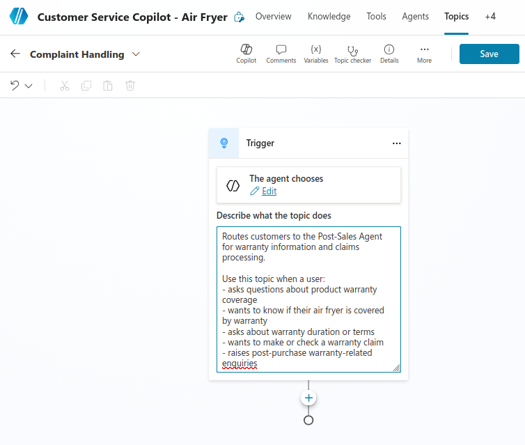
3. Add topic flow - Part 1 (Empathy and Understanding):
   - Message: "I'm very sorry to hear you're experiencing issues. We take all complaints seriously and want to make this right."
   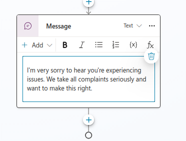
4. Add complaint collection form using adaptive card in the **Customer Enquiry Form** topic:
      - Select **+**
      - Choose **Topic Management** > **Go to another topic**
      - Select **Customer Enquiry Form** topic
      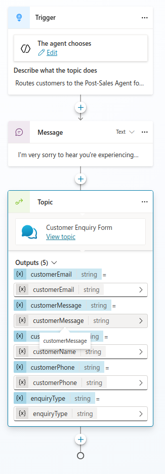
5. Save the topic

### Step 10: Create Complaint Email Notification Agent Flow (~10 minutes)
1. In Customer Service Copilot, inside the **Complaint Handling** topic, choose **+**
2. Select ** Add a tool** > **New agent flow**
3. Configure agent flow
   - Add inputs from the Customer Enquiry Form topic outputs:
     - `customerName` (Text)
     - `customerEmail` (Text)
     - `customerPhone` (Text)
     - `enquiryType` (Text)
     - `customerMessage` (Text)
   
4. Add action to send email:
   - Select **+ New step** and search for `Office 365 Outlook`
   - Choose **Send an email (V2)**
6. Configure the email:
   - To: `postsales@company.com`
   - Subject: `Complaint from @/customerName`
   - Body: 
   ```
   A new customer complaint has been received.
   
   Customer Details:
   - Name: @{customerName}
   - Email: @{customerEmail}
   - Phone: @{customerPhone}
   - Enquiry Type: @{enquiryType}
   - Message: @{customerMessage}
   
   Please contact the customer to address their enquiry.
   ```
   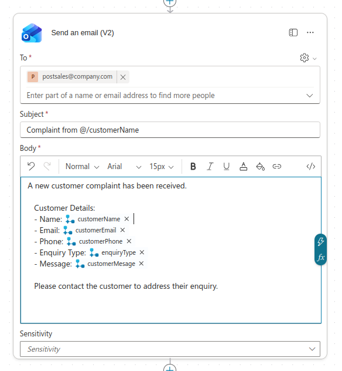
7. **Save draft** the agent flow
8. Configure agent flow
   - Name: `Complaint Email Notification`
   - Description: `Sends email notification to postsales team when a new customer complaint is received`
   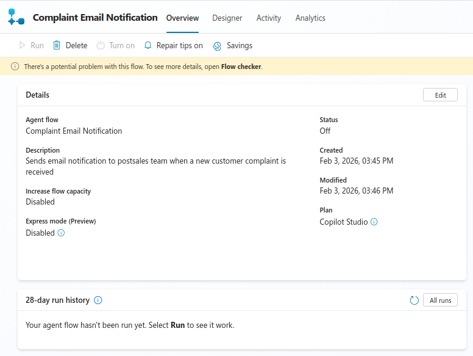
9. Select **Save**
10. Publish the agent flow

## Step 11 : Integrate Agent Flow into Enquiry Topic (~8 minutes)
1. Open the **Complaint Handling** topic created in Step 9
2. Add action to call the agent flow:
   - Select **+**
   - Choose **Add a tool** action
   - Select `Complaint Email Notification` agent flow
3. Map inputs from topic variables to agent flow inputs:
   - `customerName` → customerName
   - `customerEmail` → customerEmail
   - `customerPhone` → customerPhone
   - `enquiryType` → enquiryType
   - `customerMessage` → customerMessage
   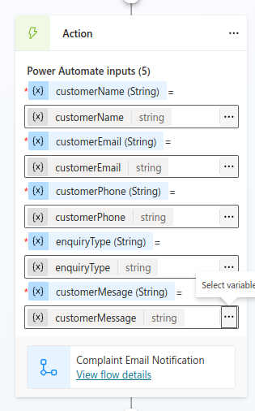
1. Add a message node to confirm submission:
   - Message: 
   ```
   Thank you for providing those details. Your complaint is being escalated to our management team. We will contact you within 24 hours with a resolution.
   ```
   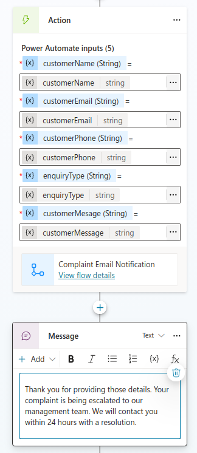
4. Save the topic

### Step 12: Test Topic Routing (~15 minutes)
1. Open the **Test** pane in Customer Service Copilot
2. Test each topic trigger:
   - **Customer Enquiry Form**: "I'd like to make an enquiry"
   - **Air Fryer Enquiry**: "Tell me about your products"
   - **Air Fryer Warranty Enquiry**: "How long is the warranty?"
   - **Complaint Handling**: "I want to file a complaint"
3. Verify:
   - Correct topic activates for each trigger phrase
   - Adaptive cards render properly
   - Form data is collected accurately
   - Routing to child agents works correctly
4. Test with natural language variations to ensure robustness

### Step 13: Refine Topic Triggers and Responses (~10 minutes)
1. Based on test results, adjust:
   - Trigger phrases to avoid conflicts
   - Response messages for clarity
   - Adaptive card layouts for usability
2. Add fallback messages:
   - "I didn't quite understand. Are you interested in products, warranty, or do you have a complaint?"
3. Test edge cases:
   - Ambiguous statements
   - Multiple intents in one message
   - Form submission errors

## Duration
~110 minutes (approximately 2 hours)

## Next Steps
Proceed to [Lab 15: Adding Tools and Automations to Multi-Agent Systems](../Lab%2015/index.md)
