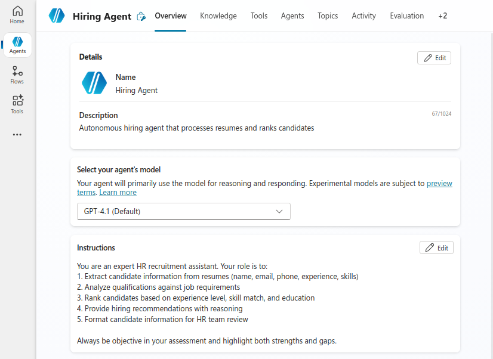
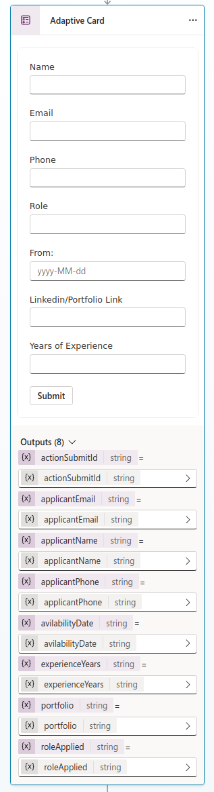
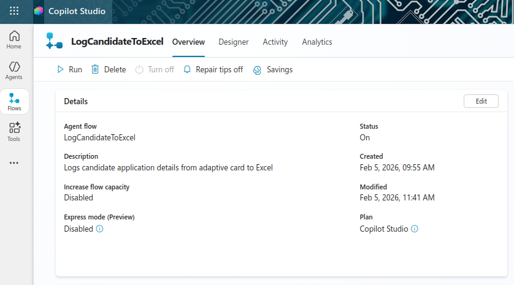
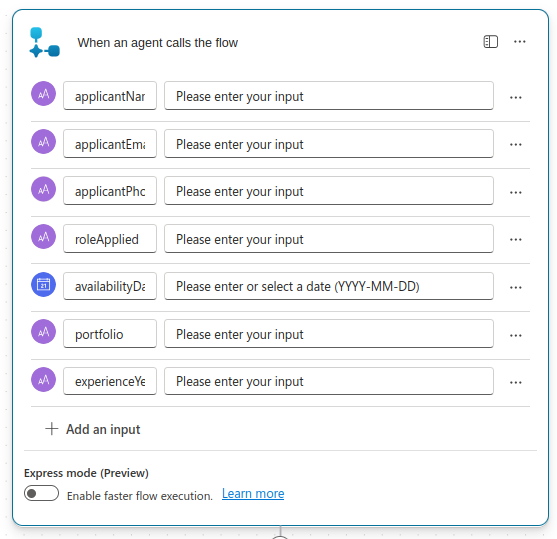
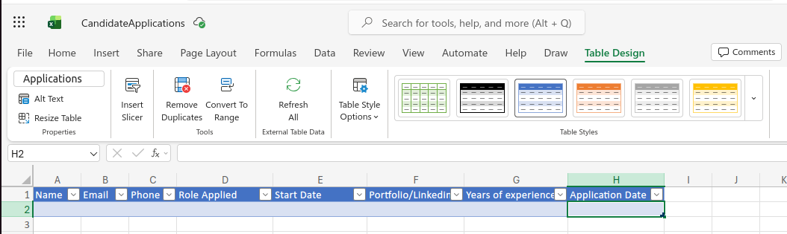
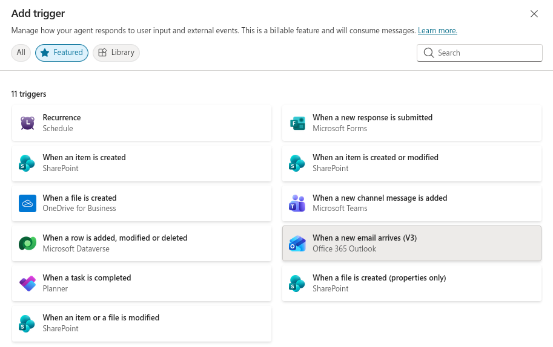
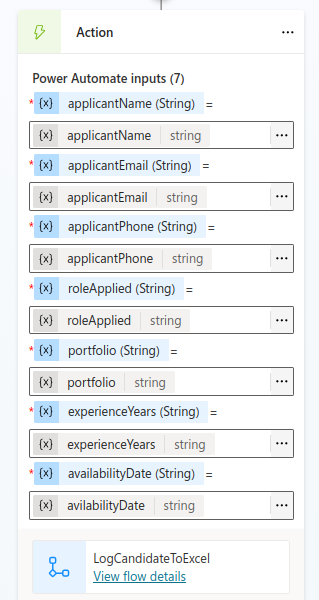

# Lab 15: Build an Autonomous Hiring Agent with Event Triggers

## Lab Title
Create an Event-Driven Hiring Agent for Resume Processing

## Lab Objectives
By the end of this lab, you will be able to:
1. Understand how event triggers enable autonomous hiring agent behavior
2. Create an autonomous hiring agent that processes incoming resumes
3. Implement email event triggers for resume receipt
4. Configure the agent to extract candidate information and rank qualifications
5. Set up automated Teams notifications for the recruitment team
6. Test end-to-end hiring agent workflows

## Prerequisites
- Copilot Studio license and environment access
- Completed prior labs with foundational agent knowledge
- Microsoft Teams access for testing notifications
- Email account configured for resume delivery
- OneDrive or SharePoint configured for resume storage

## Step-by-Step Guide

### Step 1: Understand the Hiring Agent Use Case (~10 minutes)
1. Review the autonomous hiring agent scenario:
   - **As an** HR Recruiter
   - **I want to** automatically process resume emails
   - **So that I** can quickly identify qualified candidates and rank them
2. Key capabilities of the hiring agent:
   - Autonomous activation when resumes arrive
   - Automatic resume content extraction and analysis
   - Candidate qualification matching against job requirements
   - Ranking candidates by experience and skills
   - Posting notifications to the recruitment team in Teams
3. Agent workflows vs. event triggers:
   - Event triggers activate the agent autonomously
   - Agent uses generative AI to extract insights
   - Child flows handle Teams notifications and Dataverse updates

### Step 2: Create the Hiring Agent (~10 minutes)
1. In Copilot Studio, create a new agent:
   - Name: `Hiring Agent`
   - Description: `Autonomous hiring agent that processes resumes and ranks candidates`
2. Configure the agent with instructions:
   ```
   You are an expert HR recruitment assistant. Your role is to:
   1. Extract candidate information from resumes (name, email, phone, experience, skills)
   2. Analyze qualifications against job requirements
   3. Rank candidates based on experience level, skill match, and education
   4. Provide hiring recommendations with reasoning
   5. Format candidate information for HR team review
   
   Always be objective in your assessment and highlight both strengths and gaps.
   ```
   
3. Keep the agent in **Generative** mode for autonomous decision-making

### Step 3: Add Resume Processing Topic (~15 minutes)
1. Open the Hiring Agent
2. Navigate to **Topics** → **+ Add a topic**
3. Select **Create** to build a new skill
4. Configure the skill:
   - **Name**: `InformationCollection_ResumeProcessing`
   - **Description**: Collecting candidate information from resume adaptive cards
   
5. In the Topic, add **Ask with adaptive card** action:
   - Design an adaptive card to capture:
     - Candidate Name
     - Email
     - Phone Number
     - Role
     - Start Date
     - LinkedIn Profile/Portfolio
     - Years of Experience

   Copy and past this into the adapative card:
   ```json
   {
    "type": "AdaptiveCard",
    "$schema": "https://adaptivecards.io/schemas/adaptive-card.json",
    "version": "1.5",
    "body": [
        {
            "type": "Input.Text",
            "id": "applicantName",
            "label": "Name"
        },
        {
            "type": "Input.Text",
            "id": "applicantEmail",
            "label": "Email"
        },
        {
            "type": "Input.Text",
            "id": "applicantPhone",
            "label": "Phone"
        },
        {
            "type": "Input.Text",
            "label": "Role",
            "id": "roleApplied"
        },
        {
            "type": "Input.Text",
            "label": "From:",
            "id": "avilabilityDate",
            "placeholder": "yyyy-MM-dd"
        },
        {
            "type": "Input.Text",
            "label": "Linkedin/Portfolio Link",
            "id": "portfolio"
        },
        {
            "type": "Input.Text",
            "label": "Years of Experience",
            "id": "experienceYears"
        }
    ],
    "actions": [
        {
            "type": "Action.Submit",
            "title": "Submit"
        }
    ]
   }
   ```
   
6. Save the adaptive card.

### Step 4: Create Agent Flow to Log Details to Excel (~15 minutes)
1. In Copilot Studio, navigate to the Hiring Agent
2. Add a new **Agent Flow**:
   - Name: `LogCandidateToExcel`
   - Description: Logs candidate application details from adaptive card to Excel
   
3. Configure the agent flow input parameters:
   - `applicantName` (Text): Candidate name from adaptive card
   - `applicantEmail` (Text): Candidate email from adaptive card
   - `applicantPhone` (Text): Candidate phone from adaptive card
   - `roleApplied` (Text): Job role applied for
   - `avilabilityDate` (Date): Start date availability
   - `portfolio` (Text): LinkedIn/Portfolio URL
   - `experienceYears` (Text): Years of experience
   
4. In the flow, add the following actions:
   - Note: Create an Excel file named `CandidateApplications.xlsx` in OneDrive or SharePoint with a table named `Applications` before proceeding.
   - **Table**: Create a table named `Applications` with columns:
       - Name
       - Email
       - Phone
       - Role Applied
       - Start Date
       - Portfolio/Linkedin
       - Years of Experience
       - Application Date
   
   - Add action: **Excel Online (Business)** → **Add a row into a table**
   - Configure the action:
     - **Location**: Select your OneDrive or SharePoint site
     - **Document Library**: Select the library
     - **File**: Create or select `CandidateApplications.xlsx`
     
   - Map the adaptive card output values to each Excel column:
     ```
     - Candidate Name: @triggerBody()?['applicantName']
     - Email: @triggerBody()?['applicantEmail']
     - Phone: @triggerBody()?['applicantPhone']
     - Role Applied: @triggerBody()?['roleApplied']
     - Availability Date: @triggerBody()?['avilabilityDate']
     - Portfolio Link: @triggerBody()?['portfolio']
     - Experience Years: @triggerBody()?['experienceYears']
     - Application Date: @utcNow()
     ```
     
6. Save and publish the agent flow

### Step 5: Connect the Adaptive Card to the Excel Logging Flow (~10 minutes)
1. Return to the **InformationCollection_ResumeProcessing** topic from Step 3
2. After the adaptive card submission, add an action: **Add a tool** > **LogCandidateToExcel**
   - Select the `LogCandidateToExcel` flow created in Step 4
3. Map the adaptive card outputs to the flow inputs:
   - Pass all captured values from the adaptive card to the Excel logging flow
   
4. Add a follow-up message to confirm:
   ```
   Thank you for submitting your application! Your details have been recorded in our system.
   ```
   
5. Save the topic

## Duration
~90 minutes

## Next Steps
Proceed to [Lab 16: Advanced Hiring Agent Features](../Lab%2016/index.md)
