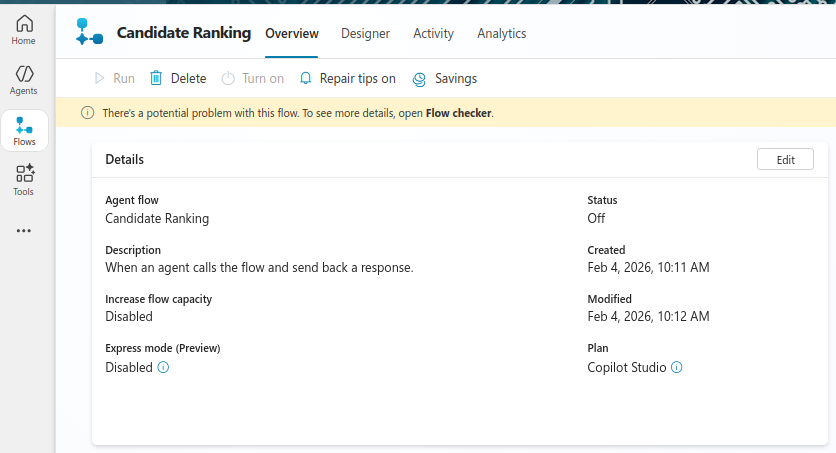
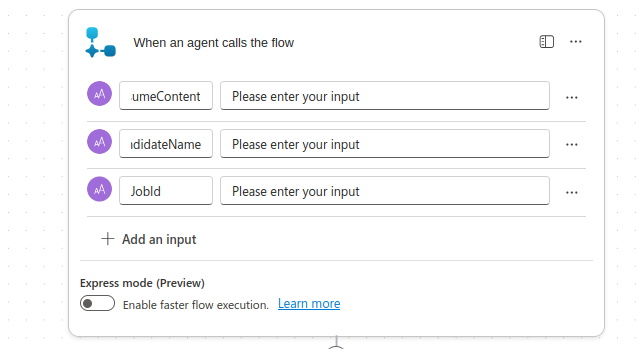

# Lab 16: Advanced Hiring Agent Features and Deployment

## Lab Title
Enhance Hiring Agent with Skill Matching and Teams Integration

## Lab Objectives
By the end of this lab, you will be able to:
1. Create a job requirements database for skill matching
2. Build agent orchestration that analyzes candidate fit against job requirements
3. Implement automated Teams notifications with rich adaptive cards
4. Create child agent flows for candidate ranking and recommendations
5. Set up Dataverse integrations for candidate tracking
6. Test and deploy the complete hiring agent workflow

## Prerequisites
- Copilot Studio license and environment access
- Completed Lab 15 with Hiring Agent and event trigger created
- Microsoft Teams access for testing notifications
- OneDrive or SharePoint configured for resume and data storage
- Sample job descriptions in a JSON configuration file

## Step-by-Step Guide

### Step 1: Create Job Requirements Configuration (~10 minutes)
1. Open **OneDrive** or **SharePoint**
2. Create a folder: `/hiring-agent-config`
3. Create a file: `job-requirements.json` with the following structure:
   ```json
   {
     "jobs": [
       {
         "jobId": "job-001",
         "jobTitle": "Power Platform Developer",
         "requiredSkills": ["Power Apps", "Power Automate", "Power BI", "C#"],
         "experienceLevel": "Mid",
         "educationRequirements": "Bachelor's in Computer Science or related field",
         "preferredCertifications": ["Power Platform Associate", "Power Platform Developer"],
         "keyResponsibilities": "Develop and maintain Power Platform solutions",
         "salaryRange": {"min": 80000, "max": 120000}
       },
       {
         "jobId": "job-002",
         "jobTitle": "Power BI Analyst",
         "requiredSkills": ["Power BI", "DAX", "SQL", "Data Visualization"],
         "experienceLevel": "Mid",
         "educationRequirements": "Bachelor's degree in Data Science, Analytics, or related field",
         "preferredCertifications": ["Power BI Data Analyst"],
         "keyResponsibilities": "Create and maintain analytical dashboards and reports",
         "salaryRange": {"min": 75000, "max": 110000}
       },
       {
         "jobId": "job-003",
         "jobTitle": "Dynamics 365 Administrator",
         "requiredSkills": ["Dynamics 365", "Administration", "CRM", "Power Platform"],
         "experienceLevel": "Mid",
         "educationRequirements": "Bachelor's degree in IT or related field",
         "preferredCertifications": ["Dynamics 365 Administrator", "Dynamics 365 Sales Administrator"],
         "keyResponsibilities": "Manage and configure Dynamics 365 environments",
         "salaryRange": {"min": 85000, "max": 125000}
       }
     ]
   }
   ```
4. Save the configuration file for use in agent flows

### Step 2: Build the Candidate Ranking Agent Flow (~15 minutes)
1. In Copilot Studio, add a new **Agent Flow** to Hiring Agent:
   - Name: `Candidate Ranking`
   
2. Configure input parameters:
   - `ResumeContent` (Text): Extracted resume text
   - `CandidateName` (Text): Extracted candidate name
   - `JobId` (Text): Target job position ID
   
3. Add prompt instruction:
   ```
   You are analyzing a candidate for a specific role. Based on the resume provided:
   1. Extract key qualifications
   2. Compare against job requirements
   3. Score on: Technical Skills (0-5), Experience Match (0-5), Education (0-5)
   4. Provide overall recommendation (Strong Match, Good Fit, Needs Development, Not Qualified)
   5. Highlight top 3 strengths and 2 development areas
   6. Suggest interview questions for this role
   ```
4. Save the agent flow

### Step 3: Create Teams Notification Flow (~15 minutes)
1. Add a new **Cloud Flow** to the agent for Teams notifications
2. Configure as **Automated cloud flow**:
   - Trigger: **When an agent triggers me from Copilot Studio**
3. Input parameters:
   - `CandidateName` (Text)
   - `MatchScore` (Number)
   - `Recommendation` (Text)
   - `TopStrengths` (Text)
   - `InterviewQuestions` (Text)
   - `Email` (Text)
4. Add action: **Post adaptive card to Teams**:
   ```json
   {
     "$schema": "http://adaptivecards.io/schemas/adaptive-card.json",
     "type": "AdaptiveCard",
     "version": "1.4",
     "body": [
       {
         "type": "TextBlock",
         "text": "New Resume Submission",
         "weight": "bolder",
         "size": "large"
       },
       {
         "type": "TextBlock",
         "text": "Candidate: @{triggerBody()?['CandidateName']}"
       },
       {
         "type": "TextBlock",
         "text": "Overall Match Score: @{triggerBody()?['MatchScore']}/15"
       },
       {
         "type": "TextBlock",
         "text": "Recommendation: @{triggerBody()?['Recommendation']}"
       },
       {
         "type": "TextBlock",
         "text": "Strengths: @{triggerBody()?['TopStrengths']}"
       }
     ],
     "actions": [
       {
         "type": "Actionfile in OneDrive**:
   - Folder: `/candidate-evaluations`
   - File Name: `evaluation_{CandidateName}_{Timestamp}.json`
   - Content:
     ```json
     {
       "candidateName": "[From email]",
       "resumeFile": "[Path from Lab 15]",
       "rankingScore": "[From agent output]",
       "recommendation": "[From agent output]",
       "processingDate": "[Today]"
     }
     ```k.office.com"
       }
     ]
   }
   ```
5. Publish the flow

### Step 4: Enhance Event Trigger with Agent Invocation (~15 minutes)
1. Return to the email event trigger from Lab 15
2. After resume extraction, add action: **Invoke agent orchestration**
   - Agent: Hiring Agent
   - Input parameters:
     - ResumeContent: [Extracted text from Step 4 of Lab 15]
     - CandidateName: [Extract from email or resume]
     - JobId: [User selection or default job]
3. After agent completes, add action to call **Teams Notification flow**:
   - Pass ranking results and recommendation
4. Add action: **Create record in Dataverse**:
   - Table: **Candidate Evaluations**
   - Fields:
     - Candidate Name: [From email]
     - Resume ID: [From Step 4 of Lab 15]
     - Ranking Score: [From agent output]
     - Recommendation: [From agent output]
     - Processing Date: [Today]
5. Publish the flow

### Step 5: Configure Hiring Agent Main Instructions (~10 minutes)
1. Edit the Hiring Agent instructions:
   ```
   You are an expert recruitment orchestrator. Your responsibilities:
   1. When receiving a resume, extract candidate information
   2. Trigger the Candidate Ranking agent flow for analysis
   3. Based on ranking results, post notifications to the recruitment team via Teams
   4. Store all evaluations in Dataverse for audit and tracking
   5. Provide the HR team with clear recommendations for next steps
   
   Always prioritize candidate privacy and provide objective, fair assessments.
   ```
2. Save the agent configuration

### Step 6: Test End-to-End Workflow (~15 minutes)
1. Send a test resume email:
   - To: [Your monitored email address]
   - Subject: "New Resume Submission"
   - Attach: A sample resume file
2. Monitor the trigger activation:
   - Check Power Automate runs
   - Verify email trigger fires
3. Check Copilot Studio logs for agent execution
4. Verify Teams notification appears in recruitment channel
5. Check Dataverse for created Candidate Evaluation record or load from job-requirements.json
   - Allow email subject to specify job position
2. Create a tracking file in OneDrive:
   - File: `/hiring-metrics/processing-log.json`
   - Track total candidates processed, match score distribution, and processing timentify target job from email body
   - Allow email subject to specify job position
2. Create dashboard in Power Apps for tracking:
   - Total candidates processed
   - Match score distribution
   - Time to process metrics
3. Configure email response:
   - Automatically acknowledge receipt to candidates
   - Include expected timeline for next steps

## Duration
~90 minutes

## Course Complete!
Congratulations on completing all 16 labs! You now have the skills to:
- Build conversational and autonomous agents
- Design event-driven hiring workflows
- Implement intelligent resume processing
- Create multi-agent systems with orchestration
- Integrate agents with Teams and Dataverse
- Deploy production-ready autonomoOneDrive/SharePoint
- Deploy production-ready autonomous hiring solutions without Dataverse