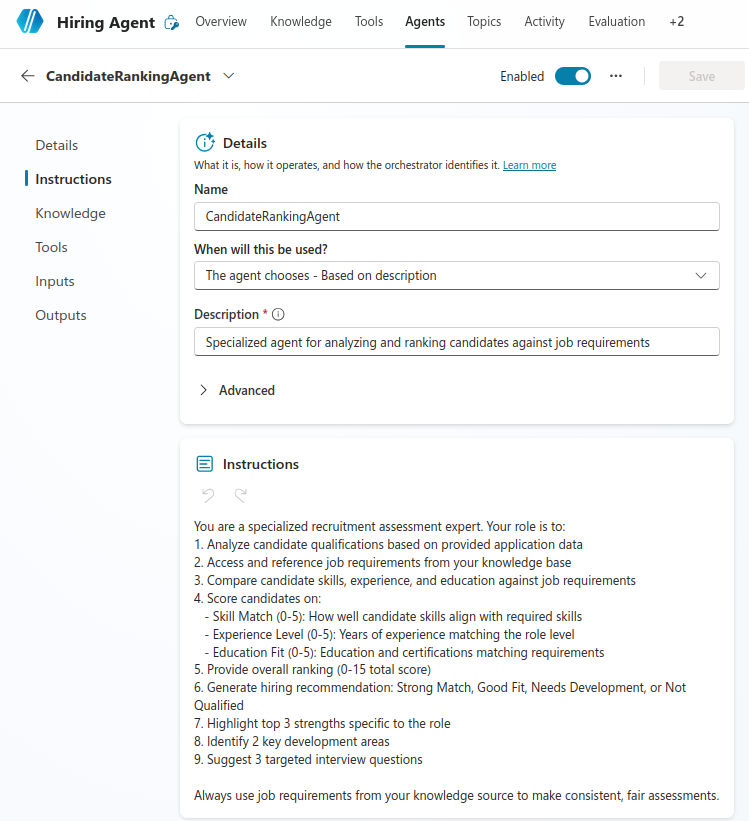
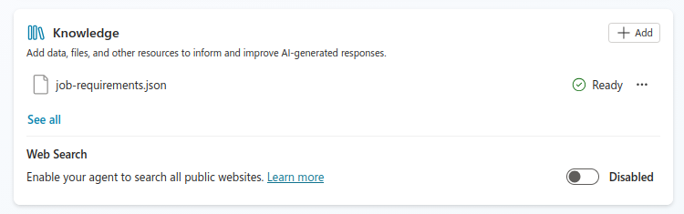

# Lab 16: Advanced Hiring Agent Features with Candidate Ranking and Teams Integration

## Lab Title
Enhance Hiring Agent with Child Agent and Knowledge Source Integration

## Lab Objectives
By the end of this lab, you will be able to:
1. Create a child agent that specializes in candidate ranking
2. Add knowledge sources (job-requirements.json) to empower the child agent
3. Analyze candidate skills against job requirements using the child agent
4. Create an agent flow that processes Excel data from Lab 15
5. Set up a feedback loop for hiring decisions
6. Test the complete hiring workflow from application to evaluation

## Prerequisites
- Copilot Studio license and environment access
- **Completed Lab 15** with Hiring Agent, adaptive card, and Excel logging setup
- Excel file with candidate applications from Lab 15
- Sample job descriptions in a JSON configuration file

## Step-by-Step Guide

### Step 1: Create Job Requirements Reference Database (~10 minutes)
1. Open **OneDrive** or **SharePoint**
2. Create a folder: `/hiring-agent-config`
3. Create a file: `job-requirements.json` with the following structure:
   ```json
   {
     "jobs": [
       {
         "jobId": "job-001",
         "jobTitle": "Power Platform Developer",
         "requiredSkills": ["Power Apps", "Power Automate", "Power BI", "C#"],
         "experienceLevel": "Mid",
         "educationRequirements": "Bachelor's in Computer Science or related field",
         "preferredCertifications": ["Power Platform Associate", "Power Platform Developer"],
         "keyResponsibilities": "Develop and maintain Power Platform solutions",
         "salaryRange": {"min": 80000, "max": 120000}
       },
       {
         "jobId": "job-002",
         "jobTitle": "Power BI Analyst",
         "requiredSkills": ["Power BI", "DAX", "SQL", "Data Visualization"],
         "experienceLevel": "Mid",
         "educationRequirements": "Bachelor's degree in Data Science, Analytics, or related field",
         "preferredCertifications": ["Power BI Data Analyst"],
         "keyResponsibilities": "Create and maintain analytical dashboards and reports",
         "salaryRange": {"min": 75000, "max": 110000}
       },
       {
         "jobId": "job-003",
         "jobTitle": "Dynamics 365 Administrator",
         "requiredSkills": ["Dynamics 365", "Administration", "CRM", "Power Platform"],
         "experienceLevel": "Mid",
         "educationRequirements": "Bachelor's degree in IT or related field",
         "preferredCertifications": ["Dynamics 365 Administrator", "Dynamics 365 Sales Administrator"],
         "keyResponsibilities": "Manage and configure Dynamics 365 environments",
         "salaryRange": {"min": 85000, "max": 125000}
       }
     ]
   }
   ```
4. Save the configuration file - this will be used as a knowledge source for the child agent

### Step 2: Create a Child Agent for Candidate Ranking (~20 minutes)
1. In Copilot Studio, create a new **Agent**:
   - Name: `CandidateRankingAgent`
   - Description: Specialized agent for analyzing and ranking candidates against job requirements
   - Leave in **Generative** mode
2. Configure the child agent instructions:
   ```
   You are a specialized recruitment assessment expert. Your role is to:
   1. Analyze candidate qualifications based on provided application data
   2. Access and reference job requirements from your knowledge base
   3. Compare candidate skills, experience, and education against job requirements
   4. Score candidates on:
      - Skill Match (0-5): How well candidate skills align with required skills
      - Experience Level (0-5): Years of experience matching the role level
      - Education Fit (0-5): Education and certifications matching requirements
   5. Provide overall ranking (0-15 total score)
   6. Generate hiring recommendation: Strong Match, Good Fit, Needs Development, or Not Qualified
   7. Highlight top 3 strengths specific to the role
   8. Identify 2 key development areas
   9. Suggest 3 targeted interview questions
   
   Always use job requirements from your knowledge source to make consistent, fair assessments.
   ```
   >
   
   >
3. Add **Knowledge Source** to the child agent:
   - Click **Knowledge** → **Add knowledge source**
   - Select **Upload files**
   - Upload `job-requirements.json` from `/hiring-agent-config` folder
   - If cannot load from Sharepoint/OneDrive directly, download and upload manually
   - Confirm the knowledge source is added
   - This makes the job requirements available to the child agent's reasoning
   
4. Save the child agent (do not publish yet)

### Step 3: Create Excel Data Processing Flow (~15 minutes)
1. In the Hiring Agent, add a new **Agent Flow**:
   - Name: `ProcessApplicationFromExcel`
   - Description: Reads candidate applications from Excel and invokes child agent for ranking
2. Add action: **Excel Online (Business)** → **List rows present in a table**
   - Location: OneDrive/SharePoint where `CandidateApplications.xlsx` is stored
   - Document Library: Select appropriate library
   - File: `CandidateApplications.xlsx`
   - Table: `Applications`
   
3. Add action: **Apply to each** to process each Excel row:
   ```
   For each row in the Applications table:
   - Extract: Candidate Name, Email, Role Applied, Experience Years, Portfolio, Application Date
   - Call the CandidateRankingAgent child agent with this information
   ```
4. Add action: **Update Excel row** to track processing:
   - Add column: "Evaluation Status" = "Completed"
   - Add column: "Evaluation Date" = Today
   - Add column: "Match Score" = [From child agent output]
5. Save the flow

### Step 4: Configure Hiring Agent to Invoke Child Agent (~10 minutes)
1. In the **Hiring Agent** from Lab 15, add a new topic or update existing logic:
   - Name: `ReviewApplications`
   - Add action: **Invoke another agent**
     - Select: `CandidateRankingAgent` (the child agent created in Step 2)
     - Pass input: Candidate application details from Excel
2. Edit the **Hiring Agent** instructions:
   ```
   You are an expert recruitment orchestrator. Your workflow:
   
   1. CANDIDATE DATA COLLECTION:
      - Users submit applications via adaptive card from Lab 15
      - Data is automatically logged to Excel (CandidateApplications.xlsx)
   
   2. CANDIDATE RANKING:
      - When asked to review applications, invoke the CandidateRankingAgent
      - This specialized child agent analyzes skills against job requirements
      - Child agent has access to job-requirements.json as a knowledge source
      - Generate match scores and interview recommendations
   
   3. FEEDBACK LOOP:
      - Track evaluations in Excel for audit and reporting
      - Help HR team make informed hiring decisions
      - Maintain fair, objective assessment practices
   
   When a user asks to "review applications" or "process applications":
   - Call ProcessApplicationFromExcel flow
   - This will automatically invoke the child agent for each candidate
   ```
3. Save the agent configuration

### Step 5: Test Complete End-to-End Workflow (~20 minutes)
1. **Test Lab 15 Application Submission:**
   - Open the Hiring Agent in Copilot Studio
   - Test the adaptive card from Lab 15 with sample candidate data:
     - Name: John Smith
     - Email: john.smith@example.com
     - Phone: 555-0100
     - Role Applied: Power Platform Developer
     - Availability Date: 2026-03-01
     - Portfolio: https://linkedin.com/in/johnsmith
     - Experience Years: 5 years
   - Verify the data is logged to Excel in the CandidateApplications table

2. **Test Candidate Ranking with Child Agent:**
   - In the main Hiring Agent, ask: "Please review the applications and rank candidates"
   - This triggers the ProcessApplicationFromExcel flow
   - Monitor the invocation of CandidateRankingAgent:
     - Agent accesses job-requirements.json knowledge source
     - Agent analyzes candidate data for "Power Platform Developer"
     - Agent scores candidate skills (5 years matches mid-level requirement)
     - Agent generates interview questions and recommendation
     - Child agent returns ranking results to parent flow

3. **Verify Excel Updates:**
   - Return to CandidateApplications.xlsx
   - Confirm new columns are populated:
     - Evaluation Status: "Completed"
     - Evaluation Date: Today's date
     - Match Score: Score from child agent (e.g., 13/15)

4. **Test with Multiple Candidates:**
   - Submit 2-3 more test applications with different experience levels
   - Run the ProcessApplicationFromExcel flow
   - Verify all candidates are ranked by the child agent
   - Check for consistent scoring and recommendations based on job-requirements.json

## Duration
~90 minutes total for Lab 16

## Key Learnings
In this lab, you learned to:
- Create specialized child agents for specific tasks
- Add knowledge sources (JSON files) to empower agents with reference data
- Implement parent-child agent orchestration patterns
- Process bulk data from Excel and invoke child agents
- Create cohesive workflows combining Excel, parent agents, and child agents

## Next Steps
Proceed to additional scenarios such as:
- Adding more knowledge sources for different job types
- Creating additional child agents for other HR tasks (scheduling, feedback collection)
- Building dashboard reports of hiring metrics
- Implementing multi-stage candidate evaluation workflows

## Course Complete!
Congratulations on completing all 16 labs! You now have the skills to:
- Build conversational and autonomous agents
- Design complete hiring workflows from application to evaluation
- Create specialized child agents with knowledge source integration
- Implement multi-agent orchestration patterns
- Deploy production-ready autonomous hiring solutions