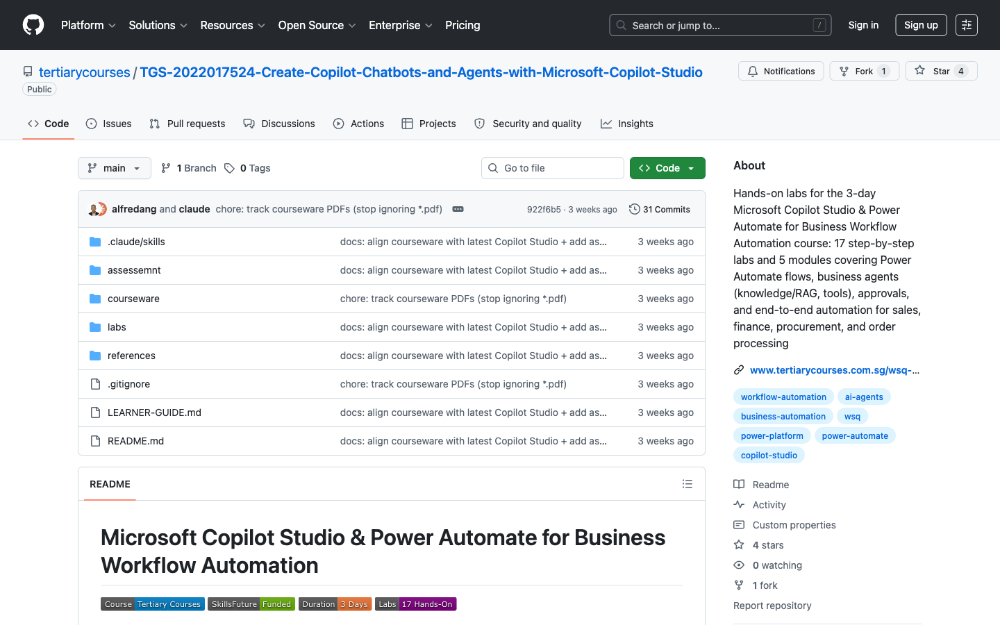

# Microsoft Copilot Studio & Power Automate for Business Workflow Automation

[](https://www.tertiarycourses.com.sg/)
[](https://www.skillsfuture.gov.sg/)
[]()
[]()

## Screenshot



This repository contains hands-on lab materials for the **Microsoft Copilot Studio & Power Automate for Business Workflow Automation** course. Learn to automate real business processes — sales, finance, procurement, and order processing — by combining **Power Automate** flows with AI **agents** built in **Microsoft Copilot Studio**.

The course is **practical and step-by-step**: every lab is written so a complete beginner can follow along, starting from creating your account through to building full end-to-end automated workflows.

## Course Overview

| Aspect | Details |
|--------|---------|
| **Duration** | 3 Days (9:30 AM – 6:30 PM) |
| **Mode** | Physical / Zoom / On-site Corporate |
| **Level** | Beginner to Intermediate |
| **Certification** | Certificate of Completion |
| **Prerequisites** | Basic Microsoft 365 familiarity (Outlook, Excel). No coding required. |

## Learning Outcomes

Upon completion, you will be able to:

- Explain business workflow automation and the difference between standalone agents and integrated workflows
- Identify workflow logic components: triggers, actions, outputs, and steps
- Build Power Automate flows that send emails, log data to Excel, and run approvals
- Create practical business agents in Copilot Studio and design prompts for structured outputs
- Connect agents to Power Automate flows and pass outputs between them
- Orchestrate complete end-to-end workflows for sales, finance, procurement, and order processing

---

## Course Structure

### Day 1 — Foundations & Power Automate

Understand workflow automation concepts and build your first automated flows.

| Lab | Title | Description |
|-----|-------|-------------|
| **Lab 0** | [Environment Setup](labs/Day%201/Lab%200%20-%20Environment%20Setup/index.md) | Create your Microsoft 365, Copilot Studio, and Power Automate accounts step by step |
| **Module 1** | [Workflow Automation Concepts](labs/Day%201/Module%201%20-%20Workflow%20Automation%20Concepts.md) | Triggers, actions, outputs, steps; standalone agents vs integrated workflows |
| **Module 2** | [Introduction to Power Automate](labs/Day%201/Module%202%20-%20Introduction%20to%20Power%20Automate.md) | Power Automate overview; flow types, common triggers, actions, connections |
| **Lab 1** | [Automated Email Workflow](labs/Day%201/Lab%201%20-%20Automated%20Email%20Workflow/index.md) | Build a flow that sends an email automatically when triggered |
| **Lab 2** | [Excel Data Logging Workflow](labs/Day%201/Lab%202%20-%20Excel%20Data%20Logging%20Workflow/index.md) | Capture form data and log each entry into an Excel table |
| **Lab 3** | [Simple Approval Workflow](labs/Day%201/Lab%203%20-%20Simple%20Approval%20Workflow/index.md) | Route a request for manager approval and act on the decision |
| **Lab 4** | [Scheduled Trigger Workflow](labs/Day%201/Lab%204%20-%20Scheduled%20Trigger%20Workflow/index.md) | Run a flow automatically on a schedule (daily reminder/digest email) |
| **Lab 5** | [Form Submission Workflow](labs/Day%201/Lab%205%20-%20Form%20Submission%20Workflow/index.md) | A Microsoft Form (shareable URL) that emails the team and logs to Excel on submit |

### Day 2 — Building Business Agents with Copilot Studio

Create AI agents that understand requests and feed structured data into your flows.

| Lab | Title | Description |
|-----|-------|-------------|
| **Module 3** | [Business Agents Concepts](labs/Day%202/Module%203%20-%20Business%20Agents%20Concepts.md) | Prompt design for structured outputs; connecting agents to flows |
| **Lab 6** | [Create Your First Copilot Studio Agent](labs/Day%202/Lab%206%20-%20Create%20Your%20First%20Agent/index.md) | Build, configure, and test a business agent from scratch |
| **Lab 7** | [Add Knowledge to Your Agent (RAG)](labs/Day%202/Lab%207%20-%20Add%20Knowledge%20to%20Your%20Agent/index.md) | Ground the agent in your own documents/websites, with citations |
| **Lab 8** | [Add Tools and Actions](labs/Day%202/Lab%208%20-%20Add%20Tools%20and%20Actions/index.md) | Give the agent tools — connectors, prebuilt actions, and flows |
| **Lab 9** | [Sales Enquiry Assistant](labs/Day%202/Lab%209%20-%20Sales%20Enquiry%20Assistant/index.md) | An agent that captures sales enquiries as structured data |
| **Lab 10** | [Procurement Request Workflow](labs/Day%202/Lab%2010%20-%20Procurement%20Request%20Workflow/index.md) | An agent that collects procurement requests and triggers a flow |
| **Lab 11** | [Automated Response Generation](labs/Day%202/Lab%2011%20-%20Automated%20Response%20Generation/index.md) | Use AI prompts to draft professional responses automatically |

### Day 3 — End-to-End Workflow Automation & Workshop

Combine agents and flows into complete business processes, then build your own.

| Lab | Title | Description |
|-----|-------|-------------|
| **Module 4** | [End-to-End Orchestration Concepts](labs/Day%203/Module%204%20-%20End-to-End%20Orchestration%20Concepts.md) | How agents + Power Automate work together; managing outputs and next steps |
| **Lab 12** | [Email Enquiry → Excel Logging → Notification](labs/Day%203/Lab%2012%20-%20Email%20to%20Excel%20to%20Notification/index.md) | Capture an enquiry, log it, and notify the team |
| **Lab 13** | [Invoice Upload → Approval Workflow](labs/Day%203/Lab%2013%20-%20Invoice%20Upload%20Approval/index.md) | Trigger an approval when an invoice file is uploaded |
| **Lab 14** | [Purchase Request → Manager Approval → Notification](labs/Day%203/Lab%2014%20-%20Purchase%20Request%20Approval/index.md) | A full procurement approval chain with notifications |
| **Lab 15** | [Order Processing Workflow](labs/Day%203/Lab%2015%20-%20Order%20Processing%20Workflow/index.md) | An agent captures an order; the flow confirms, logs, and raises a restock alert |
| **Module 5** | [Business Workflow Workshop](labs/Day%203/Module%205%20-%20Business%20Workflow%20Workshop.md) | Workshop briefing: business domains, design method, and quality bar |
| **Lab 16** | [Capstone Workshop](labs/Day%203/Lab%2016%20-%20Capstone%20Workshop/index.md) | Build your own end-to-end workflow for Sales, Finance, Procurement, or Order Processing |

---

## Repository Structure

```
copilot-studio-labs/
├── README.md
├── LEARNER-GUIDE.md                        # full step-by-step learner guide (Markdown)
├── labs/                                   # all hands-on lab content
│   ├── Day 1/                              # Foundations & Power Automate
│   │   ├── Lab 0 - Environment Setup/
│   │   ├── Module 1 - Workflow Automation Concepts.md
│   │   ├── Module 2 - Introduction to Power Automate.md
│   │   ├── Lab 1 - Automated Email Workflow/
│   │   ├── Lab 2 - Excel Data Logging Workflow/
│   │   ├── Lab 3 - Simple Approval Workflow/
│   │   ├── Lab 4 - Scheduled Trigger Workflow/
│   │   └── Lab 5 - Form Submission Workflow/
│   ├── Day 2/                              # Business Agents with Copilot Studio
│   │   ├── Module 3 - Business Agents Concepts.md
│   │   ├── Lab 6 - Create Your First Agent/
│   │   ├── Lab 7 - Add Knowledge to Your Agent/
│   │   ├── Lab 8 - Add Tools and Actions/
│   │   ├── Lab 9 - Sales Enquiry Assistant/
│   │   ├── Lab 10 - Procurement Request Workflow/
│   │   └── Lab 11 - Automated Response Generation/
│   └── Day 3/                              # End-to-End Workflow Automation
│   │   ├── Module 4 - End-to-End Orchestration Concepts.md
│   │   ├── Lab 12 - Email to Excel to Notification/
│   │   ├── Lab 13 - Invoice Upload Approval/
│   │   ├── Lab 14 - Purchase Request Approval/
│   │   ├── Lab 15 - Order Processing Workflow/
│   │   ├── Module 5 - Business Workflow Workshop.md
│   │   └── Lab 16 - Capstone Workshop/
├── courseware/                             # Facilitator + participant materials
│   ├── facilitator-slides.pptx             # Slide deck (94 slides)
│   ├── LG-<course>.docx                     # Learner Guide (Word) — generated
│   ├── LP-<course>.docx                     # Lesson Plan (Word) — generated
│   ├── build_learner_guide.py              # Single-source generator (MD + DOCX)
│   ├── build_lesson_plan.py                # Lesson-plan generator
│   └── build_assessment.py                 # WSQ assessment generator (WA + CS)
├── assessemnt/                             # WSQ assessments (question papers + answer keys)
│   ├── Written Assessment(WA) - <course>.docx
│   ├── Answers to Written Assessment(WA) - <course>.docx
│   ├── Case Study(CS) Assessment - <course>.docx
│   └── Answers to Case Study(CS) Assessment - <course>.docx
├── references/                             # Reference material
│   ├── labs/                               # Copilot Studio agents lab notes (PL-7008 style)
│   ├── Day 1/ · Day 2/                     # Previous 2-day chatbot course (reference)
│   └── PL-7008/                            # Microsoft PL-7008 course slides (PDF)
```

---

## Courseware

The `courseware/` folder holds the ready-to-deliver materials, and a full participant guide lives at the repo root:

| Material | File | For |
|----------|------|-----|
| **Learner Guide (Markdown)** | [LEARNER-GUIDE.md](LEARNER-GUIDE.md) | Participants — every lab, click-by-click |
| **Learner Guide (Word)** | `courseware/LG-<course>.docx` | Print / distribute |
| **Lesson Plan (Word)** | `courseware/LP-<course>.docx` | Facilitator — 3-day schedule |
| **Slide Deck** | `courseware/facilitator-slides.pptx` | Facilitator — 94 slides |
| **Written Assessment (WA)** | `assessemnt/Written Assessment(WA) - <course>.docx` (+ answer key) | Open-ended knowledge assessment |
| **Case Study (CS) Assessment** | `assessemnt/Case Study(CS) Assessment - <course>.docx` (+ answer key) | Practical assessment (lab-based) |

> The learner guide, lesson plan and assessments are **generated from a single source** (the lab markdown). After editing any lab, re-run `python3 courseware/build_learner_guide.py`, `python3 courseware/build_lesson_plan.py`, and `python3 courseware/build_assessment.py` to keep them in sync.
>
> **PDFs** (`LG-….pdf`, `LP-….pdf`) are generated from the DOCX via LibreOffice and are **git-ignored** (regenerable build artifacts).

---

## Prerequisites

Before starting, you need a Microsoft account with access to Power Platform. **Lab 0 walks you through getting everything for free.** In summary you will need:

- [ ] A Microsoft 365 account (a work/school account, or a free Microsoft 365 Business trial — see Lab 0)
- [ ] Access to [Power Automate](https://make.powerautomate.com)
- [ ] Access to [Copilot Studio](https://copilotstudio.microsoft.com)
- [ ] Outlook (email) and Excel (via OneDrive/SharePoint) — included with Microsoft 365
- [ ] A modern web browser (Microsoft Edge or Google Chrome recommended)

> **No prior coding or automation experience is required.** Every step is described in detail.

---

## How to Use These Labs

1. Start with **Lab 0** to set up your accounts — do this before the course if possible.
2. Work through the labs **in order**; each builds on skills from the previous one.
3. Read the **Module** concept pages at the start of each day for the "why" behind the labs.
4. Use **Lab 13** to apply everything to a workflow relevant to your own job.

---

## Key Resources

- [Power Automate Documentation](https://learn.microsoft.com/power-automate/)
- [Microsoft Copilot Studio Documentation](https://learn.microsoft.com/microsoft-copilot-studio/)
- [Microsoft 365 Developer Program](https://developer.microsoft.com/microsoft-365/dev-program)
- [Power Automate Templates Gallery](https://make.powerautomate.com/templates/)
- [Copilot Studio Licensing](https://learn.microsoft.com/microsoft-copilot-studio/billing-licensing)

---

## Course Information

**Provider**: [Tertiary Courses](https://www.tertiarycourses.com.sg/)

**Funding Available**:
- SkillsFuture Credit (SFC)
- SkillsFuture Enterprise Credit (SFEC)
- Post-Secondary Education Account (PSEA)

---

## License

This repository contains lab materials intended for educational purposes.

## Acknowledgments

- Microsoft Power Automate and Copilot Studio teams for the platform and documentation
- [Tertiary Courses](https://www.tertiarycourses.com.sg/) for course facilitation
